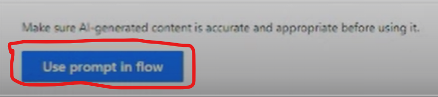

Primero que nada, definamos que es un **prompt**, un **prompt** es una
instrucción, en forma de texto, imagen o sonido, que se proporciona a un
modelo de lenguaje basado en inteligencia artificial, para que realice
una acción o genere una respuesta coherente y relevante. En nuestro caso
será una oración, un párrafo o incluso un fragmento de texto que guía al
modelo en la dirección deseada.

En resumen, un **prompt** es como una solicitud o guía que se da a un
modelo de IA para influir en su salida y obtener resultados específicos
en función de la entrada proporcionada. En el contexto del articulo y lo
que mostraremos a continuación vamos a suponer que necesitamos extraer
información relevante de un correo electrónico que llega a un buzón de
correos electrónicos.

Ya hemos explicado en otros artículos cómo crear un flujo, pero
repasemos rápidamente como crear un flujo de Power Automate que se
ejecute cada vez que un correo electrónico llega.

Una vez en el portal de Power Automate "make.powerautomate.com" vamos a
nuevo y creamos un flujo como muestra la imagen.

Una vez creado el flujo, el punto clave es como extraer la información
relevante del cuerpo y asunto del correo electrónico. Para ello
agregamos la acción de Power Automate "Create text with GPT".

Imaginemos que la casilla de correo se utiliza para recibir pedidos de
productos, entonces vamos a utilizar esta acción para extraer la
información relativa al pedido de productos. En esta acción "Create text
with GPT" el nombre es medio engañoso, por que no es solo para generar
texto con GPT, es para extraer, resumir, clasificar, etc.

Una vez agreda la acción necesitamos crear el **prompt** para extraer la
información que necesitamos del correo electrónico. Entonces hacemos
click en "Create prompt"  y se nos desplegara el siguiente menu.

Aquí debemos seleccionar "Extract information from text", se nos abrirá
un cuadro de texto para crear un **prompt** con un texto de ejemplo,
vamos a remover el texto y agregar nuestro prompt a continuación como
muestra la imagen.

Algunos puntos a tener en cuenta, la primera frase antes del "\[Start of
Text\]" es efectivamente nuestro **prompt,** es donde indicamos lo que
queremos y luego en medio del "\[Start of text\]" y "\[End of text\]" es
donde va a ir nuestro texto a procesar, en este caso como lo estamos
creado y testeando ponemos el texto que queramos, pero luego ese texto
será remplazo dinámicamente por el asunto y cuerpo del correo
electrónico. Si probamos ese **prompt** con ese texto, el resultado será
el número de producto como se puede observar a continuación, porque fue
lo que efectivamente le pedimos.

Claramente funciona, pero es básica la información obtenida, vayamos un
paso mas y pidámosle el color también.

Si probamos nuevamente el resultado debería ser:

Ahora también podríamos pedirle el nombre del cliente:

Así podríamos ir construyendo nuestro **prompt** par extraer los datos
de interés.

Una vez conformes con los resultados hacemos click en utilizar este
prompt ("Use prompt in
flow").

Y nos quedara de la siguiente manera.

En este punto deberíamos tener un **prompt** que satisfaga nuestra
necesidad y retorne todo lo que necesitamos, pero claro, aun está
hardcoded por lo que deberemos modificar el texto al procesar dentro del
área \[Start of text\] y \[End of text\] por el texto realmente
requerido que en nuestro caso es el cuerpo y asunto del correo
electrónico. Para ello solo basta por remover el texto y agregar del
menú de contenido dinámico "Dynimic content" el "Body" y "Subject".

Nos debería quedar nuestra acción configurada de la siguiente manera.

El siguiente paso ya es parte de lo que se quiera construir, puede ser
crear un elemento de lista en SharePoint, crear un ticket un sistema de
tickets, guardar en base de datos, etc. Antes de finalizar, quiero
mencionar que la acción "Create text with GPT" esta aun en preview por
lo que puede no estar disponible en algunas regiones, Microsoft la va a
ir disponibilizando en las diferentes regiones poco a poco.

**Conclusión**

Esta nueva acción de AI Builder nos abre aún más la puerta para
incorporar procesamiento de leguaje natural de una manera sencilla sin
necesidad de entrenar modelos, solamente creado el **prompt** correcto
para obtener el resultado esperado. Como ultimo comentario, a partir de
estas nuevas capacidades es que el rol de "prompt engineer" será cada
vez más relevante en las organizaciones, pues serán los prompt engineers
los encargados en crear los **prompts** para ser utilizados en las
diferentes herramientas como Power Automate, Power Apps, etc.

**Alex Rostán**  
Microsoft Business Applications MVP  
Principal Microsoft COE -- Slalom Canada   
AI & Smarts Applications/ Cloud Architect (Azure, O365, Power Platform)  
Mail: rostanker@msn.com  
Twitter: \@rostanker  
LinkedIn: https://www.linkedin.com/in/alexrostan/   

 
import LayoutNumber from '../../../components/layout-article'
export default LayoutNumber