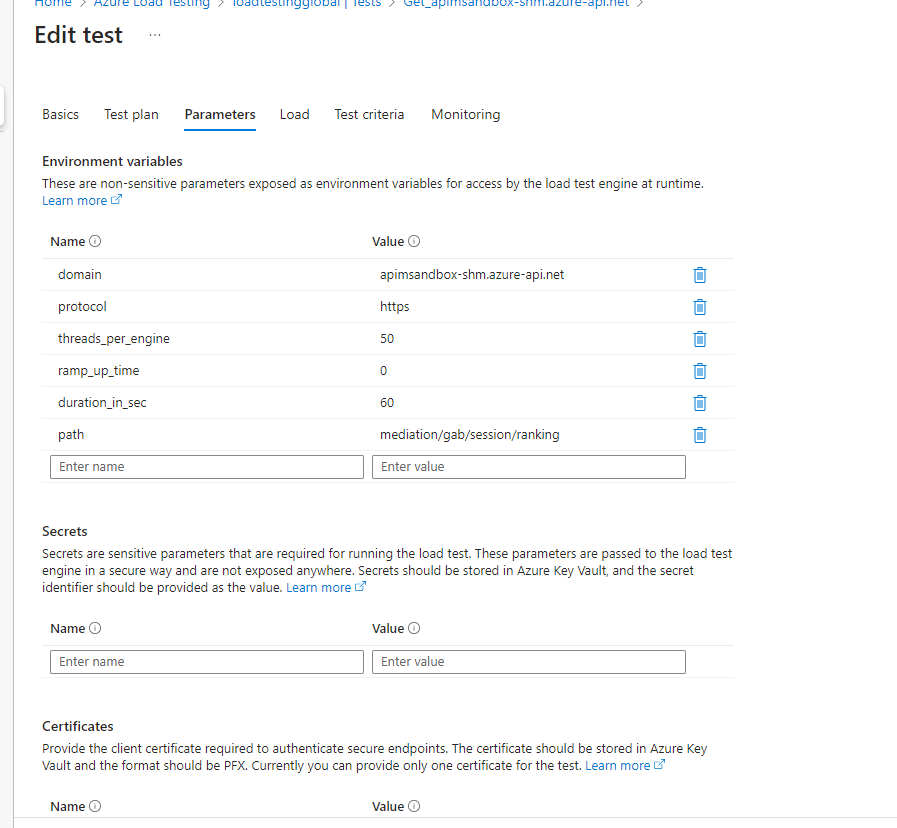

Cuando diseñamos una solución de arquitectura software, un punto
importante para tener en cuenta es, *¿Cómo de Resiliente es mi
aplicación?* *¿Se va a comportar de forma correcta bajo situaciones de
estrés? ¿Se ruperará de un Fail -- Over?*

Estas preguntas se habían dejado un poco a un lado con la llegada de los
servicios Cloud, auto-escalados y en muchos casos sin límites como los
servicios Serverless, pero nada más lejos de la realidad, si colocamos
mal las piezas y no alineamos los escalados de todos los componentes
podemos nosotros mismos provocar cuellos de botellas y problemas serios
en nuestros sistemas.

**Concepto de Resilencia**

Por definición la Resilencia es la "Capacidad que tiene un determinado
sistema informático o tecnológico para poder recuperarse
satisfactoriamente de un fallo, al tiempo que conserva la fiabilidad del
servicio."

A mí me gusta bajarlo un poco más a tierra y basarme en los siguientes
parámetros para saber si mi arquitectura es flexible y resiliente:

-   Redundancia de los datos por región.

-   Auto-escalado para accesos masivos.

-   Posibilidad de integración en red privada.

-   SLA 99,9%.

-   Avg Time \< 1seg.

-   Acceso autenticado de los datos.

-   Monitorización 360º de las ejecuciones.

-   Always on.

-   Plan B y Plan contra Fail Over.

Como veis, soy un pelín ambicioso y yo cuando diseño una solución no me
quedo en el escalado solo para ver si somos Resilientes, sino que
tenemos que pensar en la Observabilidad, tener un Backup de tus
procesos, poder trabajar en modo offline si fuera preciso..., vamos un
completo.

**Trabajemos con un ejemplo, será mucho más visual**

Pensemos que nos piden hacer una solución para puntuar sesiones técnicas
en un evento, que permita introducir votos a las sesiones, y devolver
los mismos por un API Rest para poder diseñar una solución frontal o
mobile.

-   **Servicio API Rest**

Para este punto nos vamos a decantar por usar Azure API Management, que
nos va a dar libertad para desacoplar el diseño de nuestro backend, de
nuestros frontales. Además, vamos hacer un poco de trampas y vamos a
desplegar el API de Rating en dos capas:

-   La capa de **Mediation Layer,** que dará servicio 100% a un conector
    personalizado que podemos exponer en el Power Platform, para que
    nuestros compañeros de Front puedan diseñar un Power Apps o un
    Power Pages .
    La capa de **Inner** dará conexión con nuestro backend aún por
    escoger.

-   **Backend de la solución**

Mi equipo está muy indeciso porque tengo un gran Arquitecto de
plataforma que confía mucho en los servicios de Infraestructura de Azure
y quiere optar por una arquitectura de backend muy clásica basada en
IaaS, y por otro lado mi equipo de desarrollo cree más en un framework
basado en Azure Functions.

> Por este motivo tenemos dos opciones:

-   Que nuestro backend fuera un IaaS con .Net Core, y redundado en un
    Cluster con un Load Balancer por encima para no tener problemas de
    escalado.

-   Confiar en el escalado de nuestras queridas Azure Functions, y
    desplegar un escalado por Consumo, 100% serverless y
    despreocuparnos del escalado.

-   **Modelo de Base de datos y monitorización
    
    En este punto hemos tenido muy poca discusión, y Azure CosmosDB
    nos da el servicio que queremos para alojar nuestros datos y proveer
    los datos de forma correcta al API Rest.
    Por otro lado monitorizaremos todo el sistema con Grafana y Azure
    Monitor, para tener una monitorización en matriz de la
    Infraestructura y de las trazas de nuestros servicios.

**Hagamos una pequeña prueba con Postman para ver como funciona**

Sin entrar mucho en detalles de implementación, que daría para 3
artículos, vamos a ver los puntos clave, y probar de forma manual
nuestra solución.

**Prueba del API Rest publicado en APIM**

La puerta de entrada a nuestro frontal va a ser el Azure API Management,
y en concreto un servicio API Med Layer que va a tener 3 metodos:

-   *Add Vote*: Método para añadir un voto a una sesión.

-   *List of Session*: Listado de las sesiones que se pueden votar.
-   *Ranking of Session*: Ranking de las sesiones ordenadas por más
    votos.

Si hiciéramos una llamada por Postman manual a este servicio, ya
conectado a nuestro backend tendríamos un tiempo medio de unos **190ms**
para la lectura, y de **290ms** para la escritura.
Si nos guiamos por mi definición previa de Resilencia ambas operaciones
están por debajo del 1s y al menos de forma unitaria, estan dentro de
los parámetros de rendimiento esperados.

Prueba Instanciando directamente la FX

Vamos a probar a mano por ahora la opción B de Backend en un modelo
Serverless, que en mi caso es la favorita, aunque luego daré algún dato
de comparación con VM's.

En este caso si por Postman llamamos de forma pública al servicio de Fx
tenemos una latencia media en lectura de **90ms**, y de escritura de
**190ms**.

En ambos casos vemos que la **latencia** que metemos por añadir **APIM**
es de alrededor de **100ms**, tiempos por ahora nada formales porque
hemos hecho pruebas muy manuales, pero por ahora no vemos que sea mala
la performance en concreto de APIM, vamos a ver en % quien mete más
tiempo a las operaciones si Fx o CosmosDB.

**Revisión consultas en Cosmos DB**

Para descartar que nuestro código no sea optimo, vamos comprobar desde
el Cosmos DB las dos grandes operaciones y los tiempos que consume la
BBDD.

-   Inserción de un voto
    La Fx está desarrollada con Net Core, y uso el paquete Nuget
    Microsoft.Azure.Cosmos , ya que el binding de CosmosDB con las Azure
    Functions V4, me daba un bug para la versión Net Core 6.
    

La inserción es un código muy estándar en el cual no aplico nada de
lógica de negocio.

Si hacemos uso de **Application Insight** para ver la latencia media
al insertar un elemento en CosmosDB, vemos que para 400 R/us por ahora
la base de datos gasta prácticamente el total del tiempo de inserción.

Para un tiempo concreto de **154ms de escritura, 146ms** han sido para
escribir en **CosmosDB**, lo cual podemos deducir que nuestro código
mete muy poca latencia y es poco optimizable.

-   **Lectura del Ranking**

La lectura la he implementado con una query muy muy sencilla del tipo
"SELECT \* FROM c ", que se, va a tener mal escalado a la larga porque
recupera todos los documentos, pero que por ahora para un total de 300
documentos iniciales que he cargado en CosmosDB se lleva más o menos la
mitad de esos **90ms en media**.

Por ejemplo para para una petición concreta de **54ms** , el
**CosmosDb** se ha gastado **32.4ms.**

Este método está programado mal aposta, para comprobar que cuando
hagamos pruebas de carga mas completas, y sobre todo sobrecarguemos la
BBDD la latencia se va a disparar y tendremos un rendimiento peor.

Si analizamos el código, a la salida de la Query en CosmosDB, aplicamos
en memoria una instrucción LinQ, para agrupar las sesiones por "Id
Sesión", lo cual con 200 no dará problemas, pero si cargamos 2 millones
de documentos, podemos tener problemillas.

**Introducir Azure Load Testing para probar a lo grande el rendimiento**

La radiografía anterior ha sido divertida, y ya de primeras vemos que
podemos tener un cuello de botella en la Base datos por una query mal
optimizada, y sin pensar tampoco mucho el escalado Serverless de nuestro
backend, puede hacer sufrir también a la BBDD que tiene un escalado
fijo.

Para salir de dudas, desde febrero de 2023 tenemos en GA un servicio
genial que se llama Azure Load Testing, y para los nostálgicos viene a
cubrir el vacío que nos dejo en nuestro Azure Devops perder los Load
Test de Visual Studio.

Este servicio nos va a permitir lanzar pruebas de rendimiento y como
veremos ahora sobre el ejemplo además monitorizar en dashboard todas las
piezas de nuestra arquitectura, sin necesidad de hacer todo lo que he
hecho yo manualmente para comprobar mi solución.

Azure Load Testing, permite lanzar test basados en fichero JMeter, que
podemos desarrollar en local, o bien usar la UI de Azure para generar
nuestras pruebas. 
Un Engine para Load Testing, lo podemos entender como unidades de
escalado dentro de nuestros Test, o lo que es lo mismo a más Engine, más
paralelismo de nuestras ejecuciones. Con esto podemos simular atacar
desde varios orígenes al sistema, y duplicar los hilos de prueba.

Que decir que este servicio esta 100% integrado con Azure Devops y
GitHub, por lo que podemos conectar a nuestros Pipeline de despliegue
nuestras validaciones de rendimiento mediante Azure Load Testing.

**Creando nuestro primer test por Azure Portal**

Una vez hemos creado el servicio en el portal de Azure, crear un Test es
lo más sencillo del mundo.

Accedemos al servicio, y en el apartado de Test, seleccionamos crear
nuevo Test.

De primeras ya el sistema nos va a preguntar si lo creamos en modo
'Rapido' desde la UI, o cargamos un test ya JMeter que estemos
utilizando en local por ejemplo.

Nosotros vamos a utilizar la UI para entender bien al 100% el servicio,
y todas las configuraciones que tiene, ya que si vais por el fichero
algunos pasos los auto-configura.

Deberemos introducir los siguientes datos:

-   **Test Url: En este caso la url de nuestro API Rest en APIM.**

-   **Tipo de carga**: por numero de usuarios con concurrentes o por NPS
    (num peticiones por segundo).

-   **Duración del test en segundos.**

-   **Ramp-Up**: Esto te permite elegir cuanto tiempo quieres se tome el
    sistema para lanzar el total de peticiones configuradas, por si
    queremos darle un incremental a la carga.

Imaginemos que configuramos 50 usuarios concurrentes, sin Ramp-up por no
complicar la lectura, y una duración de 60 segundos de test.

Si seleccionamos crear el test, automáticamente ejecuta el test y
empieza hacer peticiones al sistema, así que antes tener todo preparado
no os pille con el servicio no disponible.

**Interpretando un poco los datos, del primer test, configurando el report**

Una vez ha terminado el test, en el menú de ejecuciones, podemos ver el
resultado del mismo y explorar los primero datos.

Una vez accedemos, vemos un resumen con una serie de KPIS que nos
indican como de bien que ha ido el test.

Podemos ver que se han ejecutado 2764 llamadas en un minuto, y que el
tiempo de respuesta es de cerca de **1 segundo**, ¿Dónde estan mis
famosos 190 ms?, y con picos de **3,33 segundos**.
El porcentaje de error además esta por encima del 2%, lo cual nos hace
intuir que el problema de la latencia puede ser porque alguno de los
sistemas no está escalando de forma correcta.

Además Azure Load Testing te da, datos precisos de que ha hecho para que
podamos entender la naturaleza de nuestra prueba, como peticiones por
segundo, numero de usuario concurrentes, podemos ver como se ha lanzado
la prueba si total o con ramp-up ..., es muy completo.

**¿Pero como vemos ahora que es lo que está escalando peor?**

Para esto, vamos a configurar mejor nuestro test, para que podamos ver
más información tras la ejecución, y así poder deducir que servicio
debemos escalar mejor.

***Configuración de nuestro test***

Para esta parte accedemos a la parte de configuración del test, y
evaluamos que tipo de cosas extras le podemos añadir después de la
primera ejecución.

-   Podemos analiza el JMeter configurado, incluso subir uno nuevo para
    editar nuestro test (versión experto, por ahora mejor por la UI).

-   Podemos configurar parámetros tales como query string, re-configurar
    los usuarios concurrentes, o modificar el path de ejecución de
    nuestro Test Url, por si aplicamos cambios en nuestro API Rest, no
    perdiendo así el test.

-   **Load instance**, o lo que es lo que dijimos al principio elegir
    desde cuantos Engines, queremos lanzar la prueba.
    Tenemos un limite de **250 threads por Engine** de base en el
    servicio, por lo que si queremos mas pruebas concurrentes podemos
    añadir Engines a nuestro test, hasta un máximo de **10 Engines por
    Test**, y un máximo de **20 Engines por Servicio** en West Europe
    por ejemplo.

-   Debemos configurar los Test Criteria, para mí la parte más atractiva
    del servicio.
    Podemos decirle a nuestro test, que KPI's medir para que en función
    de eso nos de un Suspenso o un Aprobado, y en caso de Fail-over
    detener la prueba para no hacer más sangre.
    
    

Por ejemplo para probar la resilencia de mi Arquitectura, he añadió
una métrica que me obliga a tener los tiempos de respuesta medio del
API por debajo del segundo, o en caso contrario me suspenderá el test.

-   Por último y posiblemente el más necesario dado nuestro problema de
    escalado es la parte de Monitorización.
    Para evitar manualidades en las pruebas o tener que bucear en exceso
    en Application Insight, vamos a añadir monitorización desde el test,
    a nuestro API Management, la Function App y el Servicio de Cosmos
    DB.

Si hemos configurado el Test tal cual la imagen anterior, podemos elegir
en el apartado métricas de la configuración del Test, que tipo de
indicadores medir de nuestros servicios, para añadir mas criterio de
métrica a nuestros informes.

Evaluando nuestra arquitectura, después de un ciclo completo de Load
Testing

Ahora estamos en disposición de re-lanzar el test, con la misma
configuración de la primera ejecución. Como era de esperar los errores
500 http van vinculados a que el CosmosDB no da para devolver tanta
consulta de forma concurrente, y llega a máximos de consumo de R/Us.

Además, la sobrecarga a 100% de capacidad de CosmosDB también provoca un
pico de tiempo en las respuestas, de hay que, aunque pasemos el test,
nos acercamos mucho al segundo con escasos 50 usuarios concurrentes.

**Más datos una vez escalado escalando los sistemas y comparando
soluciones de backend.**

En la siguiente tabla podéis ver, como si ajustamos los escalados,
podemos ver que las Fx dejan de romper el CosmosDB, que en mi opinión es
el problema.

Esto quiere decir que usando Fx, tenemos que tener muy bien escalada la
BBDD, ya que al ser un sistema serverless, puede lanzar hasta 200
instancias en paralelo, y como veis la base de datos llega a duplicar
los tiempos de respuesta.

Además si recordamos el principio del artículos nos debatíamos entre si
usar Fx o VM's como backend, ya que nuestro equipo estaba muy indeciso.\
Una vez más Azure Load Testing nos permite tener datos para elegir.

Aunque parece mentira, y es contradictorio a lo que nos cuentan siempre,
en este caso a nivel de Rendimiento y por impacto a nuestra Resilencia,
sería mejor usar VM's con la arquitectura planteada por nuestro
arquitecto.
Claro está yo no voy a recomendar usar VM's de inicio porque son más
caras y requieren un mantenimiento, pero si nos tiene que hacer pensar
que no los mejores servicios todos juntos, nos van a dar la mejor
arquitectura.

En este caso si queremos optar por usar Fx, posiblemente podemos ir a un
plan de App Service para limitar el escalado horizontal que no
necesitamos para un API, o bien pensar en encolar las peticiones entre
el Fx y el ComosDB para poder atender al servicio, pero no sobrecargar
en escritura.
Para las lecturas igual cachear los resultados nos pueden dar aire en el
CosmosDB.

**La Resilencia y el Performance es muy importante**

Podríamos decir que la Monitorización esta más que asumida, también
podría decir que la Calidad de nuestras aplicaciones también se ve como
algo necesario, de ahí que cada vez más canalizaciones se gobiernen
desde un un role de Seguridad o QA, pero **¿Damos mimo a nuestras
soluciones y exploramos los limites antes de ponerlo en producción?**

Mi respuesta es **no**, casi nunca, ya que requiere de perfiles caros,
que controlen toda la solución, mucho tiempo, mirar que solo para
escribir un artículo tonto y una arquitectura mínima da para hablar un
buen rato, y salen muchas cifras.

Mi consejo es que deberíamos dedicar cada vez más tiempo a este tipo de
actividades, ya que al igual que automatizar despliegues nos ha mejorado
la vida a nosotros y a nuestros clientes, no se puede permitir en el
siglo XXI, servicios por encima del segundo, aplicaciones que no tienen
patrones de plan b, o que dependan de que nada falle para que vayan
perfectas..., la RESILENCIA es un aspecto a tener en cuenta en nuestros
diseños y cada vez será más importante.

Para estas tareas, Azure Load Testing, es sin duda inmejorable, muy
recomendable sin duda incorpóralo a nuestros pipeline y a nuestros
ciclos de vida de desarrollo. Principalmente por dos motivos: **porque
es super sencillo usarlo, y porque es muy muy potente**.

**Sergio Hernandez Mancebo**  
Azure MVP

import LayoutNumber from '../../../components/layout-article'
export default LayoutNumber