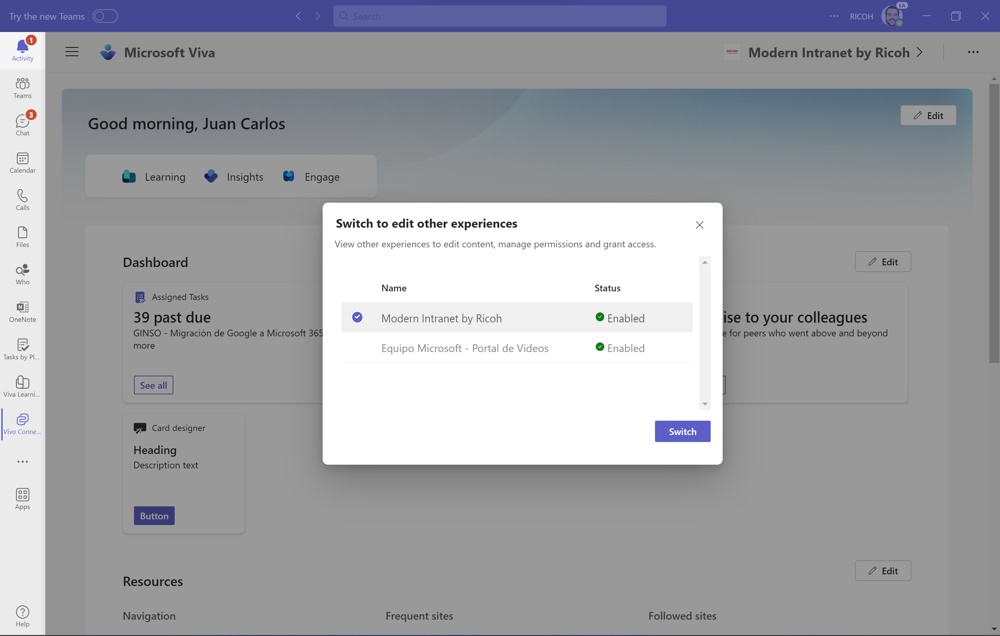

Uno de los sabores de la suite de Microsoft Viva es Viva Connections que
habilita de forma sencilla integrar Portales SharePoint como una
aplicación en Teams de forma que podamos navegar e interactuar por los
mismos sin tener que salir a un navegador. Una de las limitaciones de
Microsoft Viva Connections es que solo permitía integrar un único Portal
de SharePoint en Teams a partir de definir un Sitio del tenant como Home
Site (o Sitio Principal). Pues bien, esta limitación ha desaparecido y
siempre que tengamos el licenciamiento adecuado (**[Nota]**:
Os recomiendo revisar [este
enlace](https://learn.microsoft.com/en-us/viva/connections/set-up-admin-center)
en relación al licenciamiento necesario para poder habilitar varias
experiencias de Viva Connections en un tenant) podremos configurar en un
tenant hasta 10 experiencias de Microsoft Viva Connections. En este
artículo os voy a mostrar como realizar dicha configuración en el Admin
Center de Microsoft 365.

**Accediendo a la administración de Viva Connections en el Admin Center
de Microsoft 365**

En primer lugar, tendremos que acceder como administradores de Microsoft
365 o al menos administradores de SharePoint Online y/o de Microsoft
Teams al Admin Center de Microsoft 365:

-   Hacemos clic en Setup → Microsoft Viva:

-   A continuación, haremos clic en Viva Connections:

-   En la página que se abre visualizaremos las opciones de
    administración provistas para Viva Connections:

    -   *Create and manage Viva Connections experiences* desde donde
        visualizaremos el listado de experiencias de Viva Connections si
        ya hemos configurado estas de forma previa y podremos tanto
        modificarlas como crear nuevas (hasta 10).

    -   *Install Viva Connections for your organization in Teams* desde
        donde simplemente se muestra un panel lateral con las
        instrucciones para realizar dicha instalación desde el Teams
        Admin Center.

    -   *Pin Viva Connections in Teams*, que de nuevo muestra un panel
        lateral con las instrucciones para realizar dicho anclaje desde
        el Teams Admin Center.

**Visualizando Experiencias de Viva Connections configuradas y creandonuevas**

Como podéis deducir, lo interesante en esta administración de
experiencias de Viva Connections en el Admin Center de Microsoft 365 es
justo la primera opción que nos permite tanto visualizar las
experiencias de Viva Connections ya configuradas como crear nuevas de
acuerdo al siguiente esquema.

Para visualizar las experiencias de Viva Connections ya configuradas o
crear nuevas, haremos click en *Create and manage Viva Connections
experiences*:

-   En la página que se abre se muestran, si se han configurado, las
    experiencias existentes que se pueden modificar y también podemos
    establecer cuál es la experiencia por defecto que se visualiza en
    Microsoft Teams:

-   Si hacemos clic en una de las experiencias, se muestra un panel
    lateral con tres secciones:

    -   *General*: Nos permite cambiar el estado de publicación de la
        experiencia para que pase de Publicado a Borrador o viceversa.
        Si el estado cambia a Draft, la experiencia no se verá en Viva
        Connections.

-   *Audiences*: Nos permite establecer la visibilidad de la experiencia
    pudiendo elegir entre todos los usuarios del tenant o bien usuarios
    según su tipo de licencia o bien Grupos de Seguridad / Microsoft 365
    configurados en el tenant.

-   *Permissions*, desde donde podremos administrar los administradores
    del Sitio de SharePoint que estamos configurando en la experiencia.

Como se puede deducir, el proceso para crear una nueva experiencia de
Viva Connections consiste en establecer las informaciones mínimas en las
mismas secciones que se han explicado para una experiencia existente. La
diferencia fundamental es que lo haremos en modo asistente comenzando
con indicar si vamos a crear un Portal de SharePoint desde cero o bien
partimos de uno existente (**[Nota]**: En cualquiera de los
dos casos, tenemos que tener en cuenta que el Sitio a indicar tiene que
ser de tipo Sitio de Comunicación):

Y una vez creado el nuevo Portal o indicado el existente, procederemos a
su configuración ya que inicialmente la experiencia se crea en estado
borrador:

**Visualizando varias experiencias de Viva Connections en Teams**

La pregunta que os haréis en este punto es como se visualizan las
distintas experiencias de Viva Connections en Teams. La respuesta es que
desde la Home de Viva Connections podremos hacer un Switch de
experiencia en lugar de navegar a la experiencia por defecto:

A continuación, podremos elegir si navegamos a la experiencia por
defecto o queremos navegar a otra de las experiencias disponibles y a la
que tenemos acceso.

**Conclusión**

Tal y como había anunciado Microsoft tanto en el pasado Ignite como en
la Microsoft 365 Conference de Las Vegas, desde Viva Connections se
podrá acceder a más de un Portal a través de poder habilitar hasta un
máximo de 10 experiencias siempre y cuando se tenga el licenciamiento
requerido para ello.

**Juan Carlos Gonzalez**  
Microsoft 365 Apps & Service MVP \| M365 SME & Delivery Manager en RICOH España  
\@jcgm1978

import LayoutNumber from '../../../components/layout-article'
export default LayoutNumber