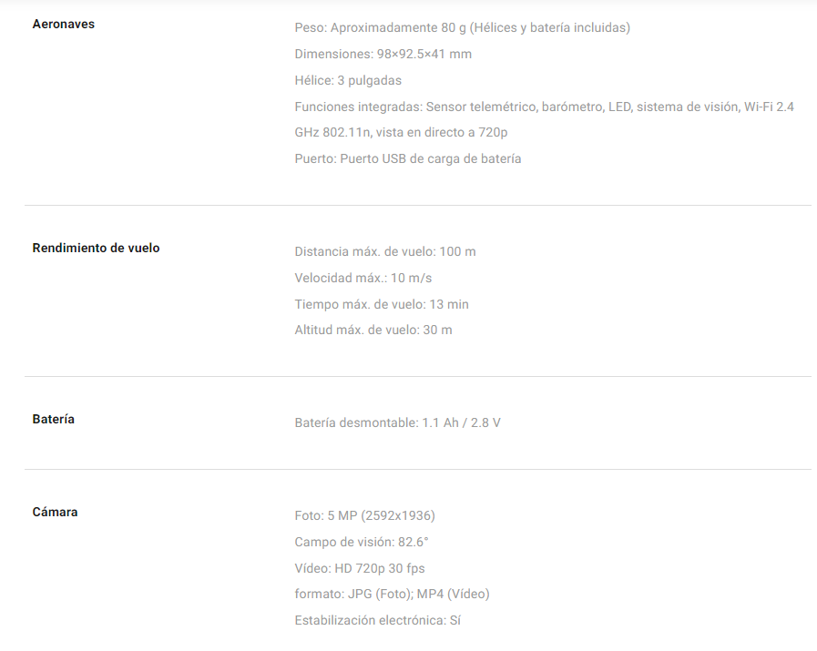
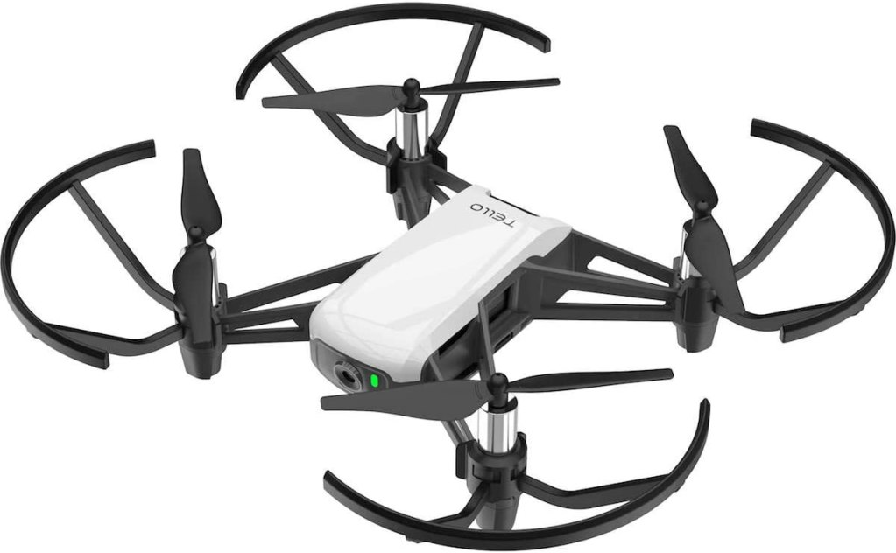
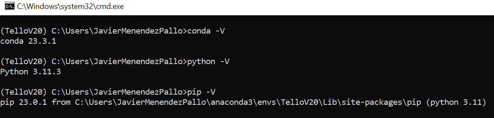
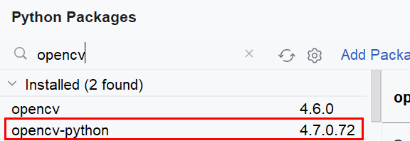
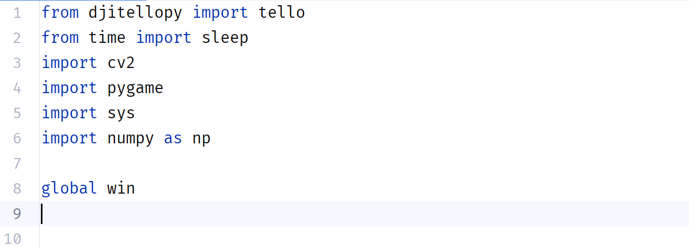
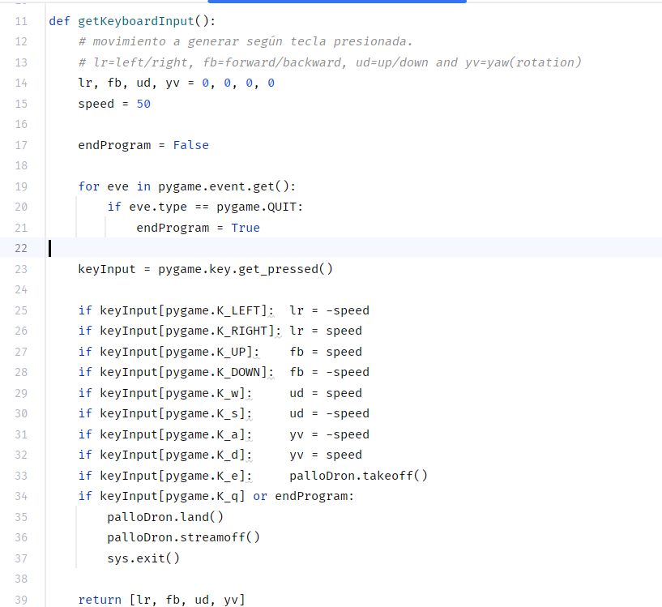
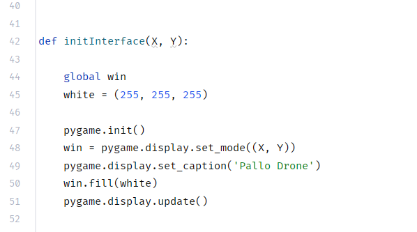
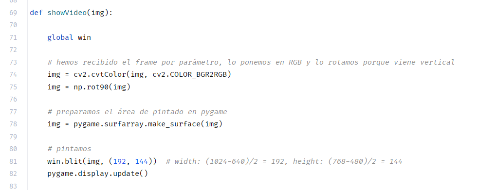
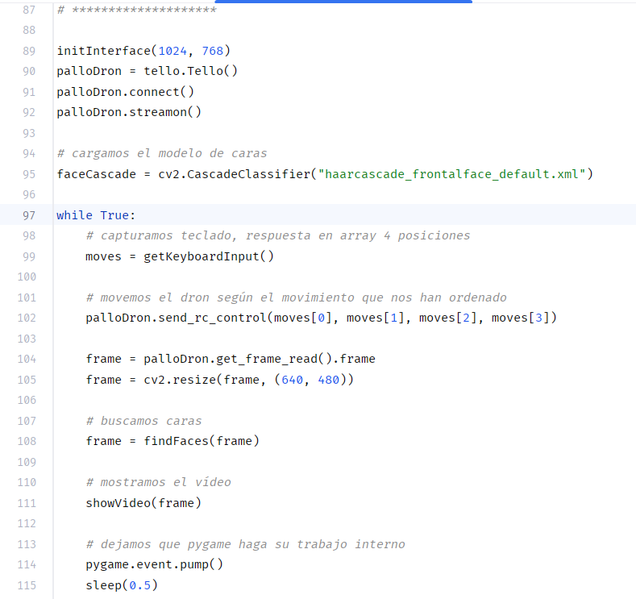

Os presento la primera parte de este artículo donde veremos una
combinación entre la inteligencia artificial y drones, la cual espero os
resulte tan instructiva y divertida como me ha resultado a mí .

Antes que nada, una pregunta: ¿por qué aplicar la combinación
IA/hardware con drones? En realidad, lo que vamos a ver lo podríamos
aplicar a todo tipo de dispositivos, pero luego de probar varios tipos
de dispositivos me ha quedado claro que una de las opciones más
divertidas son los drones. No digo que sean los únicos dispositivos ni
que todos debéis considerar a los drones la mejor opción, recordad
aquello de para gustos los colores..., pero en mi caso personal he
probado coches, tanques, brazos robóticos y drones, y estos últimos son
los que me han devuelto más horas de diversión y aplicación.

**El dron**

Tenemos muchísimas opciones en el mercado en materia de drones, y luego
de una larga comparación y tiempo invertido, he llegado a la conclusión
que los puntos importantes que harán que elijamos un dron u otro son los
que enumero a continuación. Cada lector podrá quitar, agregar o cambiar
el orden de esta lista según sus propios criterios, objetivos y
necesidades.

Antes que daros esos criterios, quiero comentaros cuales eran los
objetivos que perseguía cuando me propuse realizar este proyecto:

a)  Comprobar la dificultad de aplicar Inteligencia Artificial en un
    dron, principalmente en materia de gestión de imagen y gestión del
    vuelo del dron.

b)  Algo no muy complicado, se trata de los primeros pasos.

c)  No es necesaria gran autonomía (batería), distancia de vuelo o
    capacidad de carga.

d)  No es necesaria una cámara de súper calidad, necesitamos la
    suficiente para trabajar con la imagen desde un punto de vista de
    IA.

e)  No queremos realizar una gran inversión.

El marcar de forma previa esos objetivos y dando un vistazo previo muy
rápido a lo que hay en el mercado, nos permitirá marcar mejor las
características que debemos tener en cuenta al momento de elegir el dron
(la lista y su orden varía según tus objetivos):

1.  Debe ser "programable". Es decir que debe permitir la
    gestión/control del dron mediante código, y obviamente cuanto más
    popular sea el código permitido mejor (me refiero a que mejor si
    puedo programar en C o Python que en otro lenguaje propietario o
    similar).

2.  Debe incorporar sistema de visión/cámara (integrada, acoplada,
    etc.).

3.  Debe permitir el vuelo en interiores y exteriores.

4.  La autonomía de la batería debe ser la suficiente para realizar
    pruebas, al menos 8 a 10 minutos.

5.  Debe tener un sistema de comunicación aceptable y que permita cierta
    distancia con el control principal. Como dije antes, no necesito
    operar el dron a 2 kilómetros de distancia, pero sería frustrante
    perder la señal cuando se aleja más de 3 metros. Digamos que siga
    recibiendo señal a los 20 metros será aceptable.

6.  No quiero gastar más de 120€ (julio 2023 -- España).

A partir de aquí ya tengo mi lista de requerimientos, limitaciones o
"aceptables" y si haces un estudio de mercado encontrarás que no hay
tantas opciones posibles. Por supuesto que tienes drones que vuelan a 15
kilómetros de distancia y son programables, pero no los conseguirás por
120€... y así encontrarás que muchos cumplen muchas de las limitaciones,
pero estoy buscando solo aquellos que cumplen todas.

Daros la lista completa de las opciones resultantes creo que tendría
poca validez dada la velocidad a la que avanza el mercado, por lo que me
voy a centrar en 2 resultados: DJI Tello y DJI Tello EDU





La diferencia entre Tello y Tello EDU es que EDU soporta las mismas
funcionalidades que el estándar, y agrega el reconocimiento de *mision
pads* (accesorios que compras por separado, parecidos a una lámina, que
pones en el suelo para que el dron los reconozca automáticamente y
ejecute misiones) y swarm flying (vuelo de múltiples Tello's a la vez).
En mi caso el Tello estándar era suficiente, por lo que fue el modelo
que compré y además es más económico que la versión EDU.

**La preparación del entorno de trabajo**

Elegir un fabricante como DJI tiene la ventaja de que hay mucho material
de apoyo para programar el dron y eso no deja de ser un punto
importarte.



Con respecto al entorno de trabajo elegí
trabajar con Python, por lo que te recomiendo tener un entorno virtual
configurado con exactamente las mismas versiones de las distintas
herramientas que te detallo a continuación:

-   Python 3.11.3.

-   Anaconda 2.4.0 (conda 23.3.1).

-   PIP: 23.0.1.

Con respecto al editor, utiliza el que te plazca. En mi caso utilizo
Visual Studio Code o PyCharm indistintamente.

En cuanto el dron se inicia por primera vez y a través de la aplicación
móvil oficial, deberás configurar una red wifi con la que se comunicará
tu dispositivo con ese dron. Cuando trabajes desde el PC puedes conectar
con el dron de dos formas dependiendo de las características de tu
hardware:

-   Si tienes red LAN y wifi lo ideal es que la conexión estándar sea la
    de cable (LAN) y dejes la wifi disponible para comunicación con el
    dron al mismo tiempo (habrá momentos en los que estarás conectado a
    ambas redes).

-   Si no tienes LAN pero si wifi, lo ideal es que configures tu
    adaptador con 2 IP's. Una IP con la configuración de tu red
    habitual, y una segunda IP configurada según las características de
    tu red privada con el dron. Tienes varios artículos en la web sobre
    como configurar 2 ip's en el mismo adaptador.

-   Si tienes LAN pero no tienes wifi, no podrás comunicar con el
    dron... consejo: hazte con un USB de Wifi (tienes cientos en el
    mercado).

Como último punto también te detallo algunos paquetes (packages) que
deberás tener instalados en tu entorno:

-   Package para la comunicación con el dron: te recomiendo que te
    instales el helper de Python que recomienda el propio fabricante y
    que encontrarás documentado en
    https://djitellopy.readthedocs.io/en/latest/tello/. También puedes
    descargarte las fuentes de este helper desde
    https://github.com/damiafuentes/DJITelloPy. Si quieres
    instalártelo directamente puedes hacerlo con "pip install
    djitellopy" desde una ventana de comandos, o si prefieres tener el
    fuente a la vez de instalar el paquete lo haces con:

```
git clone https://github.com/damiafuentes/DJITelloPy.git

cd DJITelloPy

pip install - .
```

También puedes instalarlo con los propios gestores de paquetes de
PyCharm o Visual Studio, mientras lo hagas en el environment de trabajo
será indistinto.

El uso de este helper no es obligatorio, simplifica bastante el
trabajo es verdad, pero podrías interactuar desde código con el dron
SIN utilizar el helper sino enviando determinados comandos a un puerto
específico donde el dron estará "esperando" por esos comandos. Este
artículo se basa en el uso del mencionado helper, pero si no lo
quieres utilizar y quieres la comunicación directa, mi colega Bruno
Capuano tiene una excelente serie de artículos que te explican paso a
paso cómo hacerlo. Los encontrarás en su blog, en:
https://elbruno.com/2020/02/03/coding4fun-how-to-control-your-drone-with-20-lines-of-code-1-n/

-   Otro paquete Python que vamos a
    necesitar es OpenCV y lo utilizaremos inicialmente para la gestión
    de la imagen que proviene del dron, aunque haremos cosas mucho más
    interesantes más adelante. En mi caso instalé la versión 4.7 de
    opencv-python y es la que necesitarás.

-   En mi caso utilizo PyGame como paquete Python para la gestión del
    interfaz/pantalla. Nuevamente aquí tenemos gran cantidad de opciones
    y si eres asiduo programador Python puedes preferir otro, pero este
    es el que tenía a mano y cumple su función por lo que PyGame 2.4.0
    también forma parte del entorno.

-   Por último, también utilizaremos NumPy. NumPy es una biblioteca, que
    agrega soporte para arreglos y matrices grandes y
    multidimensionales, junto con una gran colección de funciones
    matemáticas de alto nivel para operar en estos arreglos. Como una
    imagen es en realidad un array, NumPy nos ayudará con algunas de las
    operaciones que vamos a realizar sobre. La versión de NumPy
    instalada es la 1.24.3.

**Código: el detalle de los primeros pasos.**

Cuando tengas el entorno preparado ya podemos comenzar a trabajar con
nuestro dron. En este epígrafe iré desgranando las distintas secciones
del código, pero no es necesario que vayas copiando y pegando de a
pedazos... te comparto todo el código al final .

Como primera entrega de este artículo dividido en dos partes, te comento
que esta primera parte cubre los aspectos básicos para la comunicación
con el dron utilizando el helper DJITelloPy. También iremos varios pasos
más allá y veremos cómo:

-   Gestionar el movimiento del dron desde nuestra aplicación.

-   Mostrar en nuestra aplicación el video que está captando nuestro
    dron, en tiempo real.

-   A modo de postre: aplicar una sencilla Inteligencia Artificial sobre
    la imagen (reconocer caras).

A vista de pájaro nuestro código funcionará de la siguiente forma:


**Imports e inicializaciones**

Esta sección no tiene mucho misterio,
simplemente enumeraremos las distintas bibliotecas que vamos a utilizar
para que Python genere los objetos correspondientes.

En la línea 1 tienes la forma de hacer referencia al helper para la
comunicación con el dron, y mediante este paquete es que realizaremos
toda la comunicación: enviaremos comandos, recibiremos respuestas,
obtendremos parámetros, etc.

La línea 2 a la 6 son simples imports del resto de paquetes.
Utilizaremos cv2 para la gestión del video, PyGame para la gestión de la
interfaz y NumPy nos ayudará con el tratamiento del vídeo.

La variable 'win' de la línea 8 será nuestro objeto que representa la
interfaz, es decir, en las siguientes líneas verás como todo lo que
hacemos en pantalla lo hacemos a través de esa variable, que es en
realidad un instanciado de PyGame.

**Capturar tecla presionada**

La primera función que definiremos es la
captura y procesa la tecla presionada en nuestra aplicación, para
"convertirla" a una orden específica para el dron.

He de comentar que la biblioteca tiene varias funciones para procesar el
movimiento, pero la más rápida es el comando que realmente entiende el
dron. Lo que nuestro dron realmente espera cuando le enviamos la orden
de movimiento es:

-   Movimiento hacia derecha o izquierda que llamamos 'lr' (positivo
    para mover hacia la izquierda o negativo para mover hacia la
    derecha)

-   Movimiento hacia adelante o atrás que llamamos "fb" (positivo para
    mover hacia adelante o negativo para mover hacia atrás)

-   Movimiento hacia arriba o abajo que llamamos "ud" (positivo para
    subir o negativo para bajar)

-   Movimiento de rotación en un sentido u otro que llamamos "yv"
    (positivo para rotación en sentido horario o negativo para sentido
    antihorario)

Y para cada uno de esos parámetros espera un valor, que yo he definido
como "speed" en la línea 15 y es lo que me he definido marco como
unidades de movimiento, que te adelanto que son unos 10 centímetros. Lo
ideal es que hagas tus propias pruebas para encontrar el valor de
"speed" ideal, haciendo que tu dron se mueva menos con un valor más
bajo, o se mueva más con un valor más alto. Si lo anterior no te queda
claro veamos un ejemplo:

Si enviamos al dron la orden moverse(50,0,0,0) en realidad lo que estás
diciendo es que quieres que se mueva 50 puntos a la izquierda de la
posición actual (si hubiésemos querido que fuese a la derecha deberíamos
haber indicado '-50'), 0 puntos hacia adelante/atrás, 0 puntos hacia
arriba/abajo y 0 puntos de rotación. Si enviamos la orden
moverse(-20,100,-35,90) le estamos pidiendo que se mueva a la derecha 20
puntos, al mismo tiempo que va para adelante 100 puntos, al mismo tiempo
que baja 35 puntos, y al mismo tiempo que rota en sentido horario 90
puntos.

Recuerda que los puntos son una medida interna, que podríamos traducir a
que 50 puntos son aproximadamente 10 centímetros.

El código de esta función en realidad no tiene mucho misterio:

-   En la línea 23 capturamos la tecla que se ha presionado en teclado.

-   Asignamos un valor positivo o negativo a los 4 parámetros lr, fb,
    ud, yv siempre en unidades de la variable speed (inicializada en
    50).

-   Devolvemos array con los 4 parámetros de movimiento.

Como puedes ver en el código el movimiento que yo he elegido es que
utilizaré los cursores para mover el dron a izquierda, derecha delante o
atrás, y utilizaré las teclas w, s, a, d para subir, bajar, rotar
horario, rotar antihorario respectivamente. Hay dos teclas más que
requieren un tratamiento especial: necesitamos una para despegar (tecla
'e') y una para aterrizar (tecla 'q').

Como ves, esto de separar el procesamiento de las teclas 'e' y 'q' se
debe a que hay que enviar comandos especiales al dron para realizar esas
acciones. El acto de despegar no es simplemente enviar el dron hacia
arriba, es un proceso separado que tiene un comando separado y por eso
lo de asignarle una tecla exclusiva. Lo mismo pasa con la tecla 'q' que
como sabes, solemos utilizar para terminar un programa Python. Al
presionarse esa tecla y antes de matar el programa debemos aterrizar el
dron y cerrar la conexión, y por ello la tratamos de forma separada.

**Inicializar el interfaz**

Otra función que he querido definir, y más
que nada para tener un código final más limpio y legible, es la de
inicializar todos los temas del interfaz de nuestra aplicación.

Esta función recibe como parámetros el ancho y alto de la ventana que
quieres crear (línea 42) y pinta una ventana con esas dimensiones
utilizando PyGame (línea 48). También le pone un título y pone color
blanco como fondo de esa ventana en las líneas 49 y 50 respectivamente.

Cualquier referencia a esta ventana nos quedará almacenada en esa
variable global que habíamos definido anteriormente llamada "win".

**Mostrar el vídeo proveniente del dron**

Una última función que necesitamos es
aquella que se encargará de mostrar el vídeo que nos está enviando el
dron. Esta función recibe como parámetro un frame de ese video ('img')
para luego procesarlo y mostrarlo.

Importante la función de la línea 74, encargada de convertir del formato
BGR en el que viene el vídeo hacia formato RGB que es el que
acostumbramos a usar. Te invito a que la comentes y veas que pasa . Por
cierto, la imagen viene rotada de origen, por lo que la rotaremos antes
de mostrarla (línea 75).

El resto de las instrucciones no tienen mucha ciencia, aunque tal vez
vale comentar esos valores de la línea 81: como en la mayoría de las
pruebas que he realizado utilizo una ventana para esta aplicación que
mide 1024 x 768 píxeles, lo que hacemos en esta línea es centrar el
frame de video dentro de nuestra ventana, tanto horizontal como
verticalmente. Dado que el frame de video es de 640 x 480 el calculo
para centrarlo es fácil y es lo que ves en esa línea. En realidad, esto
no es lo ideal, porque solo va a centrar el frame de forma correcta
cuando la ventana y el frame tengan los valores mencionados. Si quieres
hacer que la función sea válida para todas las resoluciones y tamaños de
frame posibles deberíamos obtener los valores de largo y alto, tanto
para la ventana como para el frame, y trabajar en base a eso.

**El programa principal**

Llegamos a la última parte de nuestro código y como verás hace mucha
referencia al diagrama de flujo que veíamos al principio.

Como primer cosas inicializaremos el
interfaz en la línea 89 llamando a nuestra función creada anteriormente
y pintando una ventana al usuario del 1024 x 768 píxeles.

Las 3 líneas siguientes son casi obligatorias para el uso del dron:

-   La línea 90 crea nuestro objeto dron

-   La línea 91 realiza la conexión con el dron. Aquí es donde
    utilizarás lo de la wifi que comenté al principio y obviamente el
    dron tiene que estar encendido, conectado a la red wifi y tu PC
    también tiene que estar conectado a esa red.

-   La línea 92 es el comando que ordena al dron iniciar la transmisión
    de video de todo lo que esté captando su cámara.

-   La línea 95 no te lo voy a explicar ahora, lo dejamos para la
    segunda parte, pero es importante que si la pones la comentes,
    porque si no dará un error que no te dejará seguir.

Luego de conectar con el dron e iniciar la transmisión de vídeo
comenzamos en un bucle infinito a:

-   Capturar la tecla que se presiona en el teclado (línea 99).

-   Línea 100: enviamos al dron la orden de movimiento según la tecla
    presionada, y si no es una de nuestras teclas se enviará 0,0,0,0 o
    lo que es lo mismo: "no te muevas de donde estás".

-   Las líneas 104 y 105 leen un frame de video proveniente del dron y
    lo reducen un poco. Ten en cuenta que cuanto mayor sea la resolución
    con la que quieras trabajar mayor recursos y capacidad de proceso
    necesitará tu programa.

-   La línea 108 es el postre que te comentaba antes, pero te lo
    explicaré en la segunda parte. Si comentaste la línea 95 debes
    comentar esta también, pero si quieres ver lo que hace deja ambas
    líneas sin comentar y descarga un archivo llamado
    'haarcascade_frontalface_default.xml' desde el GitHub de OpenCV en
    https://github.com/opencv/opencv/tree/3.4/data/haarcascades. Ese
    fichero xml y tu aplicación Python deben estar en el mismo
    directorio.

-   Nuestra línea 111 es la encargada de llamar a nuestra función para
    pintar el frame que hemos recibido desde el dron. Observa que le
    pasamos el frame como parámetro, pero ten en cuenta que ese frame no
    es el real que se recibió desde el dron, sino que lo hemos
    modificado en la línea 104 y 105 (y 108 si no la has comentado ).

-   Por último, llamamos a una función de PyGame que ordena que haga su
    trabajo: 'pump'. No te hagas problema por la función en sí, pero ten
    en cuenta que es aquí cuando le dices a PyGame que "si tienes algo
    pendiente de hacer hazlo ahora" (pintar pantalla, procesar una
    tecla, etc.).

**Para terminar**

Tal como te prometí, no era necesario que fueses copiando y pegando cada
trozo de código, porque aquí lo tienes completo y tal como lo hemos
explicado antes:

https://1drv.ms/f/s!ApIsxewvm-JyjB2ufjdPxmdSAJ4B

Espero que este artículo te haya resultado interesante, y si te decides
por probar el código espero que vaya todo bien y tengas un buen rato de
diversión. Ante cualquier problema puedes contactar conmigo (datos de
contacto en mi perfil de la revista).

Dejo a tu criterio todas las mejoras que este código podría recibir y
cuento contigo para la segunda parte, donde agregaremos funciones
específicas de Inteligencia Artificial e intentaremos que nuestro dron
vuele de forma automática. ¡¡te espero en la próxima!!!

¡Abrazo!

**Javier Menendez Pallo** <br />
IA MVP

import LayoutNumber from '../../../components/layout-article'
export default LayoutNumber