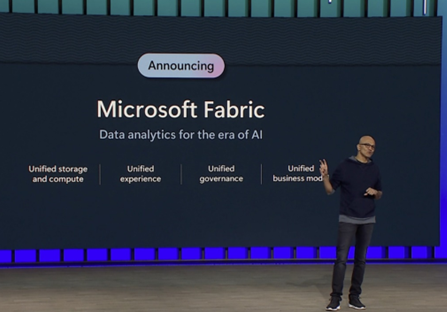

En estos días donde todo lo relacionado con Inteligencia Artificial (AI)
está en casi todos los artículos y publicaciones relacionadas con
tecnología, Microsoft ha anunciado su nueva plataforma de datos llamada
Microsoft Fabric, la solución de Data Analytics para la era de AI. Esta
solución fue presentada durante la última edición de la conferencia
Build llevada a cabo en mayo de este año.

El gran objetivo es ser una solución de data analítica provista como un
servicio en la nube (SaaS) con la capacidad de tener todas las
herramientas para poder realizar ingesta y transformación de datos (ETL
o ELT) , deltalakes, ingeniería de datos , ciencia de datos, analítica
en tiempo real e Inteligencia de negocios (BI)en un entorno compartido
que provea una estructura super robusta en relación a seguridad de los
datos así como gobernabilidad y "compliance" de los mismos, de esta
forma las organizaciones no tendrían que adquirir servicios de datos
individuales de diferentes proveedores pudiendo utilizar una solución
única que sea fácil de utilizar. Algo así como Microsoft Office,
empaquetando varios productos como Word, Excel, Outlook, pero en este
caso apuntada a una solución de datos

Microsoft Fabric consta de siete componentes principales:

-   Data Factory, proporcionando conectores para fuentes de datos
    alojados en la nube (Cloud-native) así como para datos locales
    on-premises, con el concepto de arrastrar y soltar componentes para
    realizar transformación de datos y con la capacidad de orquestar
    data pipelines.

-   Synapse Data Engineering, permitiendo una experiencia colaborativa
    muy simple fácil de usar en relación con la ingeniería de datos
    utilizando componentes Spark.

-   Synapse Data Science, proporciona un flujo de trabajo de punta a
    punta para que los científicos de datos creen modelos de AI
    sofisticados, colaboren fácilmente y entrenen, implementen y
    administren modelos de Machine Learning (ML).

-   Synapse Data Warehousing proporciona una experiencia que converge en
    Data Lake y Data Warehouse utilizando la facilidad de uso y la
    excelente prestación de SQL en los formatos de datos abiertos.

-   Synapse Real Time Analytics permite a los desarrolladores trabajar
    con la transmisión de datos desde los dispositivos de Internet de
    las cosas (IoT) y telemetría con la capacidad de analizar volúmenes
    masivos de datos semiestructurados con alto rendimiento y baja
    latencia.

-   Power BI en Fabric proporciona visualización líder en la industria y
    análisis basados en AI que permiten a los analistas comerciales y a
    los usuarios finales obtener reportes visualmente muy ricos,
    utilizando la información directamente en Fabric. Dicha experiencia
    está profundamente integrada con Microsoft 365

-   Data Activator proporciona detección y monitoreo de datos en tiempo
    real pudiendo activar notificaciones y acciones cuando encuentra
    patrones especificados en los datos, todo en una experiencia
    no-code.

Los datalake de actuales son generalmente muy complicados y dificultan
que los usuarios los creen, integren, administren y operen. Una vez que
están operativos, múltiples soluciones de datos que utilizan diferentes
formatos propietarios pueden causar una duplicación significativa de
datos. En este sentido y como alternativa válida para lo mencionado
anteriormente, la solución proporciona un datalake multi-nube,
presentado como SaaS, llamado OneLake que esta integrado y disponible en
todos los componentes de Fabric. Todos los workloads de datos entan
automáticamente conectado a OneLake. Esto también tiene una correlación
con la comparación con Microsoft Office, dado que OneLake es como
OneDrive para las aplicaciones Microsoft 365.

Los datos que se alojan en OneLake se organizan y se indexan
automáticamente para que sean fácilmente encontrados y utilizados,
facilitando el intercambio con todos los usuarios. OneLake está
disponible por igual para desarrolladores, analistas de negocio y
usuarios finales, contribuyendo a eliminar los silos de datos que, por
lo general, son bastante caóticos y son creados por diferentes
desarrolladores ,que aprovisionan y configuran sus propias cuentas de
almacenamiento.

Una capacidad clave de OneLake son los \"Accesos directos\" o shortcuts.
Los shorcuts nos permiten compartir en forma muy simple datos entre los
distintos usuarios y aplicaciones sin tener que mover o duplicar
información en forma innecesaria, también permiten a OneLake virtualizar
el almacenamiento de los datalakes que están alojados en Azure Data Lake
Storage Gen2 (ADLSg2), Amazon Simple Storage Service (Amazon S3) y
próximamente en Google Storage , lo que permite a los desarrolladores
utilizar y analizar todo tipo de información alojada en las cualquier
proveedor de servicios de nube, sin necesidad de realizar una copia de
los mismos.

Fabric está profundamente comprometido con los formatos de datos
abiertos (open-format) en todos sus niveles. Fabric trata a Delta sobre
archivos de Parquet como un formato de datos nativo utilizándolo como
predeterminado. Este profundo compromiso con un formato de datos
abiertos significa que los clientes necesitan cargar los datalakes solo
una vez y todas las cargas de trabajo pueden operar con los mismos
datos, sin tener que realizar la ingesta por separado. También significa
que OneLake admite datos estructurados y no estructurados en cualquier
formato, lo que brinda a los clientes una flexibilidad total.

Al adoptar OneLake como sistema de almacenamiento, así como Delta y
Parquet como el formato común para todas las cargas de trabajo, Fabric
ofrece a los clientes solución de datos unificados en el nivel más
fundamental. Los clientes no necesitan mantener diferentes copias de sus
datos para poder operar en forma sencilla.

En conclusión, Microsoft Fabric se presenta como una opción muy
prometedora para todo tipo de organizaciones que buscan una solución
integral y cohesiva en el ámbito de la analítica de datos y la
inteligencia artificial. Su enfoque en la simplicidad, la colaboración y
la integración de herramientas es un paso adelante en la dirección de un
proceso de toma de decisiones más informado y eficiente en la era de la
transformación digital y la IA.

Es importante mencionar que Microsoft Fabric está en etapa de Public
Preview, por lo que es posible que las funciones incluidas no estén
completas y que sufran algún cambio antes de que estén disponibles para
el lanzamiento público.

Para los que deseen tener acceso a esta instancia de Microsoft Fabric,
lo pueden hacer en forma gratuita accediendo a https://aka.ms/try-fabric

**Javier Villegas**  
IT Director , DBA & BI Services @ MSC  
Microsoft MVP , Data Platform - MCT  
javier.ignacio.villegas@gmail.com  
[\@javier_vill](https://twitter.com/javier_vill)  
[javiervillegas](https://www.linkedin.com/in/javiervillegas/)  

import LayoutNumber from '../../../components/layout-article'
export default LayoutNumber