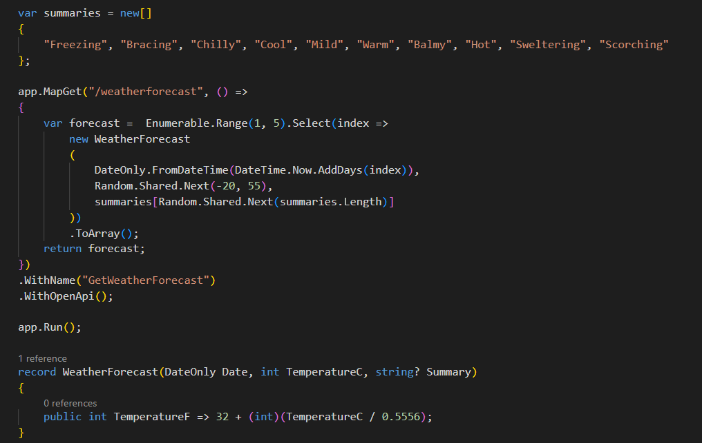
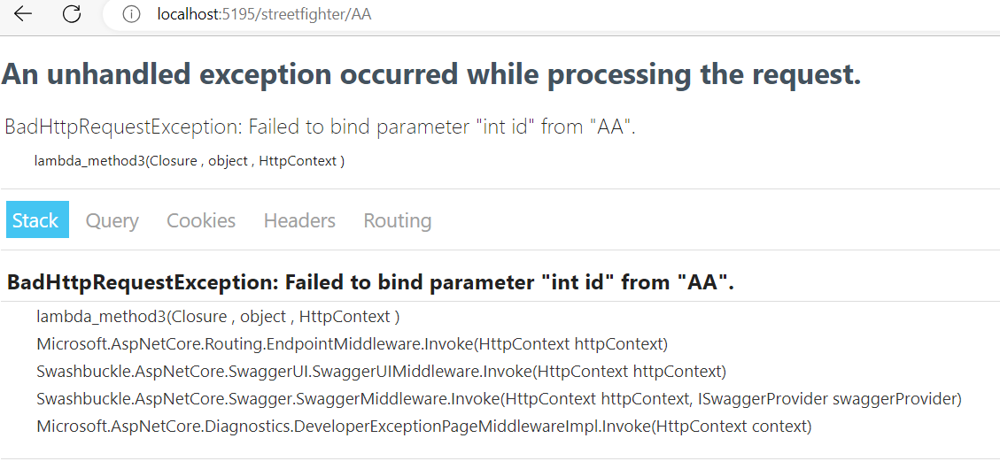
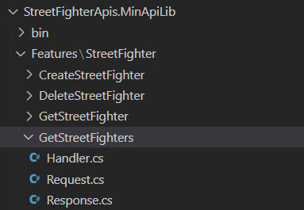

En los últimos meses se comenta mucho sobre la característica de Minimal
API. ¿Qué es esta característica? ¿Como empiezo a usarlo?

Esta funcionalidad, se publicó con la versión de .NET 6, pero no fue
hasta la versión 7 donde puede ser una opción para tener en cuenta a la
hora de realizar un nuevo desarrollo. El objetivo es mucho más simple la
creación de una API y continua con el patrón que últimamente está
haciendo Microsoft en las nuevas versiones del DotNet: Quitar magia y
elementos que no sabemos si vamos a utilizar y hacer las cosas más
simples. Recientemente tenemos un arranque de una aplicación de consola
que no hace falta un main principal para empezar arrancar. Durante
muchos años en otras tecnologías el levantar servicio que devolviese
unos pocos elementos no eran más que cuatro líneas de código entendibles
por todos, seas o no seas especialista en esa tecnología. Con un
arranque "básico" de cualquier desarrollo en .NET o conocías el lenguaje
y su implementación o no podías empezar a profundizar en el mismo sin
echar un vistazo de la documentación. Estaba la clásica broma de que
para un triste "Hola Mundo" se necesitaba mínimo una hora para poder
empezar con el mismo. Con esto que quiero decir que estas nuevas
características de simplificar el lenguaje y el tooling es una forma de
poder acercar a especialistas en otras tecnologías a utilizar DotNet.

Pero si pensamos que el único motivo es ese, es que no estamos viendo
todo lo que nos ofrece Minimal API. En este articulo vamos a profundizar
sobre que es Minimal API, sus características principales, como empezar
a usarla y os enseñare una librería [Open Source
MinapiLib](https://github.com/fernandoescolar/MinApiLib) que seguro que
te hace mucho más fácil su adopción.

**Un poco de vista atrás**

Minimal API salió como primera característica dentro de .NET con la
versión 6, una primera versión muy sencillita al que le faltaban muchas
de las características de la que tenemos en las API's de Controladores.
Parecía que solamente eran una característica para enseñar en las demos
y poco más, pero quien pensaba de esta forma se equivocaba. Salió la
versión .NET 7 en la que incluyeron muchas mejores para poder manejar
los casos de uso más complejos.

Minimal API no es solamente una nueva forma de hacer un "Hola Mundo"
sino que es una forma diferente de crear aplicaciones web en .NET
utilizando un enfoque más sencillo y simple. La idea detrás de esta
característica es permitir a los desarrolladores implementar
aplicaciones con código más legible, eliminando gran parte de las
configuraciones y abstracciones que eran necesarias en otras versiones
de .NET

Cuáles son las principales características que tiene Minimal API :

-   Pensada para centrarse en lo esencial. Uno de los grandes problemas
    que vemos en las aplicaciones es la gran cantidad de capas que no
    aportan valor, que añaden mucha complejidad innecesaria a nuestras
    aplicaciones.

-   Los conceptos básicos son comunes para todos los lenguajes así que
    si estas familiarizado con la implementación de cualquier API Rest
    la curva de aprendizaje es relativamente sencilla.

-   Mejor rendimiento que Asp.NET Core MVC.

La mejor forma para empezar con minimal API es ponerse manos a la obra,
por este motivo vamos a crear una API de personajes de Street Fighter y
vamos a ver como empezaríamos.

**Manos a la obra**

Creamos un proyecto webapi de tipo minimal ejecutando el siguiente
comando:

dotnet new webapi -minimal -o StreetFighterApis

Si vemos el código que se ha generado seria como el siguiente:



Tal y como se comenta en el inicio del artículo, viendo este código no
tenemos mucho misterio, se ha implementado un endpoint
"/weatherforecast" que nos devuelve el tiempo. Las siguientes
ejecuciones WithName("xx") y WithOpenApi son totalmente opcionales y
sirven para documentar la API usando el estándar Open API atraves de una
herramienta como Swagger.

Vale es un ejemplo relativamente sencillo, y seguro que surgen muchas
mas dudas como puedo pasar parámetros, como puedo devolver errores, como
puedo añadir validaciones, como puedo usar Interfaces. ¿El código tiene
que estar todo dentro de ese método? Obviamente la respuesta es que
**NO**, pero vamos por partes.

Por donde empezamos en primer lugar vamos a definir cuáles serán los
endpoint que va a tener nuestra y que verbos se utiliza para su
invocación. En nuestro caso estos ejemplos nos valdrían:

```
app.MapGet(\"/streetfighter\", () =\> { /\* \... \*/ });

app.MapGet(\"/streetfighter/{id}\", (int id) =\> { /\* \... \*/ });

app.MapPost(\"/streetfighter\", () =\> { /\* \... \*/ });

app.MapPut(\"/streetfighter/{id}\", (int id) =\> { /\* \... \*/ });

app.MapPatch(\"/streetfighter/{id}\", (int id) =\> { /\* \... \*/ });

app.MapDelete(\"/streetfighter/{id}\", (int id) =\> { /\* \... \*/ });
```

Como se puede observar con el objeto Map y el verbo que queramos que
responda, tiene dos parámetros una la definición de la ruta que va a
tener ese endpoint y posteriormente la función que queremos ejecutar una
vez se invoque a ese endpoint. Como podéis ver se le pueden pasar
parámetros dentro de la ruta, para que posteriormente la podamos
utilizar dentro de la función.

Una vez tenemos el esqueleto de nuestra API, empecemos por el primer
endpoint. Queremos implementar la devolución de todos los luchadores de
StreetFighter que tenemos. Tenemos un Servicio implementado que nos
devuelve esa información. ¿Cómo podemos utilizarlo? Lo primero es obvio
dentro del arranque de nuestro proyecto tenemos que inyectar el servicio
de la forma que siempre realizamos

```
builder.Services.AddSingleton\<IStreetFighter, StreetFighter\>();
```

Una vez ya está inyectado el servicio, ¿cómo lo podemos utilizar? En la
función donde vamos a llamar tendrá un parámetro con un "Attributes" en
la que indicaremos que esperamos un Servicio del tipo IStreetFighter y a
parir de ese momento ya lo podemos utilizaren sin problemas.

```
app.MapGet(\"/streetfighter\", (\[FromServices\] IStreetFighter services) =\>
{
    return services.GetStreetFightersAsync();
});
```

¿Es obligatorio indicar este "Attributes"? La respuesta es que NO, sino
que el sistema buscará si tenemos algún tipo de dependencia y si la
encuentra la inyectará. El caso del uso de un servicio, no es el único
valor que puede tener ese atributo, estáis imaginando en un escenario
más complejos, como recogemos el Body de un método Post, Put, etc.. o
bien como cogemos los parámetros de una query string. Personalmente por
facilitar este binding y tener el contexto de donde se coge soy
partidario de ponerlo y tener ese valor visible.

Este "Atrributes" puede ser:

-   **FromRoute** si ese parámetro viene de la Ruta.

-   **FromBody** si queremos coger el valor que nos llega en el body de
    la request.

-   **FromParams** Si queremos coger algún valor de un parámetro.

Antes de empezar en escenarios más complejos también conviene saber que
le podemos pasar una serie de constantes que en algunos escenarios nos
pueden hacer falta. Estas constantes son: HttpContext, HttpRequest,
HttpResponse, ClaimsPrincipal y CancellationToken. No he añadido ninguno
de estas constantes para simplificar el escenario.

Hasta ahora parece todo muy fácil, pero vamos a ver queremos implementar
el segundo endpoint, queremos que nos devuelva el personaje dado un
identificador que le pasemos por parámetro. Vamos a ponernos en el
siguiente escenario y que podría ocurrir:

-   Tenemos unos identificadores que son numéricos del 1 al 100 si el
    personaje lo encontramos devolvemos un 200 Ok con un objeto con la
    información del mensaje. En caso de que no lo encontremos
    devolveríamos un 404 objeto not found. Como lo hacemos. Una solución
    sencilla puede ser algo como lo siguiente:

```
app.MapGet(\"/streetfighter/{id}\",
(\[FromServices\] IStreetFighter services, int id) =\>
     {
         var character = services.GetStreetFighterAsync(id);
         if (character == null)
         {
             return Results.NotFound();
         }
         return Results.Ok(character);
     }
);
```

De este método salen cosas "nuevas" hay un objeto Results, como sabemos
una API debe responder con un código de estado HTTP, este objeto nos
ayuda para devolver el código de respuesta adecuado en cada escenario.

Ahora bien, vamos a ponernos en el caso de que nos hagan la siguiente
petición:

Get /streetfighter/AA. Antes de adelantaros en el artículo, hacer un
ejercicio ¿cómo se comporta nuestra aplicación? ¿Y por qué?

La solución es que nos devuelve un BadRequest pero porque intentaría
hacer un binding automático entre el Id que le pasamos en la request y
el valor que estamos teniendo.



¿Como podemos solucionar este error? Y si cambiamos el tipo del
parámetro en lugar de esperar un entero, vamos a pasarle un string.
¿Daría un error? ¿Cómo se comportaría nuestra aplicación?

Como podéis imaginar cambiando este valor, ahora mismo no se produce un
error. Pero ¿cuál es el problema que puede estar ocurriendo? Siempre
estamos ejecutando el código en nuestro servicio y si nos esta llegando
un código que sin consultarlo ya sabemos que la respuesta sería un
NotFound o un BadRequest/ Internal Reward. ¿Como podríamos solucionarlo?
En Minimal API no existe un mecanismo de validación automático, nos
tocará realizarlo a mano. Para ello encontramos un objeto
ValidationProblemDetails que lo podemos usar para devolver un código de
estado 400 con los errores de validación. En el código anterior quedaría
de la siguiente forma.

```
app.MapGet(\"/streetfighter/{id}\",
(\[FromServices\] IStreetFighter services, string id) =\>
     {
        if (!int.TryParse(id, out var idAsInt))
        {
            return Results.BadRequest(new ValidationProblemDetails(new
Dictionary\<string, string\[\]\>
            {
                { \"id\", new\[\] { \"Invalid id\" } }
            }));
        }
         var character = services.GetStreetFighterAsync(idAsInt);
         if (character == null)
         {
             return Results.NotFound();
         }
         return Results.Ok(character);
     }
);
```

Si queremos complicarnos menos la vida siempre en la ruta podemos
aplicar una regex y todo lo que no coincida con la misma automáticamente
nos devolvería un bad request sin producir ninguna excepción, lo cual
como sabéis implica problemas en el performance de tu aplicación:

```
app.MapGet(\"/streetfighter/{id:int:min(1)}\",
(\[FromServices\] IStreetFighter services, string id) =\>
     {
         var character = services.GetStreetFighterAsync(int.Parse(id));
         if (character == null)
         {
             return Results.NotFound();
         }
         return Results.Ok(character);
     }
);
```

Ya hemos visto los distintos escenarios que podemos tener en una
petición GET, ahora vamos a desempolvar cómo funcionan las Minimal API
con los métodos POST, PUT, PATCH y alguna característica nueva, que nos
puede venir bien para determinados escenarios.

Partamos de la base que nos definimos el siguiente método:

```
app.MapPost(\"/streetfighter\", (\[FromServices\] IStreetFighter services, \[FromBody\] StreetFighterRequest request) =\>
```

Nos hemos definido un tipo Struct en el que vamos a tener todos los
parámetros que tiene un nuevo personaje de nuestra API, si observáis
hemos añadido el atributo "FromBody" que lo que nos proporciona es un
binding del tipo con el parámetro request. Dentro del FromBody podemos
definir cómo se puede comportar. Por ejemplo, imaginar que no queremos
permitir que el Body nos venga en blanco para ello tendríamos que poner:

```
app.MapPost(\"/streetfighter\", (\[FromServices\] IStreetFighter
services, \[FromBody(EmptyBodyBehavior = EmptyBodyBehavior.Disallow)\]
StreetFighterRequest request) =\>
```

Si ahora, que definido el endpoint el método nos quedaría de una forma
tal que así:

```
app.MapPost(\"/streetfighter\", (\[FromServices\] IStreetFighter
services, \[FromBody(EmptyBodyBehavior = EmptyBodyBehavior.Disallow)\]
StreetFighterRequest request) =\>
{
    var character = new Character();
    character.Name = request.Name;
    character.RealName = request.RealName;
    character.Origin = request.Origin;
    character.FightingStyle = request.FightingStyle;
    return services.AddStreetFighterAsync(character);
});
```

Pero ahora poner, en un caso o un supuesto imaginar que queremos algo
más que una "simple" validación. Imaginar que solamente permitimos
añadir nuevos personajes a usuarios que son de USA. Para eso Minimal API
nos ofrece la posibilidad de los Filtros, que beneficios nos da los
filtros:

-   Ejecuta el código antes de entrar en el endpoints.

-   Inspecciona y modifica los parámetros durante la invocación del
    handler.

-   Intercepta el comportamiento de la respuesta.

Como podemos implementar un filtro. Pues para ello justo después del
MapGet, añadimos invocamos al AddEndpointFilter donde pondremos la
lógica de negocio que queremos hacer. Vamos a implementar un escenario
en el que solamente vamos a permitir introducir Personajes que son de
USA. Para ello tendríamos un código como el siguiente:

```
.AddEndpointFilter(async (EndpointFilterInvocationContext context,
EndpointFilterDelegate next) =\>
{
     context.HttpContext.Request.EnableBuffering();
     StreetFighterRequest requestArgument = (StreetFighterRequest)context.Arguments\[0\];
     if (requestArgument.Origin!=\"USA\")
        {
            return Results.Problem(\$\"StreetFighterRequest not allowed For {requestArgument.Origin} !\");
        }        
      return await next(context);
});
```

A nivel de desarrollo debemos tener claro en qué momento queremos
ejecutar este Filtro o bien ejecutar validaciones. Desde mi punto de
vista un Filtro no debe de ser un punto que tengamos que hacer muchas
consultas a una base de datos, si son validaciones que se requieren
hacer, lo suyo es que se realicen dentro del propio handler. Por poner
un caso de uso real, imaginar que tenéis un endpoint que solamente está
activo en algunos países, pues es lógico que, si recibes una petición
desde uno de los países que no lo tienen activo, no debe de llegar esta
petición al handler porque se puede evitar. Pero aquí como muchas veces
comentamos depende del contexto y del escenario en el que estamos.

**MinAPI Lib al rescate**

Si analizamos el código que hemos realizado un Simple Crud, con
validaciones, comprobaciones e integridad, podemos ver que encaja en la
gran mayoría de las API's que implementamos (naturalmente con mucha más
envergadura, criticidad que nuestro ejemplo). Pero seguro que muchos de
vosotr@s os estáis preguntando que tenemos un único fichero que es
enorme y que nos puede recordar al mejor Javascript tirado en los
tiempos de SharePoint 2010, pero con código en C#. De serie podemos
mejorar un poco la lectura de esta primera Api si todas estas funciones
las agrupamos en clase, métodos y le damos un poco más de claridad.

Sin embargo, cual es el problema que ahora vemos un método llama a una
función y luego ya vemos que es lo que hace este método. Vamos a hacer
un pequeño refactor a lo que llevamos en marcha y de paso presentamos
otra funcionalidad que tiene Minimal API. Hemos visto que tenemos muchos
endpoints pero es posible que queramos agruparlo para por ejemplo
agruparlos bajo un mismo endpoints o que les queramos aplicar un Filtro
común a todo. Por eso vamos a crearnos un fichero nos creamos esta
agrupación y extraemos los métodos. Nos quedaría algo tal que así:

```
public static class StreetFighterGroupBuilder
{
  public static RouteGroupBuilder MapStreetFighterApi(this
RouteGroupBuilder group)
  {
    group.MapGet(\"/streetfighter\", GetStreetFighterAsync);
    group.MapGet(\"/streetfighter/{id:int:min(1)}\",
GetStreetFighterByIdAsync);
    group.MapPost(\"/streetfighter\", AddStreetFighterAsync);    
      return group;
  }

private static async Task\<IResult\> GetStreetFighterAsync
(\[FromServices\] IStreetFighter services)
{
    var characters = await services.GetStreetFightersAsync();
    return Results.Ok(characters);
}

private static async Task\<IResult\> GetStreetFighterByIdAsync
(\[FromServices\] IStreetFighter services, string id)
{
    var character = await services.GetStreetFighterAsync(int.Parse(id));
    if (character == null)
    {
        return Results.NotFound();
    }
    return Results.Ok(character);
}

private static async Task\<IResult\> AddStreetFighterAsync
(\[FromServices\] IStreetFighter services, \[FromBody(EmptyBodyBehavior
= EmptyBodyBehavior.Disallow)\] Character character)
{
    var newCharacter = await services.AddStreetFighterAsync(character);
    return Results.Created(\$\"/streetfighter/{newCharacter.Id}\",
newCharacter);
}
```

Una vez tenemos la función, ahora como hacemos para invocarla, pues
queremos añadir a todos estos endpoint el atributo "api", pues añadiendo
este valor lo tendríamos en el arranque de nuestra aplicación.

```
app.MapGroup(\"/api\").MapStreetFighterApi();
```

Sobre ese endpoint imaginaros que queremos aplicarle autenticación o un
filtro, le podemos concatenar ese método a todos los endpoints que
tenemos en el mismo, algo tan trivial como esto:

app.MapGroup(\"/api\").MapStreetFighterApi().RequireAuthorization();

Este refactor, nos mejora un poco la legibilidad de nuestro desarrollo.
Pero desde el punto de vista de la devolución de una API lo que
realmente estamos buscando es lo siguiente:

-   El endpoint que quiero implementar.

-   Los parámetros tiene de entrada.

-   Los parámetros tiene de salida.

Pues un poco para darnos esta facilidad podemos usar MinAPiLib. Pero
esta librería no solamente tiene eso, sino que tiene una serie de
utilidades que nos puede ayudar a la hora de implementación: Gestión de
los errores por Cancelation Token, Validaciones en los modelos que
entran, ofuscación de los identificadores de tal forma que no los
expongamos al exterior e incorporación del sistema de Logs por defecto.

Pero vamos a empezar por el principio instalaremos los paquetes de
MinAPI Lib que vayamos a usar:

```
dotnet add package MinApiLib.DependencyInjection

dotnet add package MinApiLib.Endpoints

dotnet add package MinApiLib.Logging

dotnet add package MinApiLib.OperationCanceled

dotnet add package MinApiLib.Validation
```

Ahora vamos a nuestra clase principal y añadimos los servicios que vamos
a utilizar quedando de la siguiente forma:

```
var builder = WebApplication.CreateBuilder(args);
builder.Services.AddEndpointsApiExplorer();
builder.Services.AddSwaggerGen();
builder.Services.AddHypermedia();
builder.Services.AddAssembly();

var app = builder.Build();
app.UseHttpsRedirection();
app.UseSwagger();
app.UseSwaggerUI();
app.UseHttpsRedirection();
app.CatchOperationCanceled();
app.MapEndpoints();

app.Run();
```

Ahora vamos a crearnos una estructura de proyecto siguiendo la
arquitectura de Vertical Slice. Vertical Slice es se refiere a una
práctica de desarrollo que busca crear una implementación funcional de
una característica o conjunto de funcionalidades a lo largo de todas las
capas arquitectónicas de una aplicación. Para nuestro caso nos vamos a
crear una carpeta Features y dentro de la misma crearemos una carpeta de
cada una de las que van a implementa. Ahora por cada una de las Feature
vamos a tomar una convención, nos crearemos un Handler que es donde
tendremos toda la lógica de nuestro endpoints. Creamos una clase Request
que es una record donde tendremos definido todo lo que va a necesitar
nuestro Handler y por último una clase Response que tendrá la definición
de la respuesta que vamos a devolver. Quedando de la siguiente forma.



El fichero Request.cs es un record struct donde definiremos todo lo
necesita el Handler de entrada y desde el sitio donde viene. En el caso
del Get, como no va a tener ningún parámetro ni ningún valor de la ruta
quedaría de la siguiente forma

```
public record struct Request(
    \[FromServices\] IStreetFighter Services
);
```

Una vez tenemos claro que parámetros va a tener el parámetro de entrada
vamos a ver que vamos a devolver. En este caso voy a devolver un objeto
de tipo Character, pero por tener claro la definición voy a crearme una
clase por si en el futuro devuelvo algo más de información, como por
ejemplo si quisiera añadir paginación y quisiera modificar la respuesta
no tendría que realizar ninguna modificación en el mismo.

Y ya por último vamos al Handler que nos quedaría de la siguiente forma:

```
public record Handler() : GetHandlerAsync\<Request\>(\"/streetfighter\")
{
    protected override RouteHandlerBuilder Configure(RouteHandlerBuilder
builder)
        =\> builder                
                .Produces\<Response\>(StatusCodes.Status200OK)
                .Produces(StatusCodes.Status204NoContent)
                .WithName(\"GetStreetFighter\")
                .WithTags(\"StreetFighter\");

    protected override async Task\<IResult\> HandleAsync(Request req,
CancellationToken cancellationToken)
    {
        cancellationToken.ThrowIfCancellationRequested();
        var characters = await req.Services.GetStreetFightersAsync();
        if (!characters.Any())
        {
            return Results.NoContent();
        }

        return Results.Ok(characters);
    }
}
```

Si analizamos el código, podemos decir que es algo mas "cool" pero creo
que unifica todo lo que nos hace falta para la creación de una API,
tenemos la definición de la ruta, el verbo que vamos usar
(GetHandlerAsync, PostHandlerAsync, PutHandlerAsync,...) y que parámetro
tiene de entrada el objeto Request. A continuación, siguiendo la
convención de OpenAPI documentamos nuestra API de cara a tener una API
documentada (esas líneas que hemos añadido se pueden hacer con la
feature de base de Minimal API). Pero al utilizar MInAPILib podemos
añadir alguna característica como es incluir alguna validación (dejo
para el lector el mirar en el repo como se puede hacer). Y ya por último
tenemos un método handler donde tenemos la propia implementación que
anteriormente teníamos en nuestro controlador.

La única diferencia respecto a la primera implementación es que en el
Handler por defecto hay una implementación del CancelationToken. En la
librería de MinAPILib esta inludido porque es uno de los grandes
olvidados a la hora que empezamos a desarrollar. Muchas veces los
ignoramos y nos olvidamos de que nuestro código en ocasiones es
asíncrono. Imaginar que nuestro usuario de la API cancela la petición si
nuestra llamada al servicio no lo contemplara da igual que el usuario lo
cancele nosotros tendríamos en algún hilo una llamada a nuestro servicio
que nadie va a utilizar, lo cual estaremos perdiendo tiempo y en muchas
ocasiones dinero. Pero la magia de MinApiLib no queda solo en eso, ¿cómo
queremos tratar el error de cuando un usuario cancela una petición, que
queremos devolver? Por defecto siempre que esto ocurre se devuelve un
error 500. ¿Pero es un error 500? Seguro que si tienes montado un
sistema de alertas que notifiquen errores si tu aplicación da un número
de 500, ¿consideráis importante que un usuario cancele su propia
petición? Obviamente la respuesta es que no es un error 500 por eso hay
un manejador que en lugar de devolver un error 500, se devuelve un error
499, que si miramos su definición es que el cliente ha cancelado su
propia solicitud.

**Conclusión**

Más allá del motivo de poder atraer a otros desarrolladores al mundo
.NET Minimal Api surge porque dentro del desarrollo hay una tendencia a
la sobre arquitectura de las soluciones. Si vemos los primeros tipos de
arquitecturas propuestos, la tradicional N-Capas donde en muchos equipos
de desarrollos al final implementaban muchas capas sin sentido, o
incluso patrones más modernos como el patrón mediator que se deberían de
usar para reducir las dependencias caóticos entre objetos y promover un
acoplamiento más flexible y eficiente. Mucho de estos problemas igual es
porque estamos acostumbrados a seguir la moda que nos dicta y no
entendemos que estamos implementando. Con Minimal API el objetivo es
otro es simplificar en la medida de lo posible el código, que sea mucho
más legible, que usemos lo que queremos usar. Por este motivo creo que
si vas a empezar un proyecto es hora de que mires Minimal API y todo lo
que nos proporciona.

Si a Minimal API le añades MinAPI.Lib cambias la forma en la que tienes
implementadas tus APIs, ganando en legibilidad del código y en muchas
ocasiones también ganarás en el performance de tu API. Y a ti, ¿que te
parece Minimal API junto con MinApiLib?

Podéis descargaros el ejemplo en el siguiente repositorio de GitHub
https://github.com/AdrianDiaz81/Compartimoss.MinAPILib

**Bibliografía/Referencias**

**https://learn.microsoft.com/es-es/aspnet/core/tutorials/min-web-api?view=aspnetcore-7.0&tabs=visual-studio**

**https://learn.microsoft.com/en-us/aspnet/core/fundamentals/minimal-apis/min-api-filters?view=aspnetcore-7.0**

**https://www.developerro.com/2023/03/22/minimal-api-net7/**

**https://github.com/fernandoescolar/MinApiLib**


**Adrián Diaz Cervera Technical Lead at SCRM Lidl Hub International** <br />
Azure and M365 Development MVP <br />
http://theavenger.dev <br />
\@AdrianDiaz81 <br />


import LayoutNumber from '../../../components/layout-article'
export default LayoutNumber