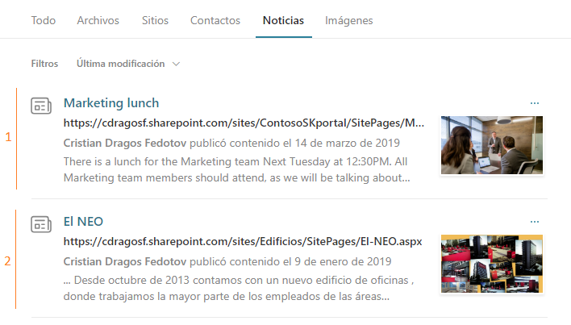
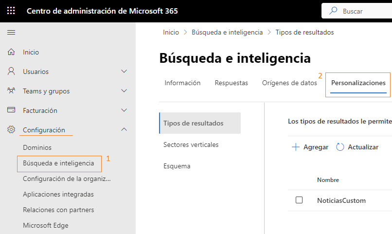
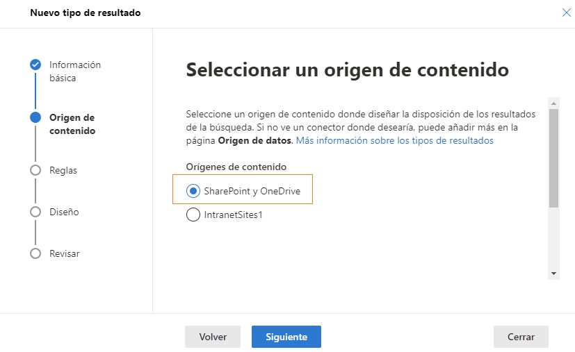
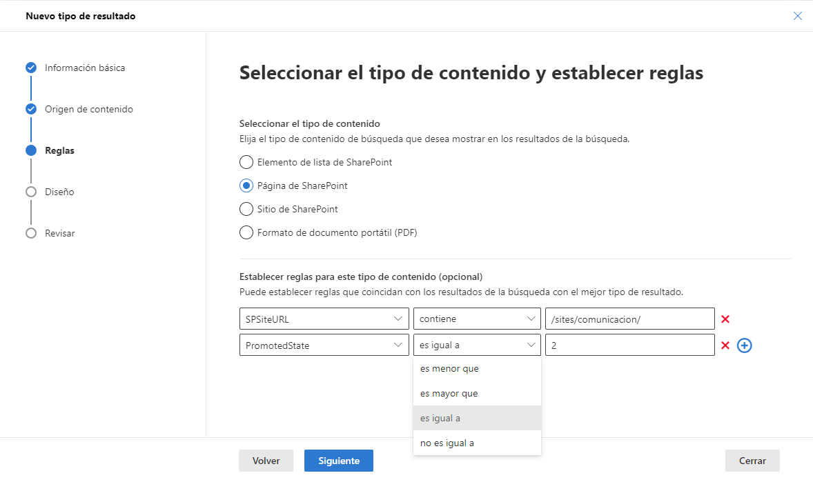
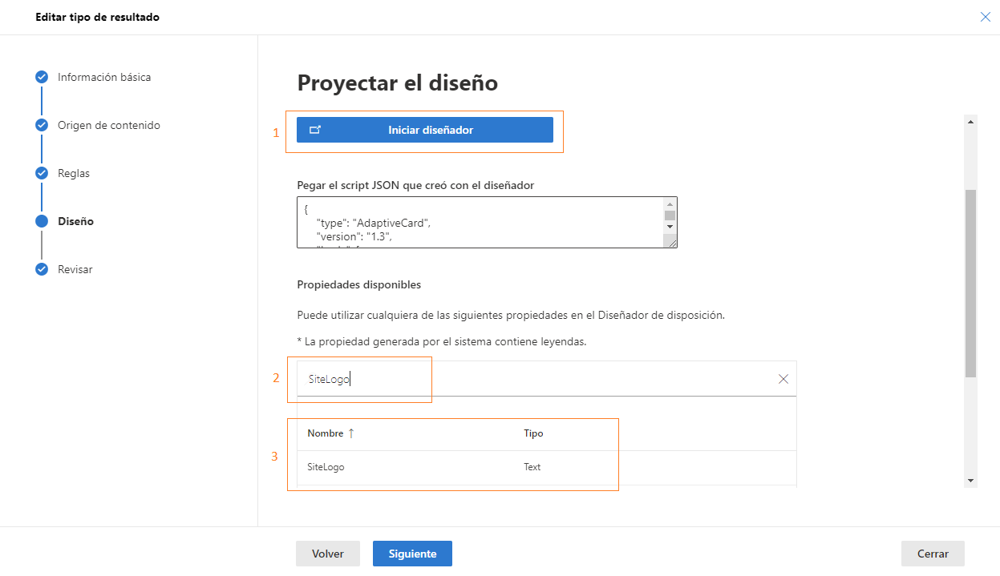
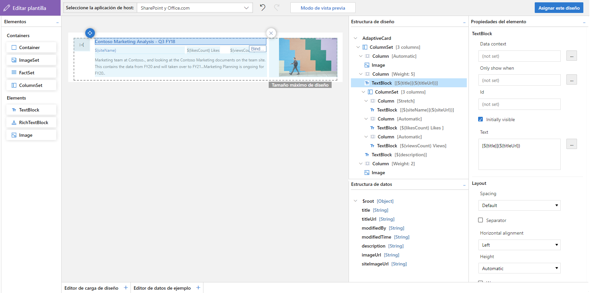
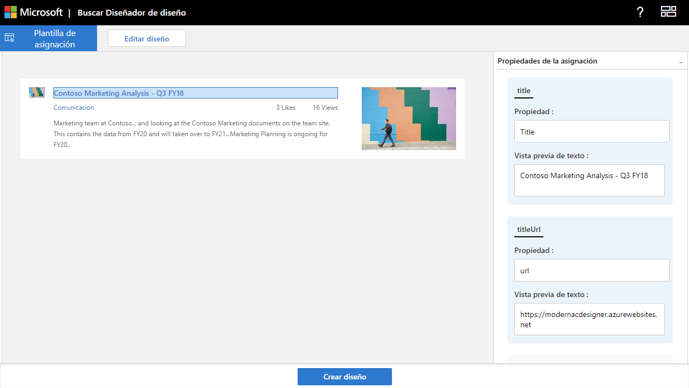
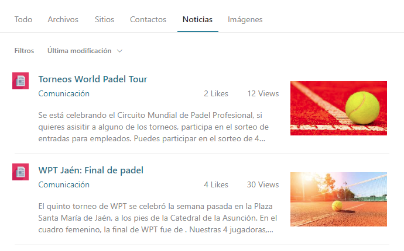

Si te digo "search display templates", te recordará a los tiempos de
SharePoint 2013 Server, cuando podíamos personalizar la búsqueda,
creando nuevos diseños mediante html y js en un único fichero y a su vez
lo asignábamos a un tipo de resultado de búsqueda.

¿Qué maravillosos esos tiempos cuando éramos libres de hacer verdaderas
locuras con ese tipo de "desarrollos" verdad? ¿Y si te digo que **puedes
sentirte libre** otra vez, **para que personalices los resultados de
búsqueda de Microsoft Search**? **Sigue leyendo**, porque en este
artículo vamos a ver cómo crear "search display templates" de manera
moderna a través de Microsoft Search y Adaptive Cards.

En mi caso voy a mostrar **un tipo de contenido** (Noticias de un sitio
de SharePoint Online) de una manera personalizada, **a través de un
formato de adaptive card y filtrando para que solo se aplique a las
noticias de un sitio de SharePoint Online en concreto.**

**¿Cómo empezamos?**

Anteriormente he creado un sitio de SharePoint Online, ubicado en la
ruta de "/sites/comunicacion" dentro de mi tenant y he publicado varias
noticias de prueba dentro de este sitio. De caja, estas noticias se
verán con el diseño por defecto en los resultados de búsqueda.

Imaginemos que esta colección de sitios es especial y queremos dar un
toque personal a las noticias que contiene. En mi caso utilizaré un
tenant de prueba de Microsoft 365 donde soy administrador global de tal
manera que puedo acceder a la parte de configuración del tenant y al
apartado de "Búsqueda e inteligencia" que es donde vamos a crear
nuestras personalizaciones.

Dentro de la opción de "Tipos de resultados" tendremos que crear un
nuevo tipo personalizado a través del botón "+ Agregar". En el
formulario de creación, encontraremos diferentes apartados, así como el
nombre del tipo de resultado, el origen de los contenidos, las reglas de
filtrado que queramos aplicar y el diseño en formato JSON.

**¿Cómo configuramos el origen de contenidos y las reglas de filtrado?**

En mi caso he llamado a este tipo de resultados, "NoticiasCustom" a
través del formulario de creación. En el paso de "Origen de contenido"
tenemos la opción de elegir entre el contenido de "SharePoint y
OneDrive" o el contenido que nos podemos traer a través de conectores
personalizados. En mi caso voy a elegir la opción de SharePoint ya que
las noticias que quiero personalizar están en una colección de sitios de
SharePoint.

Como paréntesis, podríamos tener un conector personalizado que nos
traiga contenidos de ServiceNow y mostrarlos en la búsqueda. Podríamos
personalizar con este método esos resultados y darles un formato
personalizado.

En nuestro caso vamos a seguir con el origen de SharePoint y las
noticias creadas anteriormente.

Pasando al siguiente apartado de "Reglas" podemos configurar diferentes
cosas, así como el tipo de contenido (elementos de lista de SharePoint,
Paginas de SharePoint, Sitios de SharePoint o PDFs) incluso añadir
varios filtros basados en propiedades administradas.

En mi caso he seleccionado como tipo de contenido "Paginas de
SharePoint" ya que las noticias son paginas dentro de la colección de
sitios. Como añadido he puesto que solo se aplique a los contenidos que
están por debajo de la ruta de mi colección de sitios
"/sites/comunicación" y que el campo de "PromotedState" sea igual a 2 ya
que es lo que nos indica que esos elementos están promocionados como
noticias en la colección de sitios.

Estos filtros se pueden aplicar a cualquiera de los tipos de contenidos
mencionados anteriormente.

**¿Cómo personalizamos el diseño de los resultados de búsqueda?**

En el siguiente paso de la creación del tipo de resultados encontraremos
el "Diseño", donde podemos abrir un diseñador visual de adaptive cards
al igual que un buscador de propiedades administradas disponibles para
usar como fuente de datos en los campos de la card.

También tenemos disponible el cuadro de texto donde debemos pegar la
definición de la adaptive card en formato JSON (en el próximo paso vemos
como hacer esto).

Debemos abrir el diseñador visual y aquí tenemos la opción de empezar
con una plantilla de adaptive card ya predefinida o empezar desde cero.

En mi caso he querido mostrar una adaptive card con el logo de la
colección de sitios, el titulo y url de la noticia, el nombre y la url
de la colección de sitios donde esta almacenada la noticia, el número de
likes que tiene, el número de vistas recibidas, una pequeña descripción
del contenido y la imagen de la noticia.

Para ello he utilizado el diseñador visual que nos proporciona esta
configuración y posteriormente he enlazado cada uno de estos campos con
las propiedades administradas correspondientes para cada dato (podemos
consultar todas las propiedades disponibles en el buscador que
encontramos en el formulario de creación del tipo de resultado -- Imagen
5.)

También podemos jugar con los datos de prueba en este diseñador para
poder previsualizar el formato final que tendrá nuestra tarjeta de
noticia.

Una vez hecho el enlace entre los campos de la adaptive card y las
propiedades administradas se nos habilitara el botón "Crear diseño". Al
pulsar este botón se guardarán los cambios en el diseño y el JSON de la
adaptive card se copiará al portapapeles.

Volvemos al anterior formulario de configuración y pegamos el contenido
del portapapeles (el JSON) en el cuadro del diseño, guardamos y
esperamos unos minutos para que nuestro diseño se aplique.

**¿Y el resultado final?**

Realizamos una búsqueda de prueba que nos de algún resultado de noticias
y "voilà":

Tenemos muchas posibilidades en cuanto a la lógica y diseños de las
adaptive card; textos dinámicos, controles que cambian según lógica de
negocio, iconos e imágenes, texto rico, etc.

**Ahora ya solo te queda probarlo y jugar con ello .**

**Cristian Dragos Fedotov**  
Microsoft 365 Solutions Architect en **NTT DATA  
cristianfedotov@gmail.com  
https://www.linkedin.com/in/cristianfedotov/  

import LayoutNumber from '../../../components/layout-article'
export default LayoutNumber
