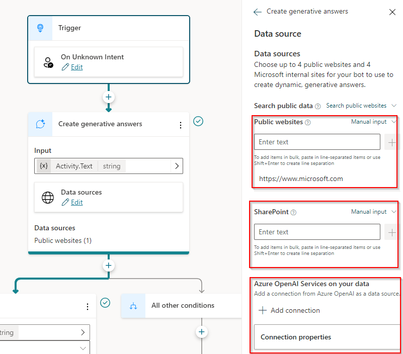

**Licenciamiento**

Antes de empezar... ¿Merece la pena crear un bot con PVA? ¿Qué coste
tendrá? Vamos a responder a esas preguntas de forma clara y sencilla:

-   *¿Cómo se licencia PVA?* Tenemos que adquirir un complemento en
    nuestro *tenant* de Microsoft 365 de PVA, que ahora mismo tiene un
    coste de 187,20€/mes[^1] para 2.000 sesiones. Esta licencia es
    también conocida como *Power Virtual Agent tenant license*.

-   *¿Qué licencia necesita un usuario para crear bots?* Necesita una
    licencia *Power Virtual Agent User License* y no tiene coste alguno.

-   *¿Qué es una sesión de PVA?* Una sesión empieza cuando un usuario
    inicia una conversación con el bot y esta termina con una respuesta,
    si la conversación dura más de 60 minutos, o si la conversación
    tiene más de 100 turnos. Si necesitamos más capacidad, se puede
    adquirir un complemento de 1000 sesiones por 93,60€/mes.

-   *¿Dónde podemos publicar nuestro bot?* Existen distintos canales
    donde podemos publicar nuestro bot, ya sea en el propio Microsoft
    Teams, en una página web, Telegram, Slack o Twilio, además de
    integrarlo con interfaces de voz.

En conclusión, solo pagamos por tener PVA disponible en nuestro *tenant*
y según el número de sesiones que se abran del bot.

**Desarrollo**

-   *Diseño*: Recientemente Microsoft creó la que se denomina
    *Microsoft's Unified Canvas* que no es más que un editor visual para
    poder crear los bots y que tanto sirve a usuarios finales (los
    famosamente llamados *citizen developers*) así como a los
    desarrolladores profesionales.

Así que el mismo editor tiene las funcionalidades básicas que puede
necesitar un *citizen developer*, así como el acceso a propiedades
avanzadas (e incluso código) para los desarrolladores profesionales.

-   *Coautoría*: Ahora también es posible que distintas personas
    trabajen a la misma vez sobre distintos temas de un bot, facilitando
    su desarrollo, además de ver qué usuario ha hecho los últimos
    cambios sobre un tema.

-   *Uso de PowerFx*: Ahora es posible escribir expresiones
    *PowerFx*[^2] en PVA. Baste recordar que *PowerFx* es un lenguaje
    similar a las expresiones de Excel y que también se usa en Power
    Apps o Power Automate.

-   *Nuevos tipos de respuesta:* Anteriormente el contenido de las
    respuestas que podíamos ofrecer en PVA era muy básico, reduciéndose
    prácticamente a contenido solo textual. Ahora ya podemos ofrecer
    contenido con imágenes y vídeos, *adaptive cards*, o incluso
    respuestas dinámicas. Además, también se pueden configurar las
    respuestas si nuestro bot va a usar interfaces de voz[^3] en algún
    momento.

**Uso de IA generativa**

El uso de la IA generativa en las distintas herramientas y servicios de
Microsoft es ya un hecho consumado, y PVA no podía quedar al margen.
Podemos usar la IA generativa en dos aspectos bien diferenciados:

-   *Autoría*[^4]*:* Podemos crear temas mediante *Copilot*, donde
    describimos qué problema queremos resolver, y PVA creará
    automáticamente el tema con las preguntas y respuestas apropiadas.

-   *Respuestas generativas*[^5]: Las respuestas generativas permiten
    que el bot encuentre y presente información de múltiples fuentes
    (tanto internas como externas) sin necesidad de crear nuevos temas.

El uso de respuestas generativas significa un antes y un después en el
desarrollo de bots, ya que no necesitamos ningún tipo de desarrollo para
éste sea capaz de entender una pregunta y encontrar el contenido que más
se adecua para responderla, ya sea interno a la compañía o que se
encuentre libremente en Internet.

Vamos a ver con un ejemplo práctico cómo funcionan ambas
características, donde cabe mencionar que necesitamos que nuestro
entorno de Power Platform se encuentre en USA y que el idioma del bot
sea el inglés para poder probarlas, ya que éstas se encuentran en modo
*Preview.* Así mismo, estas capacidades son actualmente gratuitas, pero
muy probablemente exista un coste adicional por usarlas[^6].

**Autoría con Copilot**

1)  Vamos a la sección de Temas (*Topics*) y seleccionamos *Create with
    Copilot*.

2)  Indicamos el nombre del tema y una descripción sobre lo que queremos
    resolver. En este caso indicamos que queremos preguntar al usuario
    por su nombre y dirección de correo electrónico, y presentar un
    resumen de la información introducida al final de la conversación.

Lo más interesante ha sido que Copilot nos ha creado el mensaje de
respuesta (resumen con los datos introducidos) con una *adaptive
card*, algo que no es trivial para un *citizen developer*, pero que
nos ofrece una mejor interacción con el usuario, dada la riqueza
visual de estos tipos de elementos.

3)  Guardaremos los cambios y probaremos el resultado final
    introduciendo alguna de las palabras que lanzan este tema. Podemos
    ver el resultado final en la siguiente imagen:

La facilidad y sobre todo rapidez con la que hemos creado el tema es
verdaderamente impactante, y veremos como esto reduce los tiempos de
desarrollo de los bots de forma significativa.

**Respuestas generativas**

1)  Podemos indicar que recursos queremos utilizar al ofrecer respuestas
    en la sección de *AI Capabilities*:

    a.  *Sitios web*: Podemos indicar hasta 4 sitios web públicos.
        Existen algunas recomendaciones que se deben seguir[^7], como
        por ejemplo, que la URL no tenga más de dos subniveles. Por
        cierto, y muy importante: El sitio web deben estar indexado
        por Bing. Es decir, mediante el buscador de Microsoft debemos
        poder encontrar el contenido que aparece en los sitios web
        indicados.

    b.  *Documentos*: Esta opción aun no está disponible, pero permitirá
        cargar distintos documentos (hasta 3 MB de tamaño, y de tipo
        HTML, PDF, docx y pptx) para que PVA pueda ofrecer respuestas
        basada en su contenido (el número máximo de ficheros que
        podremos usar aun es desconocido).

    c.  *Modelos de Azure Open AI*: Mediante esta opción el bot podrá
        acceder a modelos de Open AI que hayamos desarrollado, y que,
        por ejemplo, podrían acceder a documentación interna de
        nuestra compañía. Sin duda, una funcionalidad extraordinaria
        para buscar información de forma rápida y fiable.

2)  Así que introduciremos el sitio web que queremos indexar, como por
    ejemplo, la web de Microsoft:

3)  Una vez añadido el sitio y guardados los cambios, esperaremos unos
    minutos, y probaremos el bot. En este caso, queremos introducir
    alguna frase o palabra que obligue a PVA a realizar una búsqueda en
    el sitio web indicado: Preguntamos por el precio de un dispositivo
    Surface.

Sin tener que crear ningún tema, PVA ha sido capaz de respondernos a
la pregunta rápidamente. Además, podemos comprobar como en la propia
respuesta se indica que ha sido generada por Azure Open AI.
Aunque en este caso estamos indicando sitios web públicos, también
podríamos añadir contenido en SharePoint, ya sea público o privado (en
este último caso, entonces necesitaríamos añadir autenticación en el
bot), o bien contenido basado en nuestro propio modelo de Azure Open
AI, como podemos ver en la siguiente imagen:

4)  Por último, y aunque aún no está disponible, indicar que será
    posible indicar el tono que queremos que tengan las respuestas
    generadas con la IA generativa, desde un tono formal hasta un tono
    empático.

**Conclusiones**

Los recientes cambios realizados sobre PVA deberían ayudar a la
progresiva implementación de bots, tanto a nivel interno como externo
por parte de compañías privadas y administraciones públicas. Las nuevas
capacidades de autoría, la posibilidad de añadir contenido multimedia en
las respuestas, la integración con voz y multi idioma, o el hecho de
poder responder a preguntas en base al contenido de nuestros documentos
o páginas web usando la IA generativa son un importante punto de
inflexión en el desarrollo de bots.

¡Happy Bot Making!

**Ferran Chopo**  
*Power Platform Advisor -- MVP Business Apps - MCT*  
ferran@ferranchopo.com  
\@fchopo  

[^1]: https://powervirtualagents.microsoft.com/es-es/pricing/

[^2]: https://learn.microsoft.com/es-es/power-platform/power-fx/overview

[^3]: https://learn.microsoft.com/es-es/training/modules/pva-voice/

[^4]: https://learn.microsoft.com/es-es/power-virtual-agents/nlu-gpt-quickstart#create-a-new-topic-using-copilot

[^5]: https://learn.microsoft.com/es-es/power-virtual-agents/nlu-boost-conversations

[^6]: https://learn.microsoft.com/es-es/power-virtual-agents/nlu-boost-conversations#pricing

[^7]: https://learn.microsoft.com/es-es/power-virtual-agents/nlu-boost-conversations#url-considerations

import LayoutNumber from '../../../components/layout-article'
export default LayoutNumber