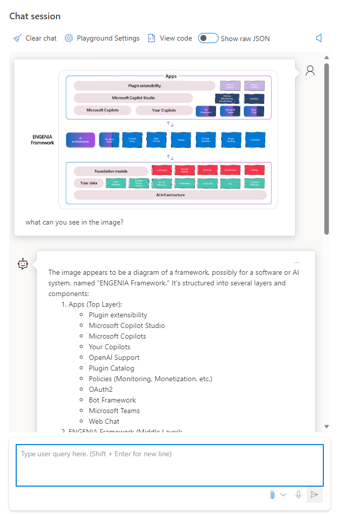

Imagina poder hacer cualquier pregunta a un potente modelo de IA y obtener una respuesta en lenguaje natural, 
no solo basada en texto, sino también en imágenes y vídeos. Imagina poder utilizar este modelo de IA para mejorar 
la accesibilidad, la interpretación de datos y la respuesta visual a preguntas para una variedad de dominios y aplicaciones. 
Esta es la visión detrás de GPT-4 Turbo with Vision, la última innovación de OpenAI y Microsoft, que ahora está disponible 
en versión preliminar en Azure OpenAI. 

GPT-4 Turbo con visión es un modelo de IA multimodal que combina la comprensión del lenguaje natural y las capacidades de generación 
de GPT-4 Turbo con la capacidad de procesar y analizar entradas de imágenes. Esto significa que los usuarios pueden proporcionar mensajes 
de texto, imágenes o ambos, y obtener respuestas de texto informadas por el contexto visual. Por ejemplo, los usuarios pueden hacer 
preguntas como "¿Cuál es el nombre de la pintura en esta imagen?" o "¿Cuántas personas usan máscaras en este video?" y obtener respuestas 
precisas y relevantes de GPT-4 Turbo con Visión. 

## Características y ventajas de GPT-4 Turbo con Vision 

GPT-4 Turbo with Vision es un modelo de IA multimodal de última generación que se basa en el impresionante rendimiento 
de GPT-4 Turbo, que es uno de los modelos de lenguaje natural más grandes y potentes del mundo. GPT-4 Turbo puede generar 
texto coherente y fluido sobre casi cualquier tema, dada una indicación de texto del usuario. También puede responder preguntas, 
resumir textos, escribir ensayos, crear historias y mucho más. 

Sin embargo, GPT-4 Turbo está limitado por el hecho de que solo puede procesar entradas y salidas de texto. Esto significa 
que no puede manejar información visual, como imágenes y videos, que son fuentes de datos y conocimiento cada vez más importantes 
en el mundo digital. Para hacer frente a esta limitación, OpenAI y Microsoft han desarrollado GPT-4 Turbo con Vision, que añade la 
capacidad de procesar y analizar entradas de imágenes a GPT-4 Turbo. Esto permite a los usuarios aprovechar la potencia de GPT-4 
para una gama más amplia de tareas, incluidas las mejoras de accesibilidad, la interpretación y el análisis de datos visuales y 
la respuesta visual a preguntas (VQA). 

GPT-4 Turbo con Vision puede manejar entradas de texto e imágenes, así como una combinación de ambas. También puede generar salidas 
de texto que se basan en el contexto visual, así como en la solicitud de texto. Por ejemplo, los usuarios pueden proporcionar una 
imagen de una escena y un mensaje de texto, como "Describa lo que está sucediendo en esta imagen" o "Escriba un título para esta imagen", 
y obtener una respuesta de texto que describa o resuma con precisión la imagen. Alternativamente, los usuarios pueden proporcionar 
un mensaje de texto y una imagen, como "¿Cuál es el nombre del animal en esta imagen?" o "¿Cuántos autos hay en esta imagen?", 
y obtener una respuesta de texto que responda a la pregunta basada en la imagen. Los usuarios también pueden proporcionar un mensaje 
de texto sin una imagen y obtener una respuesta de texto basada en el conocimiento general de GPT-4 Turbo. 

## Algunos de los beneficios de GPT-4 Turbo con Vision son: 

- Permite a los usuarios acceder y utilizar la gran cantidad de información visual que está disponible en línea 
y fuera de línea, como imágenes, videos, diagramas, gráficos, mapas, etc. 

- Mejora la comprensión del lenguaje natural y las capacidades de generación de GPT-4 Turbo al agregar contexto visual 
e información, lo que da como resultado respuestas de texto más precisas y relevantes. 

- Abre nuevas posibilidades para las aplicaciones y soluciones de IA multimodal, como las mejoras de accesibilidad, 
la interpretación y el análisis de datos visuales y la respuesta visual a preguntas (VQA). 

- Aprovecha la escalabilidad y la confiabilidad de Azure OpenAI Service, que proporciona una manera segura y 
sencilla de acceder y usar GPT-4 Turbo con Vision en la nube. 

## Casos de uso y escenarios para GPT-4 Turbo con visión 

GPT-4 Turbo con visión es un modelo de IA multimodal versátil y potente que se puede utilizar para una variedad de 
casos de uso y escenarios, como: 

- Mejoras de accesibilidad: GPT-4 Turbo with Vision puede ayudar a los usuarios con discapacidades visuales 
o discapacidades a acceder y comprender información visual, como imágenes y vídeos, proporcionando descripciones de texto, 
subtítulos, resúmenes o explicaciones. Por ejemplo, los usuarios pueden usar GPT-4 Turbo con Vision para generar descripciones 
de audio para imágenes y videos, o para traducir texto de imágenes a voz o braille. 

- Interpretación y análisis de datos visuales: GPT-4 Turbo con visión puede ayudar a los usuarios a interpretar y analizar 
datos visuales, como diagramas, tablas, mapas, gráficos, etc., proporcionando información de texto, resúmenes o explicaciones. 
Por ejemplo, los usuarios pueden utilizar GPT-4 Turbo con Vision para generar informes de texto o presentaciones basadas en 
datos visuales, o para responder preguntas basadas en datos visuales. 

- Respuesta visual a preguntas (VQA): GPT-4 Turbo con Vision puede ayudar a los usuarios a responder preguntas basadas en 
imágenes y vídeos, proporcionando respuestas de texto basadas en el contexto visual. Por ejemplo, los usuarios pueden usar 
GPT-4 Turbo con Vision para responder preguntas sobre el contenido, los atributos o las relaciones de los objetos en 
imágenes y videos, o para responder preguntas sobre los eventos, acciones o emociones de las personas en imágenes y videos. 

Estos son solo algunos de los posibles casos de uso y escenarios de GPT-4 Turbo con Visión. Las aplicaciones y soluciones potenciales están limitadas solo por la imaginación y la creatividad del usuario. 

## Conclusión 

GPT-4 Turbo con visión es un gran avance en IA multimodal que combina la comprensión del lenguaje natural 
y las capacidades de generación de GPT-4 Turbo con la capacidad de procesar y analizar entradas de imágenes. 
Esto brinda la oportunidad de utilizar GPT-4 para una gama más amplia de tareas, incluidas las mejoras de 
accesibilidad, la interpretación y el análisis de datos visuales y la respuesta visual a preguntas (VQA). 
GPT-4 Turbo with Vision ya está disponible en versión preliminar pública en Azure OpenAI Service, que 
proporciona una manera segura y sencilla de acceder y usar el modelo de IA en la nube. GPT-4 Turbo con 
Vision abre nuevas posibilidades para las aplicaciones y soluciones de IA multimodal, e invitamos a los 
usuarios a explorar y experimentar con este modelo de IA avanzado en Azure OpenAI Service. 

**Alberto Diaz Martin**  
MVP Azure, MVP Office Apps & Services  
Microsoft Regional Director  
adiazcan@hotmail.com  
@adiazcan  
http://blogs.encamina.com/por-una-nube-sostenible/ 
 
import LayoutNumber from '../../../components/layout-article'
export default LayoutNumber