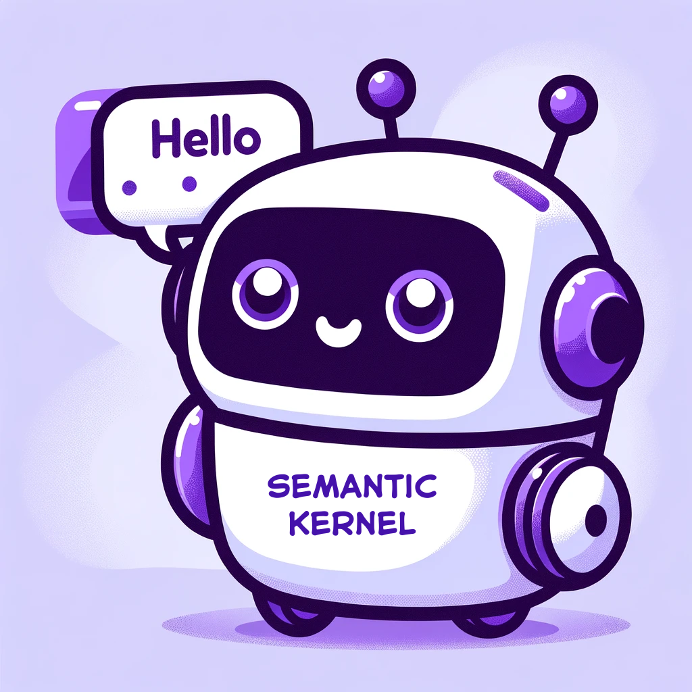

En este artículo vamos a ver una introducción a la librería Semantic
Kernel. Veremos como empezar con ella, qué problemas resuelve y sus
componentes principales.

**¿Qué es Semantic Kernel?**



**Semantic Kernel** es una librería Open Source
https://github.com/microsoft/semantic-kernel que permite combinar
fácilmente servicios de AI como OpenAI, Azure OpenAI, y Hugging Face con
lenguajes de programación convencionales, como C# y Python. De esta
forma, puedes crear aplicaciones de AI que combinan lo mejor de ambos
mundos.

**Componentes de Semantic Kernel**


Semantic Kernel ha sido desarrollado para permitir a los desarrolladores
integrar servicios de AI de forma flexible en sus aplicaciones
existentes. Para ello, proporciona un conjunto de conectores que
facilitan la adición de **memorias** y **modelos**, añadiendo un
"cerebro" simulado a la aplicación.

Además, facilita la adición de habilidades a las aplicaciones con
**plugins de AI**, que permiten interactuar con el mundo real mediante
**prompts** y **funciones nativas** que responden a disparadores y
realizan acciones, actuando como el "cuerpo" de la app de IA.

Gracias a la extensibilidad de Semantic Kernel con conectores y
**plugins**, se puede orquestar plugins de IA de OpenAI y Microsoft
sobre casi cualquier modelo. Por ejemplo, es posible orquestar plugins
diseñados para ChatGPT, Bing y Microsoft 365 Copilot sobre modelos de
OpenAI, Azure o incluso Hugging Face.

Semantic Kernel puede orquestar plugins de IA de cualquier proveedor.

Como desarrollador, puedes usar estos componentes individualmente o en
conjunto. Por ejemplo, si solo necesitas una abstracción sobre los
servicios de OpenAI y Azure OpenAI, podrías usar el SDK para ejecutar
prompts preconfigurados dentro de tus plugins, pero el verdadero poder
de Semantic Kernel proviene de combinar estos componentes.

Y hasta aquí la teoría, necesaria, ... pero ¡aburrida!... vamos al
barro, que es lo que nos gusta ☺.

[Nota]: para el resto del artículo, se asume la creación de
un servicio en Azure OpenAI, en el que se ha desplegado un modelo GPT.


**Inicializando el Kernel**

El Kernel es el punto de entrada de todo lo que pasa en Semantic Kernel.
Para poder ejecutar una función semántica, un planner, un plugin, o
simplemente llamar al servicio de OpenAI, necesitaremos pasar por el
Kernel. Lo podemos inicializar de varias maneras. En el siguiente
snippet se muestra una de ellas, donde se configura el Kernel para que
tenga acceso al servicio de chat de Azure OpenAI:


**Funciones semánticas**

Las funciones semánticas en Semantic Kernel, son meros "prompts" que se
envían al servicio de AI, junto con las "settings" que dicho servicio
requiera.

Dicho esto, el siguiente código crearía una Semantic Function en SK:


En el snippet anterior podemos ver el "prompt", así como las diferentes
settings para la llamada al servicio de AI: Número máximo de tokens para
la respuesta, Temperatura (algo así como cuánto de "creativo/original"
queremos que sea la respuesta), etc.

Luego, usando el omnipresente Kernel, convertimos ese prompt + settings,
en una Semantic Function.

Para poder ejecutar dicho prompt + settings contra el servicio de AI,
haríamos:


De nuevo tiramos del Kernel para ejecutar nuestra función semántica,
pasándole el "input" (que, si pensamos en la web de chatGPT que todos
conocemos, ese input sería lo que el usuario escribe en el cuadro de
texto) y pasando nuestra función semántica construida previamente.

Finalmente, tendremos el resultado de la función en ese objeto "result".

[Nota]: Semantic Kernel es una librería muy
"string-friendly". Prácticamente todo lo que entra y sale, son strings.
Es algo que me consta que el equipo de MS tiene previsto mejorar en
próximas versiones, pero de momento, así está. De hecho, si en algún
momento definís algún función nativa, y su tipo de salida no es string,
os saltará un error al compilar avisando de ello.

Veamos ahora otra forma de definir funciones semánticas. Podemos definir
funciones sin usar código C#, siguiendo una estructura jerárquica de
carpetas, y una combinación de 2 archivos:

-   **skprompt.txt** => contendrá la definición del "prompt" en sí
    mismo. Dicho fichero, aunque en formato TXT, tiene cierto "lenguaje"
    de plantillas, aceptando algo parecido a variables (luego veremos un
    ejemplo).

-   **config.json** => contendrá las settings que queremos enviar al
    servicio de Open AI.

Aquí podemos ver un ejemplo del contenido de ambos ficheros:

![Table 1][../images/numero58/semantic-kernel-azure-openai-para-novatos/table1.png]

Como veis, en el fichero de config, también está definiendo los
diferentes parámetros que formarán parte del prompt. Esto ayudará al
modelo a "entender" que hace, que utilidad tiene dicha función
semántica, que será muy necesario para cosas como planner (que veremos
en futuros artículos).

La siguiente imagen muestra cómo organizar nuestras carpetas para la
definición de varias funciones semánticas. La idea es poder agrupar
varias funciones relacionadas en el concepto de "plugin":


Una vez definidas nuestras diferentes funciones semánticas, las podemos
ejecutar con el siguiente código:

```
_functions = _kernel.ImportSemanticFunctionsFromDirectory(
    PathExtensions.GetPluginsRootFolder(),
    "TravelAgentPlugin");
```

En el snippet anterior, utilizamos el método del kernel
"ImportSemanticFunctionsFromDirectory" para cargar las funciones
semánticas disponibles en uno o varios plugins. A dicho método le
estamos pasando la ruta principal a la carpeta de Plugins, en nuestro
caso sería "*Plugins/Semantic*". Y como segundo parámetro, le damos el
nombre de la carpeta del plugin a importar, en este caso
"ResumeAssitantPlugin". Este último parámetro es un param array, por lo
que podríamos indicarle múltiples plugins a importar.

Una vez cargadas las funciones semánticas, podemos ejecutarla con el
siguiente código:

```
var variables = new ContextVariables();
variables.Set("City", "Sagunto");
variables.Set("NumberOfDays", "7");
```

Arriba, hemos definidos las variables de contexto que necesita nuestro
prompt. A continuación, ejecutamos nuestra función, pasando ese
Contexto:

```
var panMyTrip = await _kernel.RunAsync(
    variables,
    _functions["PlanMyTrip"]
);

_logger.LogInformation($"n{planMyTrip.GetValue<string>()}");
```

## Funciones Nativas

Además de funciones semánticas, SK tiene también el concepto de
funciones nativas. Dichas funciones, nos van a permitir poder ejecutar
código personalizado. ¿Por qué?, bueno, básicamente porque los modelos
LLM son muy buenos generando texto, pero todavía no son tan buenos
haciendo otras tareas, como por ejemplo:

-   Obtener datos de sistemas externos.

-   Saber que fecha/hora es, y por tanto operar con ellas.

-   Matemáticas complejas.

-   Ejecutando acciones concretas: enviar un email, completar un to-do,
    abrir un ticket de soporte.

-   Memorizando información.

Para todos estos casos, la solución es crear funciones nativas, donde
nuestro propio código c# será ejecutado.

En el siguiente ejemplo del artículo, vamos a ver cómo crear y ejecutar
funciones semánticas, pero además, vamos a ver como combinar funciones
semánticas y nativas.

Primero de todo, vamos a crear una función nativa, que va utilizar la MS
Graph API para sacar los "skills" del profile del usuario logado. Para
ello, definiremos una función en C# que haga dicha tarea, y para
convertirla en función semántica, simplemente usaremos el decorador
"**SKFunction**":


A continuación, vamos a crear otra función semántica, que va a hacer uso
de nuestra nueva función nativa.

![Table 2][../images/numero58/semantic-kernel-azure-openai-para-novatos/table2.png]

Fijaros como en el prompt, usando cierto lenguaje de plantilla, estamos
llamando a nuestra función nativa:

```
{{GraphSkillsPlugin.GetMySkills}}
```

Y el resultado, se "inyectará" como parte del prompt de la función
semántica.

Para ejecutar nuestra función semántica (que incluye una llamada a una
nativa), tendremos que importar ambas funciones. La manera de importar
la función semántica, es la que ya vimos en el ejemplo anterior:

```
_functions = _kernel.ImportSemanticFunctionsFromDirectory(
    PathExtensions.GetPluginsRootFolder(),
    "ResumeAssistantPlugin");
```

Para importar la nativa, tendremos que crear un objeto de la clase donde
está definida la función nativa, e importarla:

```
var graphSkillsPlugin = new GraphUserProfileSkillsPlugin(graphClient);
_kernel.ImportFunctions(graphSkillsPlugin, "GraphSkillsPlugin");
```

Una vez importadas las funciones semánticas y nativas, la ejecución
sigue el patrón ya conocido:

```
var mySkillsInfo = await _kernel.RunAsync(
    _functions["MySkillsDefinition"]
);

_logger.LogInformation($"-----MY SKILLS-----n{mySkillsInfo.GetValue<string>()}");
```

De esta manera tan potente, podemos combinar y anidar diferentes
funciones semánticas y nativas.

Y hasta aquí el artículo. Espero que os sea de utilidad.

¡Hasta el próximo artículo!

**Luis Mañez** <br /> 
Chief Architect en ClearPeople LTD <br /> 
\@luismanez <br /> 
https://github.com/luismanez


import LayoutNumber from '../../../components/layout-article'
export default LayoutNumber