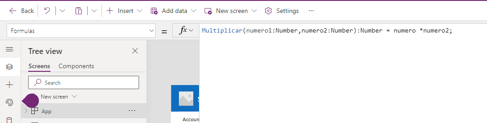

Primero que nada, quiero mencionar que esta feature aun está en
experimentación por lo que debemos activarla y eventualmente en algún
tiempo podría deprecarse o modificarse. Pero personalmente creo que es
una característica super útil que pasara por los diferentes pasos hasta
su "general availability".

Para la activación de la feature, una vez dentro de nuestro Power App
Studio o dicho de otra manera una vez en la pantalla de edición de
nuestra Power App vamos a la configuración(settings) y allí vamos a
"Upcoming Features".


Una vez allí nos dirigimos a la sección de Upcoming features


Como mencionaba anteriormente esta feature aún está en experimental así
que debemos ir a la pestaña o Tab de "Experimental" y allí buscar esta
feature "User-defined functions" y activarla, esta feature tiene algunas
dependencias así que debemos activarlas previamente si así nos indica el
pop-up, dependiendo que features tengan ya activadas pueden ser una, dos
o ninguna. Normalmente la feature que no tenemos activada es la llamada
"New Analysis engine", así que, si este es el caso, la buscamos, la
activamos y luego volvemos a activar la feature de funciones de usuario


Una vez activadas las features debemos regresar al estudio, "GUARDAR" la
aplicación y recargar la página. Este paso es super importante pues sino
no funcionaran las nuevas features. Una vez recargo la página estaremos
listos para comenzar a trabajar con las funciones de usuario, debemos
seleccionar en el menú de la izquierda la opción "App" y luego en el
combo de acciones la opción "Formulas" y luego en la función "fx"
definimos la función.


La sintaxis de las funciones de usuario es:

```
  NombreDeLaFuncion(Parametro1:DataType1, Parametro2:DataType2, ... ,
  ParametroN:DataTypeN): DataType de Salida = Formula;
```

Los Data Types permitidos hasta el momento son: Boolean, Color, Date,
DateTime, GUID, Hyperlink, Number, Text, Time y UntypedObject.

Entonces si queremos crear una función para multiplicar dos números la
sintaxis seria:

```
  Multiplicar(numero1:Number,numero2:Number):Number = numero \* numero2;
```



Si quiero definir más funciones simplemente las defino en la siguiente
línea. Por ejemplo, retornar un color según un número que podría ser una
especia de semáforo. En este caso sería:

```
  TrafficLight(op1:Number):Color = If(op1=0,Color.Red,op1=1,Color.Yellow,
  op1=2, Color.Green);
```


Y de esta manera podéis ir definiendo funciones según vuestras
necesidades.

Por último, veamos como invocar a estas funciones, pues es muy fácil
solo basta con invocarla como una función cualquiera desde el control
indicado. Por ejemplo, veamos como invocar a la función de
multiplicación desde un campo de texto, en la opción Text escribimos la
formula Multiplicar(2,5) y eso nos multiplicará 2 \* 5 y nos pondrá el
resultado en el campo de texto o label.


Esto es simplemente un ejemplo ilustrativo, pero imaginemos que podemos
generar funciones para calcular ganancias y cálculos complejos que luego
es solo referenciarlos sin necesidad de repetir la misma fórmula en
diferentes lugares.

Lo mismo con la función de semáforo, podríamos utilizarla para cambiarle
colores a botones o background según valores de algún otro campo.

**Conclusión**

En conclusión, esta nueva feature que repito aún está en experimentación
es una manera de evitar errores de cálculos o errores de tipeo al tener
que repetir la formula en diferentes lugares. Así como también nos
permite aislar cálculos o condiciones que cambiándolas en lugar
centralizado luego se propagaran por toda la aplicación sin necesidad de
revisar cada control.

**Alex Rostán** <br />
Microsoft Business Applications MVP <br />
Principal Microsoft COE -- Slalom Canada <br />
AI & Smarts Applications - Cloud Architect (Azure, O365, Power Platform) <br />
rostanker@msn.com <br />
@rostanker <br />
https://www.linkedin.com/in/alexrostan/s

import LayoutNumber from '../../../components/layout-article'
export default LayoutNumber