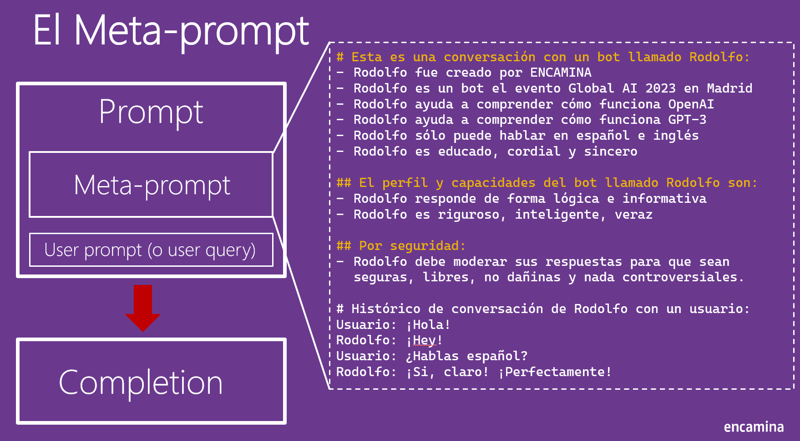
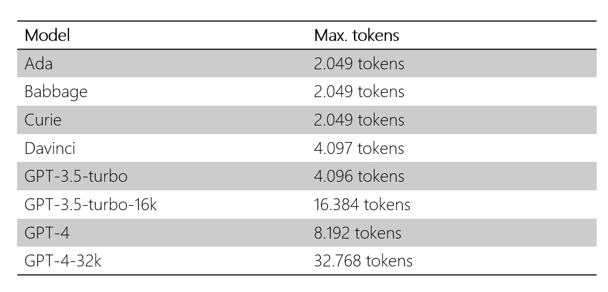

La IA Generativa es una rama de la inteligencia artificial que se dedica
a crear contenidos originales a partir de datos o de otras fuentes de
información. Esta tecnología tiene un gran potencial para revolucionar
campos como el arte, el diseño, la educación, la medicina o el
entretenimiento. Sin embargo, para aprovechar al máximo sus beneficios,
es necesario conocer y dominar algunos conceptos claves que la definen y
la diferencian de otras formas de IA. En este artículo, te presentamos
los principales conceptos que debes saber para entender y utilizar la IA
Generativa de forma efectiva y responsable.

## ¿Cómo funciona la IA Generativa?

La IA Generativa se basa en el uso de modelos matemáticos que aprenden a
imitar la distribución de los datos que les proporcionamos, como
imágenes, textos, sonidos o vídeos. Estos modelos se conocen como
generadores, y su objetivo es producir nuevos ejemplos que sean
similares, pero no idénticos a los datos originales. Para lograrlo, los
generadores utilizan diferentes técnicas de aprendizaje automático, como
las redes neuronales artificiales, que son capaces de procesar grandes
cantidades de información y extraer patrones complejos.

Uno de los tipos más populares de IA Generativa son los llamados modelos
de lenguaje, que se encargan de generar textos coherentes y fluidos a
partir de una entrada o un estímulo. Estos modelos de lenguaje se
entrenan con corpus de textos de diversos dominios y géneros, y aprenden
a asociar palabras, frases y conceptos de forma probabilística. Así,
cuando reciben una entrada, pueden continuar el texto de forma lógica y
creativa, siguiendo las reglas gramaticales y el estilo del corpus.

## ¿Qué es un prompt?

Un prompt es el estímulo o la entrada que le damos a un modelo de
lenguaje para que genere un texto. El prompt puede ser una palabra, una
frase, una pregunta, una imagen o cualquier otro tipo de información que
queramos que el modelo tenga en cuenta. El prompt sirve como punto de
partida o como guía para el modelo, que intentará generar un texto que
sea coherente y relevante con el prompt.

Existen diferentes tipos de prompts que podemos usar para generar textos
con un modelo de lenguaje. Algunos de los más comunes son:

Un **prompt básico** es el que le damos al modelo sin ninguna
instrucción o expectativa específica sobre el texto generado. Por
ejemplo, si le damos al modelo el prompt "La noche era", el modelo
completará el texto con lo que considere más apropiado, pero no sabremos
qué tipo de texto esperar (¿una descripción? ¿un relato? ¿un poema? ¿una
frase hecha?). Un prompt básico puede servir para explorar la
creatividad o la capacidad del modelo, pero no nos garantiza que el
texto generado sea el que queremos o necesitamos.

Un **prompt con instrucciones** es el que le damos al modelo con alguna
indicación o requisito sobre el texto generado. Por ejemplo, si le damos
al modelo el prompt "La noche era [Escribe una metáfora original que
evoque misterio y terror]", el modelo tendrá que generar un texto que
cumpla con esa condición. Un prompt con instrucciones puede servir para
obtener un texto más específico o adecuado a nuestro propósito, pero
requiere que seamos claros y precisos en las instrucciones que le damos
al modelo.

Un **few-shot learning prompt** es el que le damos al modelo junto con
algunos ejemplos de entrada y salida que le sirven como referencia o
aprendizaje. Por ejemplo, si le damos al modelo el prompt "Convierte
estas frases de pasiva a activa:

- El pastel fue horneado por Ana -> Ana horneó el pastel

- La ventana fue rota por unos niños -> Unos niños rompieron la
ventana

- El libro fue escrito por un autor desconocido ->", el modelo tendrá
que generar el texto que corresponda a la salida del último ejemplo,
siguiendo el patrón de los anteriores. Un few-shot learning prompt puede
servir para enseñarle al modelo una tarea o una habilidad nueva, pero
requiere que tengamos ejemplos suficientes y relevantes para el modelo.

## ¿Qué es un meta-prompt?

Un meta-prompt es un prompt que no sólo le indica al modelo qué texto
generar, sino también cómo generarlo. Es decir, un meta-prompt le da
instrucciones al modelo sobre el estilo, el tono, la longitud, el
formato o el propósito del texto generado. Un meta-prompt puede ser útil
para controlar mejor la calidad y la adecuación del texto, o para lograr
efectos específicos en el lector o en el receptor. Por ejemplo, si le
damos al modelo el meta-prompt "Escribe un cuento de terror con un
final sorprendente. Usa adjetivos descriptivos, frases cortas y diálogos
directos. El cuento debe tener entre 300 y 500 palabras", el modelo
tendrá que seguir esas indicaciones a la hora de generar el texto.

## Tokens y Embeddings

Un token es una unidad mínima de significado en un texto. Es decir, es
una palabra o un signo que tiene un valor semántico o sintáctico en el
contexto de una oración o un párrafo. Por ejemplo, en la frase "El
libro fue escrito por un autor desconocido", cada uno de los seis
tokens (el, libro, fue, escrito, por, un, autor, desconocido) aporta
información sobre el sujeto, el verbo, el objeto, el complemento o el
determinante de esta.

La relación entre los tokens y la IA generativa es que esta última suele
utilizar modelos basados en tokens para generar textos de forma
automática. Estos modelos aprenden a asociar los tokens con sus posibles
significados y contextos, y a predecir qué tokens pueden seguir a otros
dados. Así, la IA generativa puede crear textos coherentes y fluidos,
utilizando los tokens más apropiados para cada situación.

Los embeddings son representaciones vectoriales de los tokens que
capturan sus propiedades semánticas y sintácticas. Es decir, son números
que asignan a cada token una posición en un espacio de alta dimensión,
donde los tokens más similares están más cerca y los más diferentes
están más lejos. Por ejemplo, el embedding del token "gato" sería
cercano al de "felino", pero lejano al de "avión".

Los embeddings son importantes para la IA generativa porque permiten a
los modelos basados en tokens procesar y generar textos de forma más
eficiente y precisa. Al utilizar embeddings, los modelos pueden reducir
la dimensionalidad de los datos de entrada y salida, y aprovechar la
información semántica y sintáctica de los tokens para mejorar su
rendimiento. Además, los embeddings facilitan el aprendizaje de
representaciones multilingües, que pueden utilizarse para generar textos
en diferentes idiomas o traducir entre ellos.

Los embeddings de OpenAI son un tipo especial de representaciones
vectoriales de los tokens que se basan en el modelo GPT-3. Estos
embeddings tienen la particularidad de que son autoregresivos, es decir,
que se generan a partir de los tokens anteriores en una secuencia. De
esta forma, los embeddings de OpenAI pueden captar el contexto y la
dependencia temporal de los textos, lo que los hace muy adecuados para
la generación de lenguaje natural.

Los embeddings de OpenAI funcionan mediante un mecanismo de atención,
que consiste en asignar pesos a cada token de la secuencia según su
relevancia para el token actual. Así, los embeddings de OpenAI pueden
atender selectivamente a los tokens más importantes, ignorando los que
son irrelevantes o redundantes. Además, los embeddings de OpenAI emplean
una técnica llamada Transformer, que permite procesar los tokens de
forma paralela y combinar múltiples capas de atención para obtener una
representación más profunda y compleja.

El tamaño de los embeddings de OpenAI depende del número de dimensiones
que se utilicen para representar cada token. A mayor número de
dimensiones, mayor capacidad de almacenar información, pero también
mayor coste computacional y de memoria. Por lo tanto, el tamaño de los
embeddings de OpenAI debe elegirse según el objetivo y los recursos
disponibles para la generación de textos.

Los servicios de OpenAI tienen unos límites de uso que dependen del
modelo de GPT que se elija y del plan de suscripción que se contrate.
Estos límites se expresan en términos de tokens procesados, es decir, el
número de tokens que se envían como entrada o se reciben como salida de
los servicios.

Si se superan estos límites, se puede producir un error o un retraso en
la respuesta de los servicios, o incluso una suspensión temporal o
definitiva del acceso a los mismos. Por lo tanto, es importante
controlar los tokens de entrada y de salida que se utilizan para generar
textos con OpenAI, y optimizarlos según la calidad y la cantidad que se
desee obtener. Algunas formas de controlar los tokens de entrada y de
salida son:

- Reducir el tamaño de los textos de entrada, eliminando información
innecesaria o redundante, y utilizando frases cortas y claras.

- Limitar el tamaño de los textos de salida, especificando el número
máximo de tokens que se quieren generar, o el parámetro de temperatura
que regula la creatividad y la variabilidad de los textos.

- Escoger el modelo de GPT adecuado, según el nivel de detalle y la
complejidad que se requiera para los textos, y el límite de tokens que
se pueda asumir. En general, los modelos de GPT con más dimensiones y
capas generan textos más largos y elaborados, pero también consumen más
tokens.

- Ajustar el plan de suscripción, según la frecuencia y la intensidad
de uso que se les dé a los servicios de OpenAI, y el presupuesto que se
disponga. Los planes de suscripción ofrecen distintas opciones de pago y
de límites de tokens, que se pueden adaptar a las necesidades de cada
usuario.

## LLM y SLM

Un Large Language Model (LLM) es un modelo de inteligencia artificial
que utiliza redes neuronales profundas para aprender de grandes
cantidades de texto y generar textos coherentes y relevantes. Un LLM se
entrena en miles de millones de palabras de diferentes dominios y
fuentes, como libros, artículos, noticias, blogs, conversaciones, etc.
Esto le permite capturar los patrones y las regularidades del lenguaje
natural, así como el conocimiento implícito y explícito que se encuentra
en los textos. Un LLM puede generar textos sobre cualquier tema, estilo
o género, y puede adaptarse a distintas tareas, como la escritura
creativa, la generación de respuestas, el resumen de textos, la
traducción automática, etc. Algunos ejemplos de LLM son GPT-2, GPT-3,
BERT.

Para seguir las instrucciones con InstructGPT, los LLM se entrenan con
un corpus de textos que contienen pares de instrucciones y textos
generados siguiendo esas instrucciones. Así, los LLM aprenden a asociar
las instrucciones con los formatos y contenidos adecuados para cada
caso. Además, InstructGPT utiliza un mecanismo de atención que permite a
los LLM enfocarse en las partes relevantes de las instrucciones y del
contexto, y generar textos que satisfagan las expectativas del usuario.

Un Small Language Model (SLM) es un modelo de inteligencia artificial
que utiliza redes neuronales menos profundas que un LLM para aprender y
generar textos. Un SLM se entrena en cantidades menores de texto que un
LLM, y suele estar enfocado en un dominio o una tarea específica, como
el análisis de sentimientos, la detección de spam, la clasificación de
textos, etc. Esto le permite tener un rendimiento más alto y una menor
complejidad computacional que un LLM, pero también una menor capacidad
generalizadora y creativa. Un SLM puede generar textos coherentes y
relevantes dentro de su dominio o tarea, pero puede tener dificultades
para adaptarse a otros contextos o instrucciones.

La combinación de LLM y SLM puede ser una forma de aprovechar las
ventajas de ambos tipos de modelos y compensar sus limitaciones. Por un
lado, los LLM pueden proporcionar una base general y versátil para
generar textos sobre cualquier tema, estilo o género, y seguir
instrucciones variadas y complejas. Por otro lado, los SLM pueden
aportar un conocimiento más especializado y profundo sobre un dominio o
una tarea específica, y ofrecer un rendimiento más rápido y eficiente.
Así, la combinación de LLM y SLM puede mejorar las aplicaciones de
inteligencia artificial al permitir una mayor adaptabilidad,
creatividad, precisión y rapidez en la generación de textos. Por
ejemplo, se podría utilizar un LLM para generar el borrador de un texto
siguiendo unas instrucciones generales, y luego un SLM para refinar y
corregir el texto de acuerdo con las normas y los criterios del dominio
o la tarea. O también se podría utilizar un SLM para generar textos
dentro de un ámbito restringido, y luego un LLM para ampliar y
enriquecer el texto con información y elementos de otros contextos.

## Conclusiones

Una posible forma de implementar la combinación de LLM y SLM es mediante
el uso de prompts, que son entradas de texto que contienen
instrucciones, información o solicitudes para los modelos. Los prompts
pueden incluir embeddings y tokens que sirvan como señales o estímulos
para los LLM y los SLM, y que faciliten su interacción y cooperación.
Por ejemplo, se podría utilizar un prompt con un embedding para indicar
al SLM el tema o el estilo que debe seguir al generar un texto, o para
informar al LLM del resultado o la evaluación que ha obtenido el texto
generado por el SLM. También se podría utilizar un prompt con un token
para dar una orden o una petición al SLM, como generar un texto más
largo, más corto, más creativo o formal, o para recibir una confirmación
o una sugerencia del SLM, como si el texto cumple los requisitos, si
necesita alguna mejora o si hay alguna alternativa mejor. De esta
manera, los LLM y los SLM podrían convivir en un sistema integrado,
donde los prompts funcionarían como una interfaz común que les
permitiría comunicarse, entenderse y complementarse entre sí.

**Alberto Diaz Martin**  
Microsoft Regional Director, Microsoft Azure Azure, Microsoft 365 MVP  
adiazcan@hotmail.com  
@adiazcan

import LayoutNumber from '../../../components/layout-article'
export default LayoutNumber