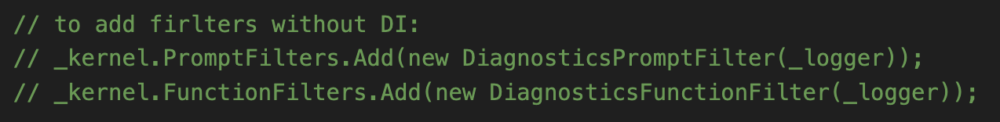
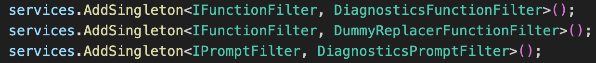

En este artículo vamos a ver que son los *Function* y *Prompt* filters
de Semantic Kernel. Veremos en qué nos pueden ayudar, y como crearlos y
usarlos en nuestro código.

***Disclaimer***: esta funcionalidad de Semantic Kernel, como todavía
mucha otra, se encuentra en fase experimental, asi que es muy posible
que sufra algunos cambios, o que incluso se descarte en favor de otra
solución, como de hecho parece que ha pasado con otro modelo que había
similar a los filtros y que parece que pronto será eliminado en favor de
los filtros. Mas adelante hablaremos también de este otro modelo, para
que vosotros mismos podáis opinar sobre qué modelo os gusta más.

**¿Qué problema resuelve los Function y Prompt filters?**

Las Function filters nos van a permitir ejecutar código personalizado,
justo antes y después de que se ejecute una Function del Kernel, bien
sea Semántica o Nativa. En el caso de los Prompt filters, nos permite
ejecutar nuestro código personalizado, justo antes y después de que el
Prompt se genere.

Esto nos ofrece cierto modelo de "pipeline" en lo que se refiere a la
ejecución de una Function, ya que nos permite registrar todos los
Filtros que queramos, y la ejecución ira pasando por cada uno de ellos,
según el orden en el que se registren.

**Not so long ago... Function Hooks**

Desde hace relativamente poco (Noviembre 2024, versión 1.0.0-beta6), y
hasta hace muy poquito (siendo precisos, 24 de Enero 2024, versión
1.2.0), Semantic Kernel ofrecía un modelo diferente de poder ejecutar
nuestro código en los momentos previos y posteriores a la ejecución de
la Function. Nos referimos al modelo de Hooks, basado en eventos. En
este modelo, el siguiente código nos muestra cómo funcionaba:

Básicamente lo que tenemos es la posibilidad de manejar 2 eventos a
nivel de Kernel:

-   FunctionInvoking: justo antes de la ejecución de la función.

-   FunctionInvoked: justo después de la ejecución de la función.

A pesar de que esto sigue siendo parte de Semantic Kernel, parece que va
a ser retirado y sustituido por los Filtros. Uno de los principales
problemas con este modelo basado en eventos, es que no soporta Inyección
de dependencias (algo que hoy en día es muy utilizado). Además, los
Event handler parecen cosa del pasado ☺.

**Function Filters**

Para crear un filtro de función, debemos implementar la interfaz
***IFunctionFilter***, como podemos ver en el siguiente código:

Como te puedes esperar, el método *OnFunctionInvoking* se ejecuta justo
antes de la ejecución de la función, y el *OnFunctionInvoked*, justo
después de la misma. Otra ventaja de los filtros frente a los eventos es
que con los filtros puedes crear todos los que necesites, y se
ejecutaran en el orden en que los registres. Por ejemplo, aquí tenemos
otro filtro que, además, altera el resultado final de la función.

Y, ¿cómo los registramos?, pues podemos hacerlo de 2 maneras diferentes.
La primera es directamente sobre la colección de filtros del objeto
Kernel:

La segunda opción es dentro de la propia inyección de dependencias:

Basta con registrar los filtros en la Service collection, ya que el
Kernel builder, llegado el momento, registrara en el Kernel todo aquel
objeto que implemente la interfaz IFunctionFilter y este registrado en
la Service collection.

**Prompt Filters**

De forma muy similar a los filtros de función, podemos crear y registrar
los filtros de Prompt. En este caso, implementaremos la interfaz
***IPromptFilter***.

De nuevo, OnPromptRendering es ejecutado justo antes de renderizar el
Prompt, y OnPromptRendered justo después de renderizarlo.

Para registrarlo, exactamente igual que para los filtros de funciones.

Y hasta aquí el artículo. Espero que os sea de utilidad.

¡Hasta el próximo artículo!

**Luis Mañez**  
Chief Architect en ClearPeople LTD  
Microsoft 365 Development MVP  
@luismanez  
https://github.com/luismanez

import LayoutNumber from '../../../components/layout-article'
export default LayoutNumber