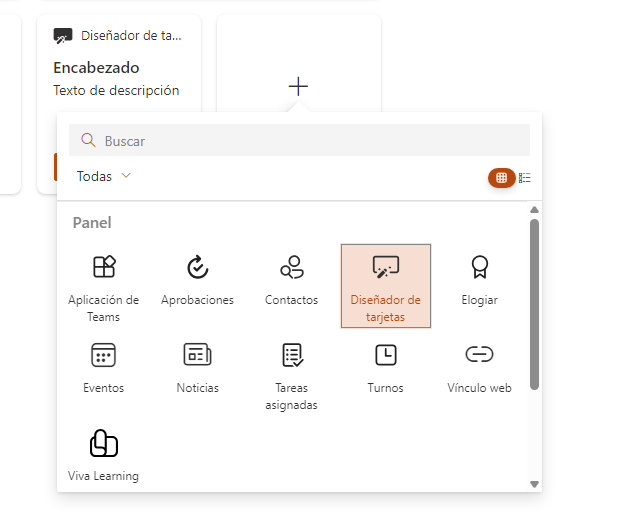
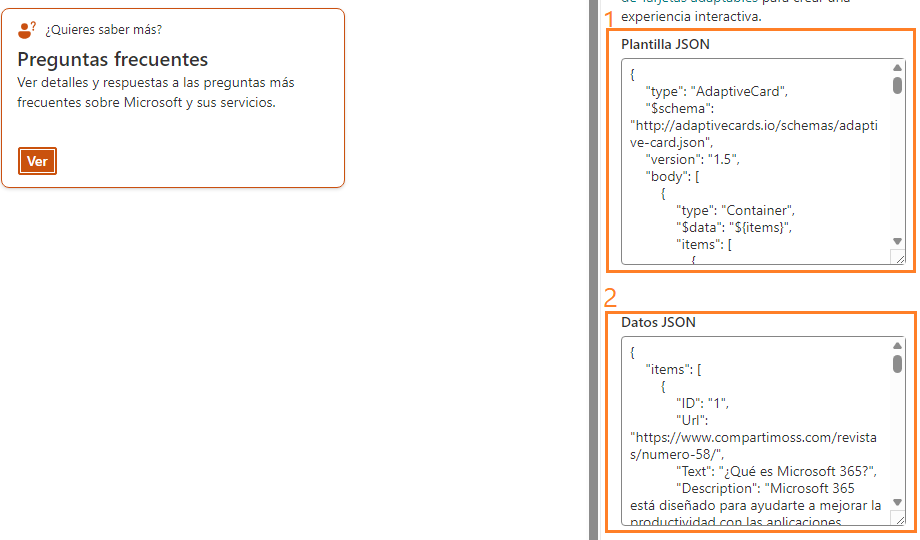
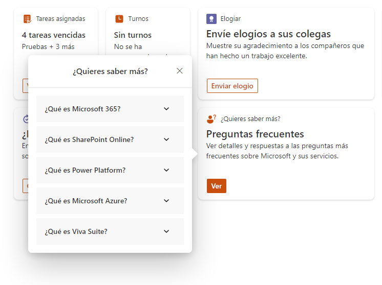
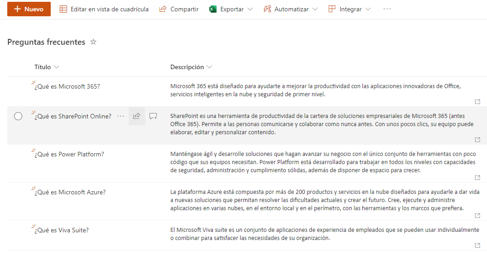
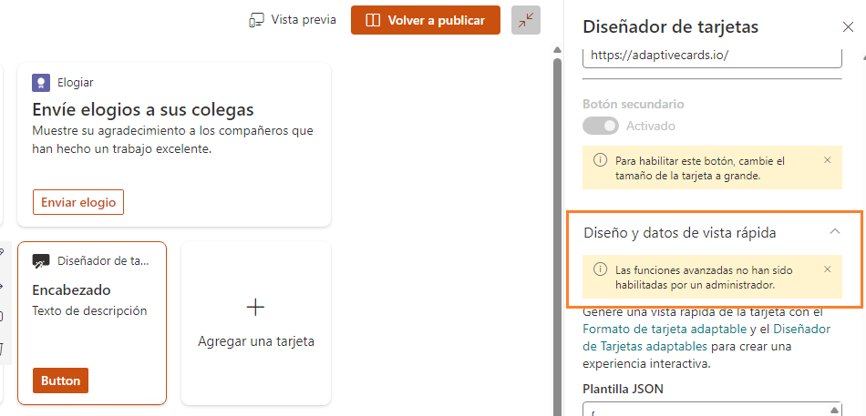
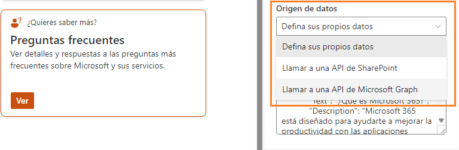
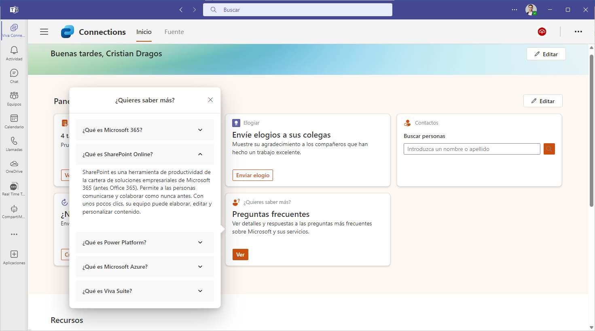

¿Sabías que puedes crear **tarjetas personalizadas en el dashboard de
Viva Connections** y manejar datos dinámicos desde la **API Graph** o
SharePoint sin necesidad de escribir ni una línea de código en SPFx? En
este articulo vamos a ver cómo funcionan las nuevas tarjetas
personalizadas, como integrarlas con APIs, como crearlas y como se
visualizan en el dashboad de Viva Connections.

**¿Qué necesitamos para empezar?**

Anteriormente he creado un sitio de SharePoint Online, que tengo
configurado como centro principal para Viva Connections ([como
configurar Viva
Connections](https://learn.microsoft.com/es-es/viva/connections/set-up-admin-center)).
Una vez configurado lo anterior tenemos la posibilidad de usar el
dashboard de Viva Connections, pudiendo añadir tarjetas de diferentes
tipos que están disponibles de caja, pero hay un tipo de tarjeta
especial y es el "**Diseñador de tarjetas**".




Al configurar esta tarjeta, en el panel lateral de propiedades podemos
añadir diferentes datos, así como título, descripción, configurar varios
botones dentro de nuestra tarjeta, icono, la plantilla de adaptive card
que queremos usar en formato JSON y los datos a mostrar en formato JSON
también.

**¿Cómo mostramos datos en una tarjeta personalizada?**

Dentro del panel lateral, en el campo "Plantilla JSON" añadimos la
definición de nuestra adaptive card en formato JSON:




Una vez configurado lo anterior, guardamos el dashboard y publicamos la
página. Como sabéis, este dashboard lo podemos ver desde diferentes
sitios: SharePoint Online y Microsoft Teams. En mi caso la visualización
es sencilla, un acordeón con título y descripción donde puedo ir
haciendo click y desplegar cada una de las preguntas que he informado en
el campo de Datos JSON.




Y te preguntarás... vale, ¿**y dónde están las APIs**?

Sigue leyendo que ahora viene lo bueno.

**¿Cómo usamos datos "dinámicos"?**

Hasta ahora hemos visto como crear una tarjeta, con nuestro diseño
personalizado en formato adaptive card y con una fuente de datos que
hemos configurado en formato JSON, pero imaginaros que el día de mañana
quiero añadir una pregunta frecuente más a nuestro acordeón dentro de la
tarjeta. Muy fácil, editamos el JSON de datos y añadimos un elemento
más... **¡ERROOOOR!**

Lo que voy a hacer es crear una lista de SharePoint Online (con dos
campos de título y descripción que usamos en la adaptive card). Esta
lista la voy a llamar "PreguntasFrecuentes". Una vez creada la lista voy
a hacer que mi tarjeta lea los datos a través de la API Graph y así no
tener que hacer cambios en el dashboard y el día de mañana cuando
necesite algún cambio en los datos, iré a mi lista de SharePoint Online
y editare los elementos en esta lista.

Haciendo esta extensión a la tarjeta tengo un control mucho más extenso
sobre los datos, mediante permisos, pudiendo elegir la visibilidad de
los elementos según usuarios, podríamos añadir un flujo de aprobación
sobre los ítems de la lista u otras lógicas añadidas.




**¿Cómo habilitamos el uso de las APIs en la configuración de las
tarjetas?**

Por defecto esta opción esta deshabilitada a nivel de tenant. De hecho,
en el panel de configuración de la tarjeta tendremos un mensaje de aviso
que nos indica esto:




Para habilitar esta funcionalidad necesitamos lanzar un comandao de
PowerShell con el parámetro **IsDataAccessInCardDesignerEnabled** puesto
a true:

**"Set-SPOTenant -IsDataAccessInCardDesignerEnabled $true"**

También necesitamos crear el catálogo de aplicaciones de SharePoint
Online (si no tenemos uno creado ya). Solamente accediendo a esta url:

```
https://{nombre del tenant}**-admin.sharepoint.com/_layouts/15/tenantAppCatalog.aspx**
```

forzaremos la creación del catálogo de aplicaciones si no está creado
ya.

Una vez hecho estos dos pasos, volvemos a la configuración del dashboard
de Viva Connections, editamos la tarjeta personalizada que hemos creado
anteriormente y veremos que ahora tenemos una configuración más donde
podremos elegir el "**Origen de datos**":




En mi caso voy a elegir "**Llamar a una API de Microsoft Graph**" y a
continuación introducir la URL a la API donde especificaré todos los
parámetros necesarios, así como el endpoint de la API que quiero
recuperar, el GUID de la lista de "Preguntas frecuentes" y algún detalle
más, quedando algo así:

"**/v1.0/sites/root/lists/1d52b3bd-ad08-4a17-93b7-3afbfc3abc83/ítems**"

A continuación, introducimos esta URL en el campo de "**Solicitar URL**"
y le damos al botón "**Prueba**" para ver los resultados... te digo
desde ya que te vas a encontrar con un **error de acceso denegado**. ¿Y
porque será?

Estamos utilizando la API Graph. ¿Qué se necesita para usar esta API?:
**peeeermisos**.

Estos permisos necesitamos dárselos a través de Microsoft Entra ID
(aplicaciones registradas) y buscar el registro de aplicación de
"**SharePoint Online Client Extensibility Web Application Principal**".

Para el endpoint que he utilizado en este ejemplo se necesitan permisos
delegados para Microsoft Graph: Sites.Read.All y aprobamos la solicitud
de permisos con un usuario administrador.

Después de hacer esta última configuración de permisos, podemos volver
al dashboard y probar el resultado.

(Es posible que necesitemos ajustar la plantilla JSON de la tarjeta ya
que la fuente de datos ha cambiado y la estructura de los resultados
también).




**Consideraciones**

Como colofón y a modo de conclusiones de este artículo:

-   Se necesita tener creado el catálogo de aplicaciones porque la
    tarjeta personalizada se despliega como una solución dentro del
    mismo, de manera automática, una vez guardada y publicada la página
    del Dashboard de Viva Connections.

-   Actualmente la experiencia de configuración no es del todo amigable,
    pero en un futuro próximo será mejorada por Microsoft.

**Ahora te toca a ti .**

GitHub con la info. del articulo:
https://github.com/cdragosf/VivaConnectionsCards

**Cristian Dragos Fedotov** <br />
Microsoft 365 Solutions Architect en NTT DATA  <br />
cristianfedotov@gmail.com <br />
https://www.linkedin.com/in/cristianfedotov/

import LayoutNumber from '../../../components/layout-article'
export default LayoutNumber