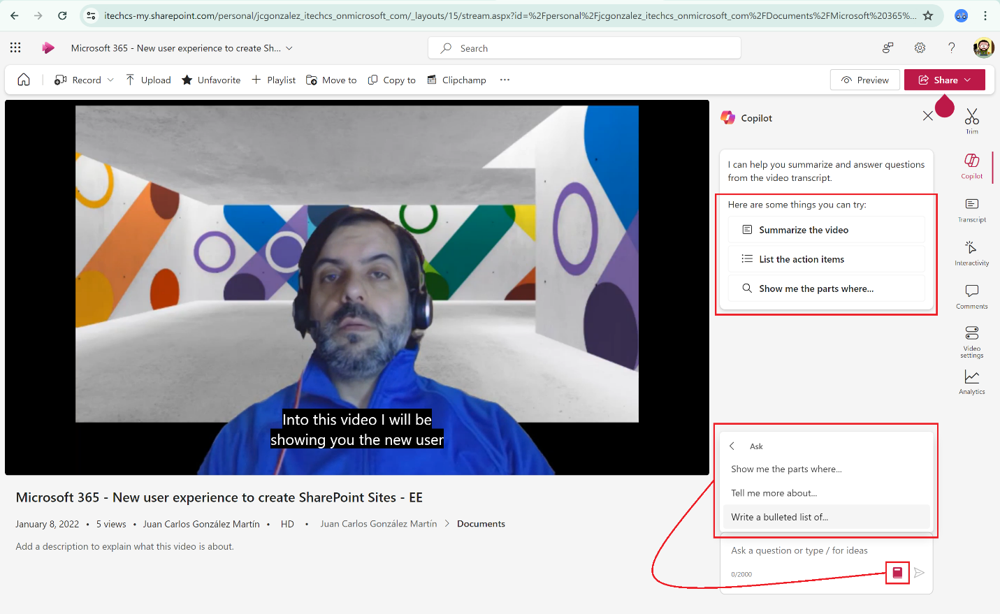

Uno de los últimos Copilots "liberado" por Microsoft como parte de
Copilot para Microsoft 365 es Copilot para Microsoft 365 que facilita a
los usuarios que puedan realizar consultas e interactuar con videos
gestionados en Microsoft 365 independientemente de su origen (reuniones
de Teams, creados por los usuarios, cargados por los usuarios, etc). En
este artículo vamos a hacer un recorrido sobre el actual Copilot para
Microsoft Stream.

**Como funciona Copilot para Microsoft Stream**

Copilot para Microsoft Stream está disponible en el contexto de
cualquier video disponible en Stream, pero requiere que se disponga un
transcript del mismo o bien que se genere el mismo. Si no hay un
transcript generado, Copilot aparecerá como deshabilitado:

Generar un transcript de un video, si no lo tiene, es una tarea
relativamente sencillo como parte de las opciones disponibles en las
configuraciones del video. Podemos generar el transcript o bien
cargarlo:

Una vez el transcript está disponible, ya podemos comenzar a utilizar
Copilot para Microsoft Stream (Nota: A tener en cuenta que tendréis que
refrescar la página para que Copilot esté operativo).

**Usando Copilot para Microsoft Stream**

¿Qué es lo que podemos hacer con Copilot para Microsfot Stream? Como
podéis ver en pantalla, los casos de uso habituales son:

-   Resumir el video.

-   Listar los elementos de acción.

-   Preguntar por aspectos concretos del video.

Además, tenemos la opción de visualizar prompts adicionales:

Por ejemplo, si le pedimos a Copilot un resumen del video este es el
resultado:

-   Se muestra el resumen del video.

-   Se incluyen citas a los momentos concretos del video donde un tema
    específico del resumen del video se trata.

Si seguimos interrogando a Copilot para Stream en este caso por las
ideas principales del video, este es el resultado:

-   Por cada idea se muestran Pros y Cons.

-   De nuevo, se incluyen citas a los momentos concretos del video donde
    se trata la idea.

**Conclusiones**

Copilot para Microsoft Stream es uno de los últimos Copilots que se
incorpora dentro de Copilot para Microsoft 365. Habilita escenarios de
consulta de contenidos e ideas tratadas en videos de Stream que pueden
proceder de grabaciones de reuniones de Microsoft Teams o bien videos
grabados/cargados por el usuario.

**Juan Carlos Gonzalez**  
Microsoft 365 MVP | M365 SME & Delivery Manager  
@jcgm1978 | https://www.linkedin.com/in/juagon/  

import LayoutNumber from '../../../components/layout-article'
export default LayoutNumber