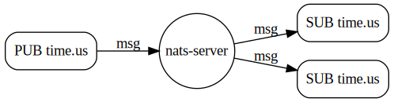
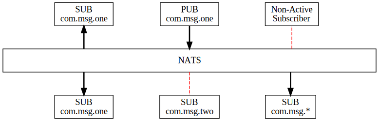

En las arquitecturas modernas, es bastante común tener servicios de
mensajería como piezas clave para nuestros sistemas distribuidos. Dentro
de Azure, es seguro que el lector conoce servicios como Azure Service
Bus o Azure Event Hub, y fuera de Azure también conoce sistemas bastante
conocidos como Kafka o RabbitMQ. NATS es otro sistema de mensajería que
está aumentando su popularidad debido a que está diseñado como un
sistema de mensajería ligero, rápido y de baja latencia. Emplea un
modelo de publicación/suscripción (pub/sub) y es conocido por su
simplicidad y eficiencia.

Las principales características que nos ofrece NATS como sistema de
mensajería son:

-   **Simplicidad y Desempeño**: NATS es conocido por su simplicidad en
    la configuración y su alta velocidad de procesamiento de mensajes.

-   **Modelo Pub/Sub**: Permite la comunicación asincrónica entre
    productores y consumidores mediante temas.

-   **Conectividad**: Ofrece una alta disponibilidad y es capaz de
    manejar grandes cantidades de conexiones concurrentes.

-   **Persistencia**: Por defecto, NATS no persiste mensajes, aunque
    agrega capacidades de persistencia y almacenamiento de mensajes.

NATS es un sistema que está en auge debido a que es ideal para
aplicaciones que requieren baja latencia y alta velocidad, y encaja
perfectamente en sistemas de microservicios, debido a la simplicidad y
eficiencia en la comunicación de los mismos.

**Antes de empezar: un poco de contexto**

Es importante, antes de empezar a hablar de la tecnología, entender muy
bien cuál es el contexto en el que se puede usar NATS y por qué es una
tecnología que tengo muy en cuenta en el desarrollo actual.

Primero de todo, en el proceso de adopción de Kubernetes por parte del
producto/organización en la que estás involucrado, es algo natural
comparar productos que puedes ejecutar dentro de Kubernetes en lugar de
servicios de Azure que estás ejecutando. ¿Por qué? Una vez que ya tienes
un clúster de ejecución, es natural dentro del concepto FinOps valorar
si el servicio que estás usando puede ser más económico y con las mismas
prestaciones que lo que estás ejecutando dicho servicio. En este caso,
hay alternativas en Azure como Azure Service Bus, Colas de Storage o
EventHub que, dependiendo de las necesidades de tu proyecto, puede ser
una alternativa muy buena. Sin embargo, eso tiene un coste junto con un
ahorro, como puede ser evitar el mantenimiento de dicho servicio. Fuera
del ecosistema de Azure, hay otros servicios como RabbitMQ o Kafka, que
son sistemas bastante complejos de administrar y que requieren bastante
tiempo de administración y un grado de conocimiento de la tecnología
bastante elevado. Esto quiere decir que si ponemos en una balanza entre
un servicio PaaS o un servicio administrado en equipos que no tengan
conocimiento sobre sistemas de colas, tienes una dependencia del
servicio escogido.

Ante esta disyuntiva y por otras muchas razones que no vienen al caso en
este artículo, existe la Cloud Native Computing Foundation (CNCF), donde
hay muchos proyectos Open Source, sostenidos por la comunidad, que te
liberan de atarte a un "vendor". No olvidemos que uno de los motivos por
los que las organizaciones adoptan Kubernetes es para poder ser
agnósticos en la medida de lo posible del cloud. Dentro de estos
proyectos está NATS, por lo que si estás en un ecosistema de Kubernetes
y estás dudando en determinadas piezas sobre qué opción elegir, revisa
los proyectos que están certificados por la CNCF ya que dan una
seguridad y pueden ayudar en la visión de tu producto.

**¿Qué debemos de saber para poder sacarle todo el partido a NATS?**

Cuando usamos un sistema de mensajería, tenemos que tener claro tanto
cómo vamos a publicar el mensaje como cómo lo vamos a consumir.

A la hora de publicar, hay poco cambio entre un publicador de NATS y un
publicador de Service Bus, por ejemplo. Publicamos un mensaje en NATS,
el concepto se llama Stream, pero podemos llamarle cola, tópico o el
nombre que estemos acostumbrados a llamarle. Es importante el concepto
de Subject, que es el nombre que le queremos poner al mensaje. Cuando
identifiquemos un consumidor, lo tendremos a la escucha del Stream en
base al Subject que nos interese.



Ahora bien, en los consumidores, tenemos que tener claro cómo funciona y
es algo que debemos tener muy en cuenta para poder preparar bien nuestro
sistema y sacarle todo el partido a NATS. El consumidor que
implementamos estará suscrito a un determinado Subject. Este Subject es
una cadena que puede estar vinculada a una determinada cadena. Esta
cadena, por ejemplo, puede ser aplicación.pedidos.aceptados. Podemos
tener un microservicio que esté leyendo todo lo que esté vinculado al
Subject aplicación.pedidos.\*, o bien, por ejemplo, podemos tener un
microservicio que gestione todos los pedidos aceptados de un país, de
esta forma, dependiendo de cómo tengamos los mensajes, podemos ir
creando nuestros consumidores. Dentro de todos los conceptos que tiene
NATS, quizás el de Subject es el que tenemos que tener más claro y
pensado en nuestro desarrollo. Es un concepto un tanto diferente, por
ejemplo, al de Service Bus, donde creamos suscriptores de los tópicos
que nos hacen falta. Esto provoca que necesitemos un mayor acoplamiento
de nuestros desarrollos a la estructura del Service Bus y para poder ir
escalando a más países necesitaremos ir definiendo diversos
suscriptores. En NATS tenemos un único canal donde se publican todos los
mensajes (con las características específicas) y los consumidores los
leen si lo necesitan, y si durante el tiempo establecido el mensaje no
se ha leído, el mensaje se pierde.

Si vamos a migrar una aplicación ya existente para que use NATS, es
importante pensar en nuestra topología de mensajes para poder sacarle
mucho partido a este sistema de mensajería.



Cuando usamos un sistema de mensajería tenemos que tener claro por una
lado tanto como vamos a publicar el mensaje como como lo vamos a
consumir.


**Manos a la obra**

Una vez que ya sabemos a grandes rasgos la filosofía de trabajo que
tiene NATS, vamos a empezar a utilizarlo. El primer paso es crear
nuestra infraestructura. Para instalar un servidor de NATS tenemos
bastantes posibilidades, instalarlo en nuestra máquina o bien usar un
Docker para usarlo. Para empezar, es recomendable usar Docker ya que
cualquier aspecto de tu instalación, una vez apagado el contenedor,
dejará tu ordenador mucho más limpio que antes. Los pasos para ponerlo
son muy sencillos:

docker run -p 4222:4222 -p 8222:8222 -p 6222:6222 \--name nats-server
-ti nats:latest

A continuación, si todo ha ido bien se visualizará la siguiente pantalla


Para testar que está funcionando correctamente bastará con abrir un
telnet al puerto que hemos expuesto en nuestro Docker

telnet localhost 4222

Una vez que tenemos el servidor de NATS, lo que vamos a hacer es crear
una aplicación de consola para publicar un mensaje.

Instalaremos el paquete de NuGet de NATS.

A continuación, con un código como el siguiente publicaríamos el
mensaje:

```csharp	
using System.Text;

using NATS.Client;

using NATS.Client.JetStream;

using NATSExamples;

namespace Nats.Pub;

/// \<summary\>

/// This example will demonstrate JetStream publishing.

/// \</summary\>

internal static class JetStreamPublish

{

private const string Usage =

\"Usage: JetStreamPublish \[-url url\] \[-creds file\] \[-stream
stream\] \" +

\"\[-subject subject\] \[-count count\] \[-payload payload\] \[-header
key:value\]\" +

\"\\n\\nDefault Values:\" +

\"\\n \[-stream\] example-stream\" +

\"\\n \[-subject\] example-subject\" +

\"\\n \[-payload\] Hello\" +

\"\\n \[-count\] 10\" +

\"\\n\\nRun Notes:\" +

\"\\n - count \< 1 is the same as 1\" +

\"\\n - quote multi word payload\" +

\"\\n - headers are optional, quote multi word value, no colons \':\' in
value please!\";

public static void Main(string\[\] args)

{

ArgumentHelper helper = new ArgumentHelperBuilder(\"JetStream Publish\",
args, Usage)

.DefaultStream(\"example-stream\")

.DefaultSubject(\"example-subject\")

.DefaultPayload(\"Hello\")

.DefaultCount(10)

.Build();

try

{

using (IConnection c = new
ConnectionFactory().CreateConnection(helper.MakeOptions()))

{

// Use the utility to create a stream stored in memory.

JsUtils.CreateStreamOrUpdateSubjects(c, helper.Stream, helper.Subject);

// create a JetStream context

IJetStream js = c.CreateJetStreamContext();

int stop = helper.Count \< 2 ? 2 : helper.Count + 1;

for (int x = 1; x \< stop; x++)

{

// make unique message data if you want more than 1 message

byte\[\] data = helper.Count \< 2

? Encoding.UTF8.GetBytes(helper.Payload)

: Encoding.UTF8.GetBytes(helper.Payload + \"-\" + x);

// Publish a message and print the results of the publish
acknowledgement.

Msg msg = new Msg(helper.Subject, null, helper.Header, data);

PublishAck pa = js.Publish(msg);

Console.WriteLine(\"Published message \'{0}\' on subject \'{1}\', stream
\'{2}\', seqno \'{3}\'.\",

Encoding.UTF8.GetString(data), helper.Subject, pa.Stream, pa.Seq);

}

}

}

catch (Exception ex)

{

helper.ReportException(ex);

}

}

}

Como implementariamos un consumidor, el ejemplo es con fines para
familiarizarse con la el cliente de Nats.

No tiene mucho misterio el como implementarlo:

using NATS.Client;\
using NATS.Client.JetStream;\
using NATSExamples;\
\
namespace Nats.Consumer;\
\
\
internal static class JetStreamPullSubFetch\
{\
private const string **Usage** =\
\"Usage: JetStreamPullSubFetch \[-url url\] \[-creds file\] \[-stream
stream\] \" +\
\"\[-subject subject\] \[-durable durable\] \[-count count\]\" +\
\"\\n\\nDefault Values:\" +\
\"\\n \[-stream\] fetch-stream\" +\
\"\\n \[-subject\] fetch-subject\" +\
\"\\n \[-durable\] fetch-durable\" +\
\"\\n \[-count\] 15\";\
\
public static void Main(string\[\] args)\
{\
ArgumentHelper helper = new ArgumentHelperBuilder(\"Pull Subscription
using primitive Expires In\", args, **Usage**)\
.DefaultStream(\"fetch-stream\")\
.DefaultSubject(\"fetch-subject\")\
.DefaultDurable(\"fetch-durable\")\
.DefaultCount(15)\
.Build();\
\
try\
{\
using (IConnection c = new
ConnectionFactory().CreateConnection(helper.MakeOptions()))\
{\
*// Create a JetStreamManagement context.\
*IJetStreamManagement jsm = c.CreateJetStreamManagementContext();\
\
*// Use the utility to create a stream stored in memory.\
*JsUtils.CreateStreamExitWhenExists(jsm, helper.Stream,
helper.Subject);\
\
*// Create our JetStream context.\
*IJetStream js = c.CreateJetStreamContext();\
\
*// Start publishing the messages, don\'t wait for them to finish,
simulating an outside producer.\
*JsUtils.PublishInBackground(js, helper.Subject, \"fetch-message\",
helper.Count);\
\
*// Build our consumer configuration and subscription options.\
// make sure the ack wait is sufficient to handle the reading and
processing of the batch.\
// Durable is REQUIRED for pull based subscriptions\
*ConsumerConfiguration cc = ConsumerConfiguration.Builder()\
.WithAckWait(2500)\
.Build();\
PullSubscribeOptions pullOptions = PullSubscribeOptions.Builder()\
.WithDurable(helper.Durable) *// required\
*.WithConfiguration(cc)\
.Build();\
\
*// subscribe\
*IJetStreamPullSubscription sub = js.PullSubscribe(helper.Subject,
pullOptions);\
c.Flush(1000);\
\
int red = 0;\
while (red \< helper.Count)\
{\
IList\<Msg\> list = sub.Fetch(10, 1000);\
foreach (Msg m in list)\
{\
Console.WriteLine(\$\"{++red}. Message: {m}\");\
m.Ack();\
}\
}\
\
*// delete the stream since we are done with it.\
*jsm.DeleteStream(helper.Stream);\
}\
}\
catch (Exception ex)\
{\
helper.ReportException(ex);\
}\
}\
}
```

Dentro del GitHub de NATS existen muchos más casos de uso
https://github.com/nats-io/nats.net.v2 para que puedas ver toda la
potencia que tiene este sistema de mensajería y cómo le viene como
anillo al dedo a tu desarrollo en AKS.

**Conclusión**

La adopción de un servicio de mensajería conlleva la adaptación de tus
desarrollos a ese tipo de arquitectura. Algo que en muchas ocasiones
solemos hacer es pensar qué necesitamos resolver y cómo lo queremos
resolver, y de esta forma, seguro que utilizamos mucho mejor las
herramientas.

NATS es un sistema de mensajería que se adapta perfectamente a las
arquitecturas de microservicios, es bastante fácil de usar y con un
rendimiento alucinante. Si estás buscando una alternativa a servicios
propietarios de un Cloud o alternativas a productos más comerciales o
famosos, échale un vistazo, ya que lo más seguro es que se adapte
perfectamente a lo que estás buscando.

Happy Coding!

**Adrián Diaz Cervera** <br />
Technical Lead at SCRM Lidl Hub International <br />
Azure and M365 Development MVP <br />
http://theavenger.dev <br />
@AdrianDiaz81


import LayoutNumber from '../../../components/layout-article'
export default LayoutNumber