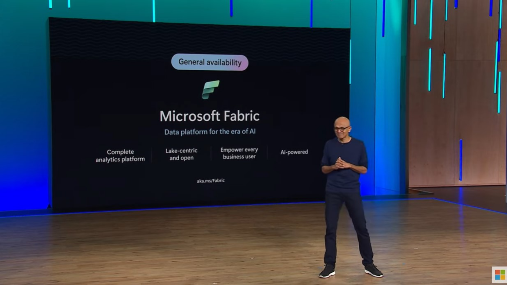
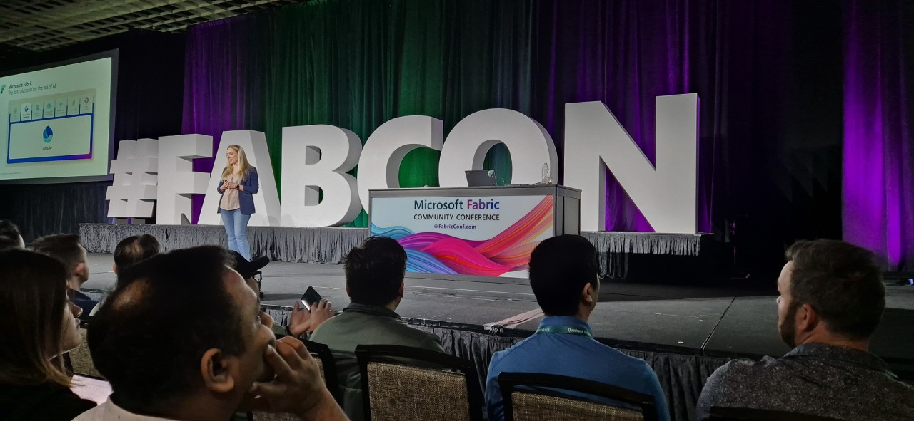
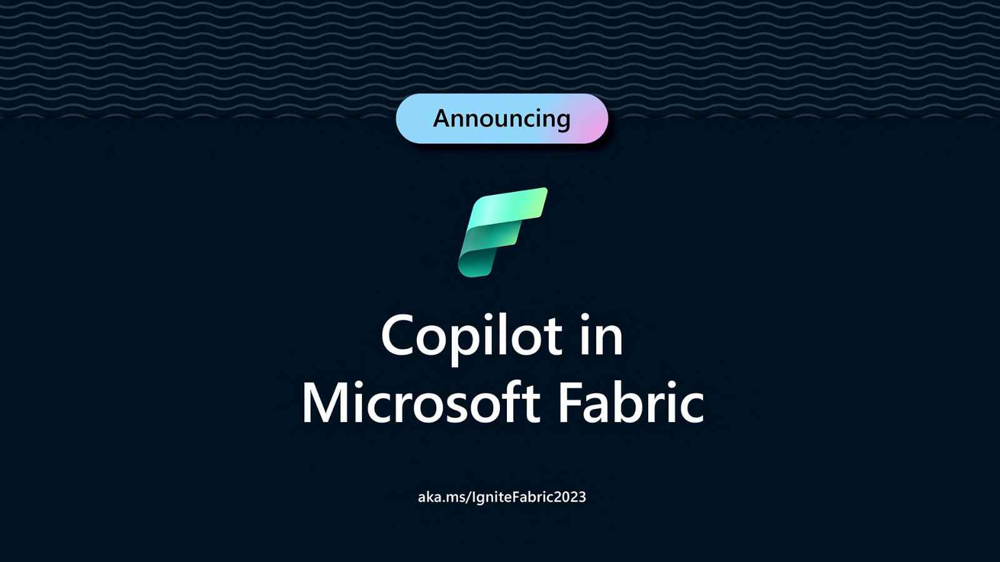
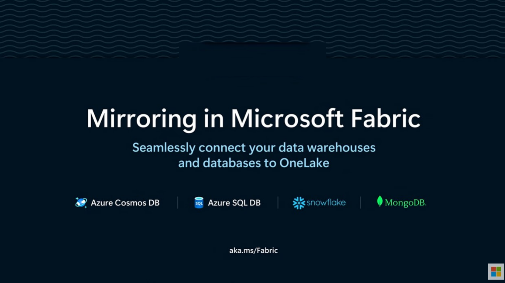

Ya hemos mencionado el anuncio sobre Microsoft Fabric, que fue
presentado en sociedad como Public Preview en mayo de 2023 durante el
Microsoft Build para luego ser presentado como General Availability en
noviembre durante Microsoft Ignite.

Para hacer un breve resumen, Microsoft Fabric es una plataforma de data
analytics integral diseñada para organizaciones que buscan una solución
unificada para el manejo de datos. Ofrece servicios de punta a punta que
incluyen Ingeniería de Datos, Data Factory, Ciencia de Datos, Análisis
en Tiempo Real y Data Warehouse. Con Fabric, las empresas pueden
centralizar el almacenamiento de datos con OneLake y aprovechar las
funcionalidades de inteligencia artificial sin necesidad de
integraciones manuales.

Microsoft Fabric integra componentes independientes, lo que facilita la
administración y gobernanza centralizadas, y proporciona un acceso fácil
y la reutilización de todos los recursos. Además, al ser una plataforma
basada en IA, ayuda a extraer más valor de los datos, unificando datos y
servicios, incluyendo Lakehouses y Data Warehouses

En resumen, Microsoft Fabric es una solución de análisis all-in-one que
abarca desde el movimiento de datos hasta la ciencia de datos y el
análisis en tiempo real, facilitando la transición hacia la era de la
inteligencia artificial.

Otra característica de Microsoft Fabric es que es una solución Software
as a Service (SaaS) lo que permite poder crear una prueba de concepto o
un proyecto de datos en pocos minutos, y sin tener que instalar ningún
software

**Novedades en Fabric**

Fabric Community Conference

Durante el pasado mes de abril, Microsoft a llevado a cabo la primer
Fabric Community Conference en la Vegas donde ha realizado varios
anuncios. Con más de 4200 asistentes, la primera de muchas #FABCON ha
sido un gran existo

Recientemente, Microsoft ha anunciado la primer Microsoft Fabric
Community Conference Europa, que se llevara a cabo en Estocolmo, Suecia,
entre los días 25 y 27 de septiembre, y donde, seguramente, seguiremos
viendo nuevas cualidades de esta nueva plataforma de datos

**Certificación DP-600** : Aprobando el examen DP-600, "Implementación
de soluciones de análisis con Microsoft Fabric" podremos obtener la
certificación de "Fabric Analytics Engineer Associate", para poder
prepararnos para dicho examen, Microsoft ha puesto a disposición varios
canales de aprendizaje totalmente gratuitos, por ejemplo, en Microsoft
Learn , tenemos disponible un curso de 9 episodios llamado "Microsoft
Learn Together Microft Fabric" que está totalmente en español.

-   9 episodios sobre Microsoft Fabric:
    https://aka.ms/learnlive-microsoft-fabric-aprender-juntos

-   Como Pasar el Examen DP-600:
    https://aka.ms/learnlive-fabric-dp-600-cram-sessions

**Copilot en Microsoft Fabric**

Copilot para ciencia de datos e ingeniería de datos es un conjunto de
herramientas mejorado mediante AI que ayudan a los profesionales de los
datos en su flujo de trabajo, nos asiste con la finalización inteligente
de código, automatiza tareas rutinarias y proporciona plantillas de
código estándar para facilitar la creación de ETLs y la de modelos
analíticos complejos. Mediante algoritmos avanzados de aprendizaje
automático, Copilot ofrece sugerencias de código contextuales que se
adaptan a la tarea específica en cuestión, lo que le ayuda a programar
más eficazmente y con mayor facilidad. Desde la preparación de los datos
hasta la generación de conclusiones, Microsoft Fabric Copilot actúa como
ayuda interactiva, lo que aligera la carga que tienen los ingenieros y
científicos, y acelera el recorrido desde los datos sin procesar hasta
la obtención de conclusiones significativas.

Copilot para Data Factory es un conjunto de herramientas mejoradas por
la inteligencia artificial que admite la limpieza y transformación de
datos para profesionales y particulares, con el fin de simplificar su
flujo de trabajo. Proporciona generación de código inteligente para
transformar datos con facilidad y genera explicaciones de código para
ayudarle a comprender mejor las tareas complejas.

Power BI ha introducido una inteligencia artificial generativa que
permite crear informes automáticamente mediante la selección del tema de
un informe o con preguntas a sobre un tema concreto. Puede usar Copilot
para Power BI a fin de generar un resumen de un reporte o dashboard

Mirroring

Mirroring en Microsoft Fabric es una solución de replicación de datos
que permite la integración continua y en tiempo casi real de datos desde
diferentes sistemas hacia OneLake. Permite replicar datos de forma
continua desde bases de datos como Azure SQL Database, Azure Cosmos DB y
Snowflake hacia OneLake y con los datos más actualizados en formato
consultable en OneLake, podremos utilizar servicios en Fabric para
análisis con Spark, ejecución de Notebooks, ingeniería de datos y
visualización a través de informes de Power BI.

La tecnología de Mirroring en Fabric nos permite realizar data analytics
con datos en tiempo real, sin tener que esperar la ingesta de los mismo
en forma programada. Desde su presentación, Microsoft ha continuado
innovando y agregando nueva funcionalidad a Fabric, por lo que los
invito a seguir el blog https://blog.fabric.microsoft.com para estar
al tanto de estos anuncios, como los que continuaran llegando, , que
como verán no son pocos.

**Javier Villegas** br /
IT Director , DBA & BI Services @ MSC  
Microsoft MVP , Data Platform - MCT  
javier.ignacio.villegas@gmail.com  
[@javier_vill](https://twitter.com/javier_vill)  
[javiervillegas](https://www.linkedin.com/in/javiervillegas/)  

import LayoutNumber from '../../../components/layout-article'
export default LayoutNumber