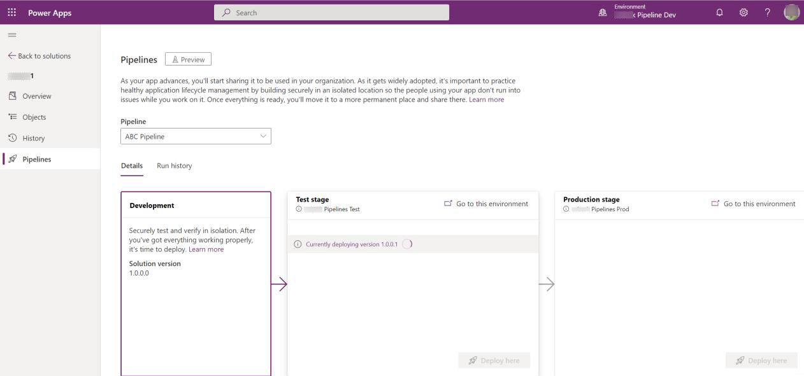
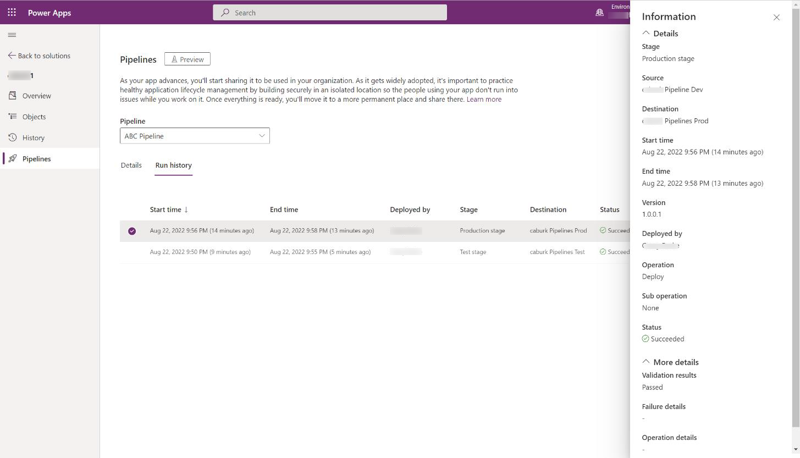
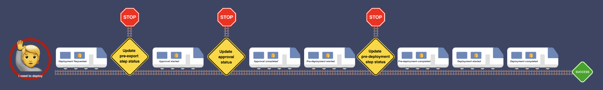
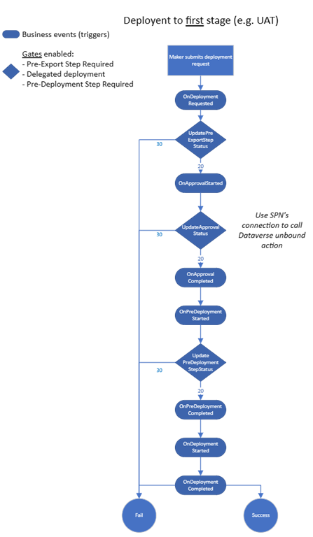

**¿Qué son?**

Pipelines es un componente de Power Platform cuyo objetivo es canalizar
la correcta gestión del ciclo de vida de nuestras aplicaciones. Nos
permite automatizar y controlar los despliegues de soluciones entre
entornos, estableciendo condiciones para evitar que los desarrolladores
tomen sus propias decisiones a la hora de gestionarlos. Reducen el
esfuerzo y el conocimiento del dominio necesario por los desarrolladores
para ser autónomos en tareas de ALM, garantizando así un correcto
funcionamiento del ciclo de vida de las soluciones de Power Platform
entre los diferentes entornos de los que dispone cada proyecto.




**Ventajas del uso de Pipelines**

-   Mejoran la productividad de makers, developers y administradores
    agilizando los despliegues de soluciones y asegurando la calidad de
    estos.

-   Te permiten ahorrar tiempo y dinero ya que el propio sistema se
    encarga de la actualización de los pipelines, gestión de errores y
    el mantenimiento de estas.

-   Permite extender su funcionamiento estándar para ampliar sus
    funcionalidades, como veremos más adelante en este artículo.

-   Proporciona seguridad en los despliegues entre entornos, almacena
    logs de auditoria que son fácilmente consultables y permite generar
    reporting de los despliegues mediante Power BI.

-   Almacenan backups de las soluciones (uno *administrado* y otro *no
    administrado*) en cada despliegue para su posterior acceso, por
    ejemplo, en caso de querer restaurar una versión anterior de una de
    las soluciones.

**Configuración de entornos**

Para una configuración correcta de los pipelines, necesitamos mínimo 3
entornos, pero idealmente 4, que son:

-   **Entorno HOST**: en este entorno instalaremos la aplicación de
    Pipelines, y es donde configuramos los pipelines, asociamos los
    entornos de desarrollo y de destino, y configuramos las fases de
    despliegue que conformarán nuestras canalizaciones.

-   **Entorno DEV**: es el entorno de desarrollo, donde el equipo
    desarrolla las aplicaciones, y existen soluciones No administradas
    que están siendo modificadas por los equipos de desarrollo.

-   **Entorno UAT/PRE/TEST** (opcional): es el entorno de pruebas y
    validación, donde ya sea nuestro cliente o nuestro equipo de
    testing, realiza las pruebas correspondientes antes de subir los
    desarrollos a producción. En este entorno, las soluciones deben ser
    administradas, para evitar que sufran modificaciones antes de llegar
    a PRO.

-   **Entorno PRO**: es el entorno de producción, donde el sistema
    cumple el objetivo para el cual fue desarrollado, y donde todo debe
    funcionar correctamente. En este entorno, las soluciones deben ser
    administradas, para evitar que sufran modificaciones y se puedan
    introducir errores sin que hayan sido probados previamente en el
    entorno de pruebas y validación.


Como se puede apreciar en el esquema, el flujo de despliegue va siempre
desde el entorno DEV hacia UAT y luego hacia PRO. El sistema de
pipelines garantiza el alineamiento de soluciones entre entornos,
previniendo el *tampering* (la modificación del artefacto de despliegue
durante su camino hasta el entorno de PRO). Permite, además, configurar
restricciones en las fases de despliegue (*deployment stage*), por
ejemplo, una de las más comunes es una restricción que impida desplegar
una solución desde DEV hasta PRO, sin pasar previamente por UAT. De esta
forma, se garantiza la fase de pruebas y validación de todos los
desarrollos.

**¿Qué licenciamiento se necesita?**

-   Entorno Host: Debe ser un entorno de Producción (o sandbox), pero no
    necesita ser un entorno Administrado.

-   Entorno DEV: Puede ser un entorno de desarrollo (o sandbox, o de
    producción) y no necesita ser un entorno Administrado.

-   Entornos de destino (PRE/UAT/TEST/PRO): Debe ser un entorno de
    Producción y necesita ser un entorno Administrado.

**Para convertir un entorno en Administrado, todos los usuarios
necesitan tener acceso premium (por ejemplo, licencia Power Apps
Premium).**

Por tanto, dependiendo de qué usuarios accedan a cada entorno,
necesitaremos un licenciamiento u otro. En todo caso, **los usuarios que
accedan a los entornos de destino de los despliegues necesitan tener
licenciamiento premium**.

Por ejemplo, una configuración válida podría ser:

  -----------------------------------------------------------------------
  Entorno                 Tipo de entorno         Licencia Premium
  ----------------------- ----------------------- -----------------------
  Host                    Producción              No

  DEV                     Developer               No

  UAT                     Producción              Sí

  PRO                     Producción              Sí
  -----------------------------------------------------------------------


**Modelo de datos**

Con el objetivo de entender el funcionamiento interno del sistema de
pipelines de Power Platform, vamos a estudiar el modelo de datos que
hace funcionar todo el sistema.


La entidad **DeploymentEnvionment** almacena la información sobre los
entornos que conforman las fases de despliegue, tanto entornos de
desarrollo como entornos de destino.

**DeploymentPipeline** contiene la configuración principal de cada
pipeline, y se relaciona con **DeploymentStage**, que almacena
información sobre las fases de despliegue.

**DeploymentStageRun** y **DeploymentStageRunStatus** almancenan la
información sobre cada una de las ejecuciones que se hacen de una fase
de despliegue, generando así un historial que podemos consultar
posteriormente, asociado a la solución que se ha desplegado, y donde se
puede visualizar el resultado de cada una de las ejecuciones.




Finalmente, la entidad DeploymentArtifact contiene la información de la
solución que se ha desplegado, su versión administrada y su versión no
administrada, la cual nos permite recuperar una versión anterior de
cualquier solución que se haya desplegado anteriormente. Además,
mediante estos artefactos, podemos exportar estas soluciones a
repositorios externos como GitHub o DevOps.

**Roles de seguridad en el uso de pipelines**

Al instalar la aplicación de pipelines, obtenemos 2 nuevos roles que
podemos asignar a los usuarios de cada uno de los entornos (Host, DEV y
Targets).

-   **Deployment Pipeline User:** los usuarios que disponen de este rol,
    pueden ejecutar los pipelines que han sido previamente compartidos
    con ellos. No pueden crear ni modificar la configuración de los
    pipelines.

-   **Deployment Pipeline Administrator:** los usuarios que disponen de
    este rol tienen control total sobre los pipelines, sin necesidad de
    tener el rol de System Administrator.

-   Por tanto, se dispone de dos roles que permiten aplicar una
    granularidad suficiente en el sistema para hacer funcionar el
    sistema de pipelines sin afectar al resto de accesos o permisos del
    sistema, lo cual ayuda mucho en la gestión del ALM (Application
    Lifecycle Management).

**Usar pipelines mediante la interfaz de commandos (CLI)**

Si preferimos usar la CLI para desplegar las soluciones, tenemos dos
comandos disponibles en la CLI de Power Platform, dentro del comando pac
pipeline.


```
pac pipeline list
```

Permite listar los pipelines disponibles en el entorno actual. Como
parámetros, podemos indicarle:

-   --environment -> el entorno desde el que listar los pipelines
    (pasando la URL o el GUID del entorno).

-   --pipeline -> el nombre o ID del pipeline del cual queremos listar
    los detalles, como por ejemplo las fases de despliegue,
    configuración del pipeline, etc.


```
pac pipeline deploy
```

Permite iniciar el despliegue de uno de los pipelines del entorno
actual. Como parámetros, podemos indicarle:

-   --environment -> el entorno desde el que listar los pipelines
    (pasando la URL o el GUID del entorno).

-   --solutionName -> el nombre de la solución que queremos desplegar.

-   --stageId -> el nombre de la fase de despliegue que queremos
    ejecutar (esto lleva implícito el entorno de destino al que queremos
    desplegar).

-   --currentVersion -> versión actual de la solución que queremos
    desplegar.

-   --newVersion -> versión nueva que tendrá la solución que queremos
    desplegar.

-   --wait -> despliegue síncrono. Esperar a que la solución termine
    de desplegar.


Mediante el uso de la CLI podemos, entre otras cosas, añadir este tipo
de despliegues en pipelines de CI/CD de Azure DevOps por ejemplo, usando
ahora el sistema de pipelines nativos de power platform, y combinándolo
con despliegues de otros artefactos en Azure, actualizaciones del
repositorio, o ejecución de pruebas unitarias o de integración.

**Extender los pipelines**

El proceso de despliegue de los pipelines, llamado fase de despliegue
(Deployment Stage), permite interceptarlo en diferentes fases para
extender su funcionalidad o integrar otros sistemas que actúen en el
proceso de integración continua o despliegue continuo de nuestra
organización.



La fase de despliegue se puede asemejar a un tren que avanza desde un
punto de origen hasta un punto de destino, y va parando en distintas
estaciones, donde pueden subirse o bajarse pasajeros, o puede que no se
suba ni se baje nadie. En el caso de la fase de despliegue de pipelines,
podemos interceptar, mediante flujos de Power Automate, los puntos de
extensión disponibles en la fase de despliegue, usando el trigger de
Dataverse disponible en Power Automate. En el caso de que los
interceptemos, el proceso de despliegue se para, hasta que confirmemos
el avance o la cancelación del despliegue desde el flujo que lo ha
interceptado. Esta acción nos permite, por ejemplo, exportar soluciones
a repositorios de código, configurar aprobaciones de despliegue via
email o teams, consultar APIs o sistemas externos para realizar
cualquier acción previa al despliegue, etc.

Los puntos de extensión disponibles son los siguientes:

-   **Pre-export:** sirve para realizar acciones previas a la
    exportación de la solución del entorno de origen (generalmente, el
    entorno DEV).

-   **Pre-Approval:** sirve para realizar acciones de aprobación o
    denegación del despliegue, así como el envío del código fuente a
    repositorios como DevOps o GitHub, por ejemplo. En este momento, la
    solución ya ha sido exportada desde el entorno de origen.
    En este punto de extensión, podemos configurar también los
    despliegues delegados, que nos permiten configurar por ejemplo un
    Service Principal o un Usuario de Aplicación como propietario del
    despliegue, y por tanto del artefacto en el entorno de destino. Esto
    ahorra mucho trabajo de ALM ya que, de lo contrario, habría que
    realizar acciones de cambio de propietario en el entorno de destino
    posterior al primer despliegue.

-   **Pre-Deployment:** Sirve para realizar acciones previas al
    despliegue de la solución, como por ejemplo una segunda fase de
    aprobación, o la conexión con APIs o sistemas externos que realicen
    alguna validación necesaria previa al despliegue.



En la imagen se puede apreciar la fase completa de despliegue, y dónde
podemos interceptar la misma para realizar las acciones que hemos
comentado arriba.

En caso de interceptar la fase de despliegue en alguno de los puntos de
intercepción, debemos notificar al proceso de despliegue, si debe
continuar con el despliegue (mediante un código de resultado 20, o si
debe cancelar el despliegue, mediante un código de resultado 30. Esta
confirmación nos permite, por ejemplo, configurar sistemas de
aprobaciones que notifiquen a los responsables del proyecto, y les
permitan aprobar o denegar cualquier intento de despliegue directamente
desde Teams, Email o la aplicación de aprobación de la que se disponga
en la organización.

**David Lorenzo López** <br />
Power Platform Solutions Architect <br />
davidll65@hotmail.com <br />
@dlorenzolop <br />
https://www.linkedin.com/in/davidlorenzolopez/ <br />
