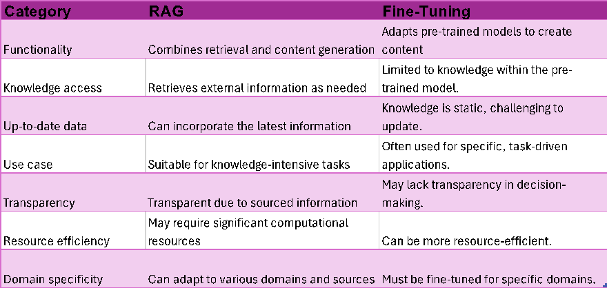
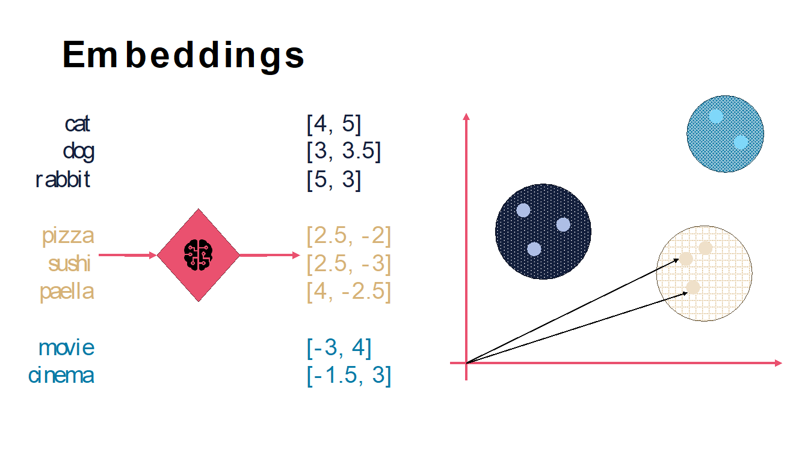
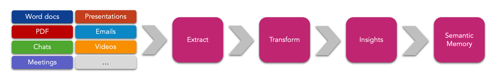
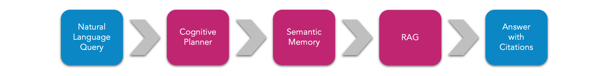
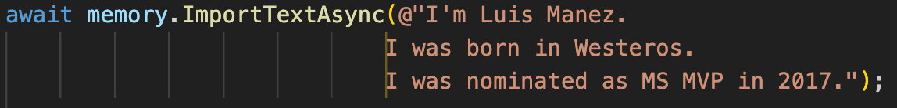
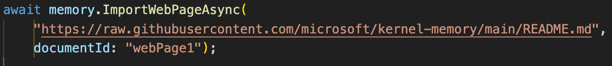

En este artículo vamos a ver que es el patrón RAG (*Retrieval --
Augmented -- Generation*) y como de sencillo nos va a ser implementarlo
usando la librería *KernelMemory*.

**Introducción**

Si estás trabajando en soluciones de Inteligencia Artificial (y si no lo
estas, háztelo ver, porque la IA se lo está comiendo todo), tarde o
temprano te va a llegar la siguiente pregunta o requisito: La IA
generativa está muy bien, y puedo pedirle que me planifique un viaje
para mis vacaciones de verano, o que me diga como quitar las manchas de
tomate de mi camisa... pero lo que yo quiero es que me ayude a preparar
una oferta para Contoso, o saber si tengo derecho a llevar a mi hijo al
médico en horas de trabajo, o cuánto stock tenemos de sillas MARKUS
(nombre real de una silla de Ikea ☺).

Cuando eso pasa, la respuesta es sencilla: La IA no sabe nada de mi ni
de mi empresa, no tiene acceso a esos datos privados. La IA ha sido
entrenada con millones y millones de datos públicos. Para que la IA
tenga "conocimiento" de los datos privados de mi empresa, existen 2
opciones:

-   **Fine-tunning**: Se trata de ajustar un modelo de inteligencia
    artificial pre-entrenado en una nueva tarea específica, utilizando
    un conjunto de datos adicional. En lugar de entrenar un modelo desde
    cero, se toma un modelo existente que ya ha aprendido
    representaciones generales del lenguaje o imágenes, y se afina con
    ejemplos específicos y relevantes para el nuevo contexto.
    En otras palabras, coges un LLM existente, y lo entrenas con tus
    datos. Actualmente esta opción ha perdido terreno con respecto al
    RAG, principalmente porque es una opción bastante cara de
    implementar. Solo suele utilizarse en dominios muy específicos, con
    una jerga muy particular, etc., por ejemplo, en temas médicos o
    farmacéuticos.

-   **RAG**: Consiste en aumentar el "Prompt" enviado al modelo
    información de contexto, que ayudara al modelo a ser capaz de
    responder la pregunta. De forma ultra-simplificada: ChatGPT ha sido
    entrenado con datos hasta el año 2021, por lo tanto, no sabe que
    selección fue campeona del mundial de futbol de 2022. Sin embargo,
    si como parte del Prompt, le pasamos el palmarés de Leo Messi,
    seguramente verá que fue campeón en el 2022, y deducirá que
    Argentina fue el vencedor del mundial del 2022. A lo largo del
    articulo veremos mejor cómo funciona.

La siguiente tabla** muestra las diferencias entre fine-tunning y RAG
desde diferentes categorías:

** Source:
https://research.aimultiple.com/retrieval-augmented-generation/

**RAG Pattern al detalle**

Si recordáis lo explicado en la introducción, es posible que os estéis
preguntando: ¿pero, y si lo que quiero es que el LLM me conteste
preguntas sobre las incidencias gestionadas por mi call-centre... como
voy a pasarle al LLM toda esa barbaridad de información? ... muy buena
pregunta, me alegra que me la hagas! ☺ ... la verdad es que no es tan
sencillo. Para empezar, el Prompt de un LLM es limitado, y aunque
actualmente, un modelo como gpt-4 puede llegar a los 120k Tokens,
podemos quedarnos cortos en casos como el del call-centre. Pero es que,
además, estos servicios de IA te van a cobrar por Token, tanto de su
input (el Prompt), como de la respuesta generada, así que conviene
buscar una estrategia para que ese Prompt aumentado, tenga la
información justa y necesaria.

Es aquí donde entran en juego las famosas bases de datos vectoriales.
Estas DBs son capaces de almacenar la información en forma de
Embeddings. Los Embeddings no es más que una representación numérica de
una palabra o texto, generalmente en forma de vectores. Los Embeddings
son generados por el propio modelo (generalmente son modelos diferentes
a los más conocidos como gpt-4. Actualmente el más usado para el cálculo
de Embeddings es el modelo *text-embedding-ada-002*). Estos Embeddings
tienen una característica muy importante para el RAG, y es que son
capaces de medir la relación semántica entre dos palabras o textos. Si
lo reducimos a palabras, aquellas que están relacionadas semánticamente
están más cerca entre sí, que aquellas que no tienen tanta relación.
Esta cercanía se mide en un espacio multidimensional y en función de
muchísimos parámetros, pero, por ejemplo, las palabras "gato" y "perro"
estarán más cercas entre sí, que de la palabra "guitarra". La siguiente
imagen lo ilustra gráficamente con espacio vectorial de 2 dimensiones:

Una vez entendido el concepto de Embedding, la idea que nos debe quedar
es que estas bases de datos vectoriales nos van a permitir realizar
búsquedas basadas en esa "cercanía", que van a darnos resultados con
relaciones semánticas con la query pasada. Esto mejora bastante la
típica búsqueda de Keyword. Con este mecanismo, ya no tendremos que
pasarle al modelo todas nuestras incidencias de call-centre, ahora
bastara con primero hacer una query a nuestra DB vectorial con el
problema del usuario, por ejemplo, "el router muestra una luz roja y la
conexión a internet no funciona". Esto nos dará resultados de
incidencias parecidas a la que estamos intentando resolver, y será esa
información la que pasaremos al RAG.

Quizá todavía estes pensando: "ya, pero aun así, esas incidencias
'cercanas' a la que yo necesito resolver, todavía pueden tener mucho
contenido para poder pasar al Prompt"... pues estás en lo cierto, hay
todavía algunas cosas a resolver. El siguiente grafico intenta explicar
como suelen ser los procesos de pre-procesado e indexado de la
información para funcionar mejor con el patrón RAG:

1.  **Extracción de texto**: En este primer paso, se extrae todo el
    texto del documento. Aquí se aplican técnicas de OCR para, por
    ejemplo, extraer texto plano de un documento PDF.

2.  **Troceado del texto del documento**: Una vez tenemos texto plano,
    dicho texto se trocea en fragmentos mas pequeños (chunks). Esto hará
    que nuestra búsqueda semántica retorne resultados más específicos de
    lo que se busca, y, en definitiva, más pequeños. Estos chunks son
    los que aumentaran luego nuestro Prompt. Existen diferentes técnicas
    para este "troceado", normalmente se elige un tamaño de Tokens por
    chunk, y se toma cierta "ventana" del chunk anterior (así se
    mantiene mejor el contexto).

3.  **Generación de Embeddings**: Estos "chunks" son transformados a
    Embeddings.

4.  **Indexación en nuestra BD vectorial**: finalmente, los chunks y sus
    embeddings son almacenados en DB. Normalmente, se almacena también
    otro tipo de información en forma de metadatos, que pueda mejorar la
    query posterior.

Como hemos dicho, esta sería la parte de pre-procesado de los datos que
queremos que formen parte de nuestro RAG. La siguiente imagen describe
el proceso de Retrieval y Augmented:

1.  El usuario realiza una query.

2.  La query se pasa al modelo para generar los Embeddings de dicha
    query.

3.  Dichos embeddings se envían a la BD vectorial y se realiza una
    búsqueda por proximidad.

4.  Los chunks semánticamente más cercanos a la query son incluidos como
    parte del Prompt. Es decir, el Prompt con la query del usuario
    original, se complementa con esos chunks en forma de contexto.

5.  El Prompt aumentado es enviado al Modelo, que genera una respuesta
    basada en la query + contexto.

**Kernel Memory**

Kernel Memory es una librería *OpenSource,* cuyo desarrollo lidera un
equipo de Microsoft, y que nos va a permitir hacer RAG de manera muy
sencilla, y ocupándose de gran parte de los pasos que hemos visto
anteriormente. Tenéis todo el código fuente en el siguiente repositorio
GitHub: https://github.com/microsoft/kernel-memory

Soporta diferentes bases de datos vectoriales, entre ellas Qdrant,
Redis, Postgres, MongoDB o Azure AI Search. Además permite crear tu
propio conector a otra DB vectorial implementando la interfaz
*IMemoryDb*. Además de soportar múltiples DBs vectoriales, también
soporta diferentes modelos de AI, como pueden ser OpenAI, Azure OpenAI o
Llama. Estos conectores también están desacoplados, pudiendo crear los
nuestros propios implementando las interfaces pertinentes.

**Indexando documentos optimizados para RAG**

Vamos a ver ahora como podemos indexar información con KernelMemory,
teniéndola así optimizada para RAG. El siguiente snippet muestra cómo
podemos configurar KernelMemory para utilizar Azure AI Search como DB
vectorial, y Azure OpenAI como servicio de AI (con modelos para
Embeddings y Chat completions):

En este caso, la configuración de los servicios de Search y AI vendrían
del fichero de settings.json:

Una vez configurado nuestro objeto *Memory*, disponemos de varios
métodos para indexar documentos/contenido.

El siguiente snippet indexaría el texto pasado:

Podemos indexar también un documento desde su path:

Ahora un ejemplo de cómo indexar directamente una página web:

Te animo a que revises la documentación para ver algún que otro método
soportado. En próximos artículos veremos más cosas, como el soporte para
metadatos y alguna cosa más. Hasta aquí seria la parte de indexar
información. Internamente, cada uno de estos *Import* seguirá el proceso
comentado anteriormente (extracción de texto plano, chunking, cálculo de
embeddings y guardado en DB).

Ahora que ya tenemos nuestra documentación indexada, la librería
proporciona un par de métodos para poder hacer el *Retieval-Augmented*.

Por un lado, podemos hacer una query de Search a la DB vectorial:

También tenemos la opción de preguntar directamente al modelo, de tal
forma que KernelMemory de forma interna hará una llamada al método de
Search, e incluirá los resultados como parte del Prompt, retornando
directamente la respuesta del Modelo.

La siguiente imagen es una captura de *Fiddler* a la petición que KM ha
hecho al modelo. Fijaos como en el contenido del Prompt, además de la
query del usuario, está incluyendo información que ha recuperado de la
BD vectorial (en este caso, como el texto era muy cortito, no necesito
hacer chunking al indexarlo, por eso el texto es tal cual lo importado.
Con un documento más grande, veríamos multiples *chunks*).

Y hasta aquí el artículo. Espero que os sea de utilidad.

¡Hasta el próximo artículo!

**Luis Mañez**   
Chief Architect en ClearPeople LTD   
@luismanez   
https://github.com/luismanez   

import LayoutNumber from '../../../components/layout-article'
export default LayoutNumber