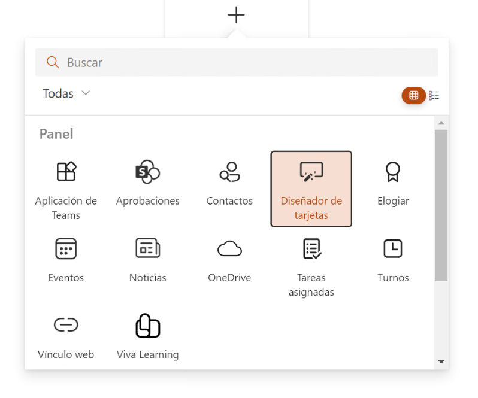
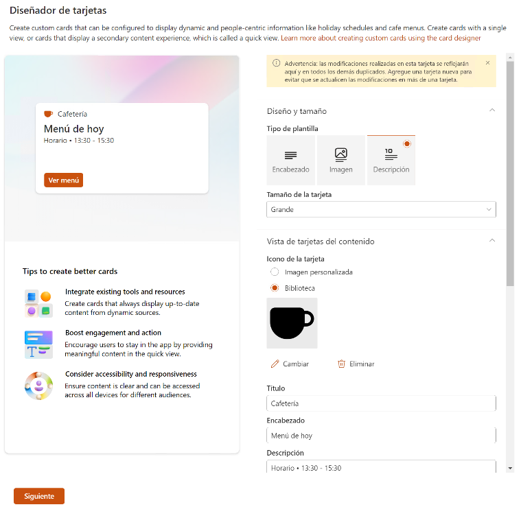
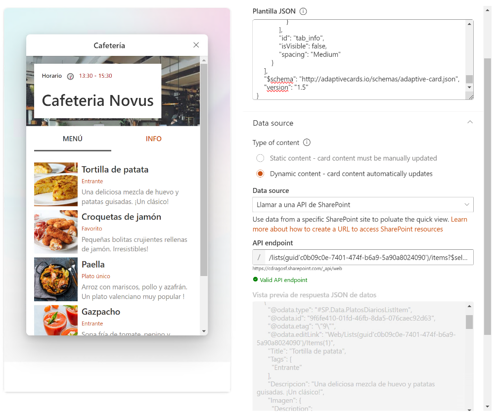
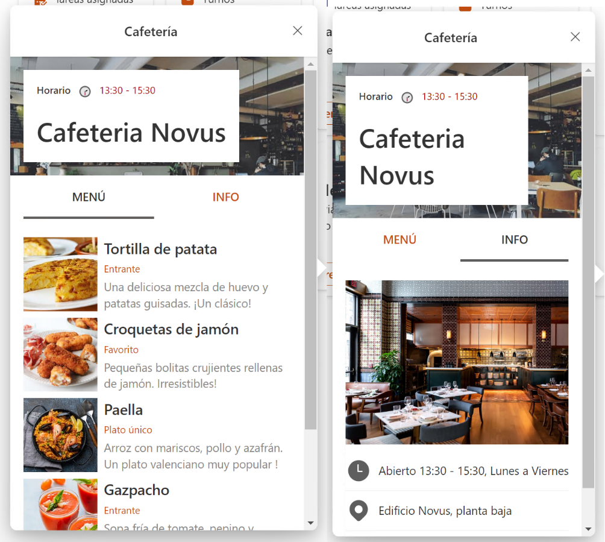
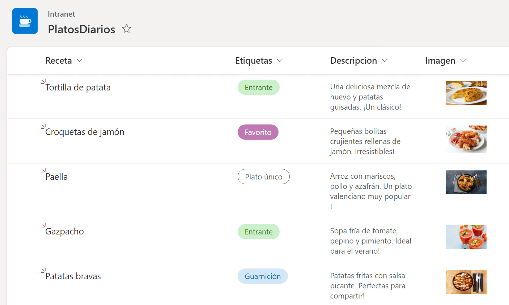
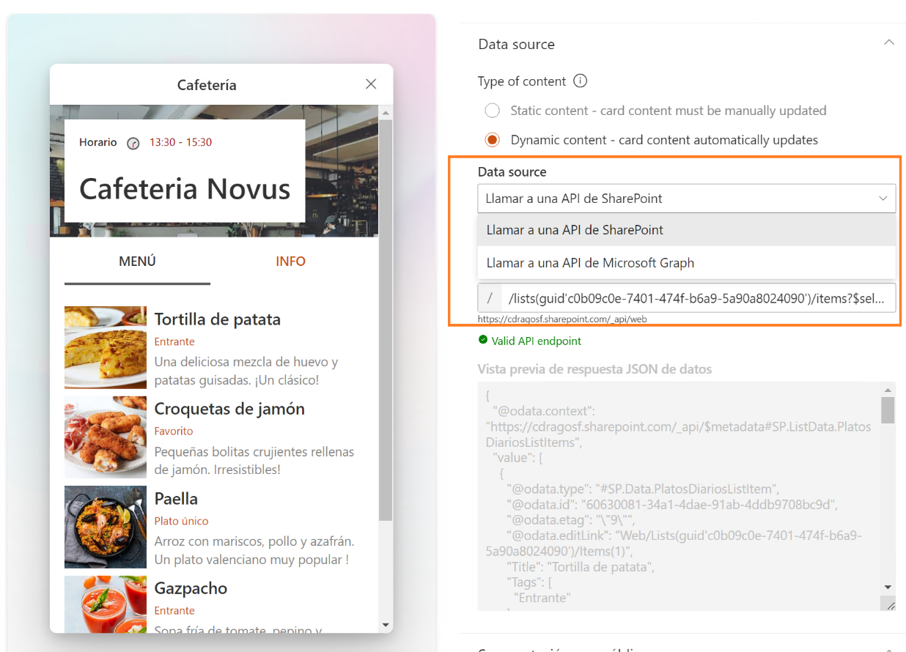
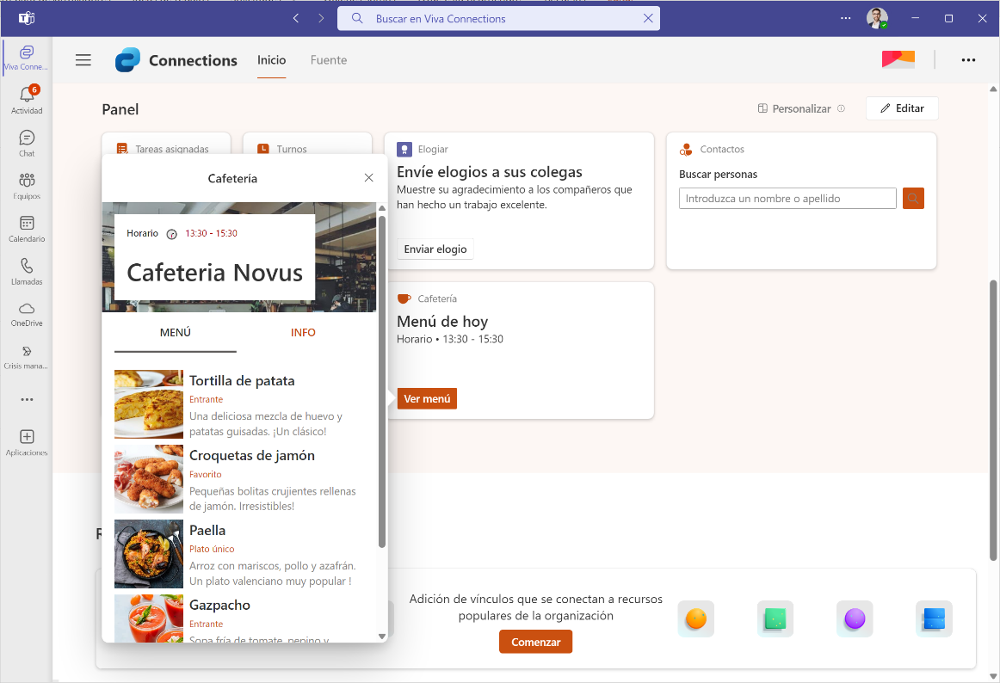

Una vez más, te traigo una buena manera de sacar información dinámica a
través del diseñador avanzado de tarjetas del dashboard de Viva
Connections. En este articulo vamos a ver cómo funciona el nuevo
diseñador de tarjetas avanzadas, como integrarlas con APIs de SharePoint
Online, como crearlas y como se visualizan en el dashboad de Viva
Connections.

**¿Cómo empezamos?**

Necesitamos un sitio de SharePoint Online, configurado como centro
principal para Viva Connections ([como configurar Viva
Connections](https://learn.microsoft.com/es-es/viva/connections/set-up-admin-center)).
Después de la preparación de nuestro entorno, podemos usar el dashboard
de Viva Connections, donde tenemos disponibles diferentes tipos de
tarjetas, pero hay un tipo de tarjeta especial y es el "**Diseñador de
tarjetas**".

El diseñador de tarjetas ha tenido grandes cambios desde la versión
anterior que fue liberada en modo preview, ahora tenemos un diseñador
completo y amigable, con una vista moderna que encaja con el diseño de
toda la suite Viva.

En este nuevo diseñador tenemos una nueva previsualización de la tarjeta
que estamos editando en tiempo real, tanto de la vista principal de la
tarjeta como la vista de detalle.

**¿Cómo cambiamos el diseño de la tarjeta personalizada?**

Para la visualización principal de la tarjeta, mediante el diseñador
podemos editar aspectos como:

-   el tipo de plantilla: solo texto, texto e imagen, detalle con
    descripción.

-   tamaño de la tarjeta: mediano formato cuadrado, grande formato
    alargado .

-   imagen personalizada o desde iconos de Fabric UI.

-   el título de la tarjeta (tip: podemos incluir emojis y caracteres
    especiales).

-   las acciones que se pueden realizar haciendo clic en la tarjeta en
    sí, o en los botones primario y secundario (en ambos casos, se puede
    abrir una URL o abrir el panel de vista detalle de la tarjeta).

Y para la visualización de detalle de la tarjeta, podemos editar:

-   la plantilla JSON de la visualización de este detalle.

-   la fuente de datos: estático en formato JSON o dinámico con llamadas
    a Graph API o a la API de SharePoint Online.

(Dejo al final del articulo el enlace al GitHub con el JSON del diseño
completo de la tarjeta.)

Todos los cambios o modificaciones se reflejaran en tiempo real en la
vista previa que nos ofrece el diseñador, incluso podremos interactuar
con la vista previa haciendo clic en los botones o pestañas que estemos
diseñando dentro de la tarjeta, de tal manera que podamos comprobar el
buen funcionamiento.

Una vez configurado lo anterior, guardamos el dashboard y publicamos la
página. Como sabéis, este dashboard lo podemos ver desde diferentes
sitios: SharePoint Online y MS Teams. Mi diseño del detalle de tarjeta
es bastante sencillo, un titular con el nombre del comedor y luego dos
pestañas: en una mostramos los platos del día y en otra se muestra
información sobre el restaurante.

Vale, ¿**y como accedemos a los datos a través de la API**?

**¿Cómo recuperamos los datos dinámicos?**

Una vez que tengamos el diseño de la tarjeta con datos de ejemplo
podemos pensar en enlazar esa tarjeta al modelo de datos que tengamos,
ya sea a través de la API de SharePoint Online o a través de la Graph
API. En mi caso, estoy mostrando el menú diario del comedor de la
empresa. Toda esta información se actualiza automáticamente en una lista
de Microsoft Lists, por lo tanto utilizará la API de SharePoint para
sacar los ítems de esta lista en formato JSON y poder usarlos en mi
plantilla de adaptive card dentro de la tarjeta que he creado.

Mi lista de platos del menú tiene cuatro campos bastante sencillos:
titulo del plato, etiqueta que indica el tipo de plato que es, breve
descripción y una imagen.

Con todo esto ya creado y listo para usar, volvemos a la configuración
del dashboard de Viva Connections, editamos la tarjeta personalizada
creada anteriormente y dentro de la configuración elegimos el "**Origen
de datos**". En este caso he elegido "Llamar a una API de SharePoint",
ya que todas las listas de Microsoft Lists se pueden recuperar a través
de esta API.

La URL que he formado para llamar a la API es esta:
**"/lists(guid\'c0b09c0e-7401-474f-b6a9-5a90a8024090\')/items?\$select=Title,Descripcion,Imagen,Tags"**
. En la URL estoy seleccionando solamente los campos que me interesan de
la lista para aligerar la llamada REST.

A continuación, introducimos esta URL en el campo de "**API endpoint**"
y una vez verificada la URL, veremos un mensaje de "Valid API endpoint"
en color verde y en el cuadro de abajo van a aparecer los resultados de
la query en formato JSON. (Es posible que tengamos que hacer alguna
pequeña modificación en el diseño de la tarjeta para indicar de que
campos queremos sacar la información en cada placeholder de la adaptive
card.)

**Consideraciones**

-   Se necesita tener creado el catálogo de aplicaciones porque la
    tarjeta personalizada se despliega como una solución dentro del
    mismo, de manera automática, una vez guardada y publicada la página
    del Dashboard de Viva Connections.

-   En este ejemplo he utilizado la llamada a la API de SharePoint, pero
    si queremos usar la API Graph, debemos realizar varias
    configuraciones adicionales de permisos.

**Ahora te toca a ti .**

GitHub con la info. del articulo:
https://github.com/cdragosf/VivaConnectionsCards

**Cristian Dragos Fedotov**  
Microsoft 365 Solutions Architect en **NTT DATA**   
cristianfedotov@gmail.com   
https://www.linkedin.com/in/cristianfedotov/
