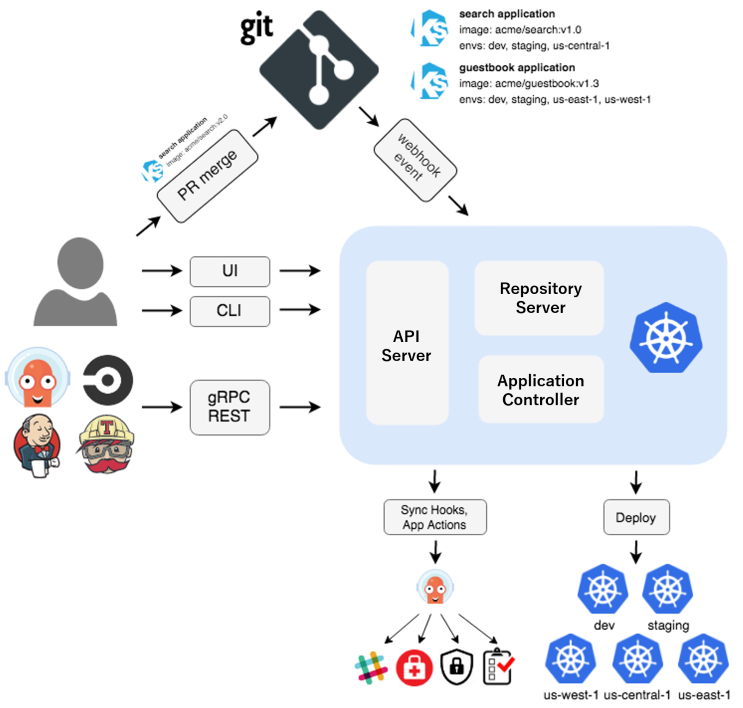
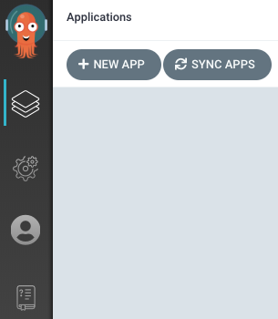
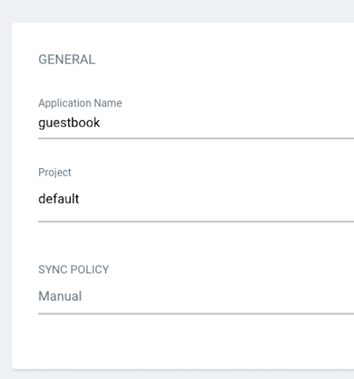
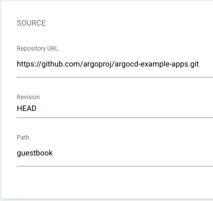
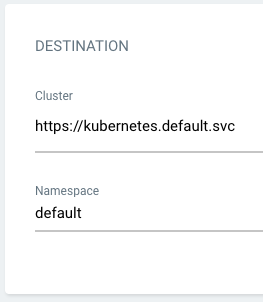
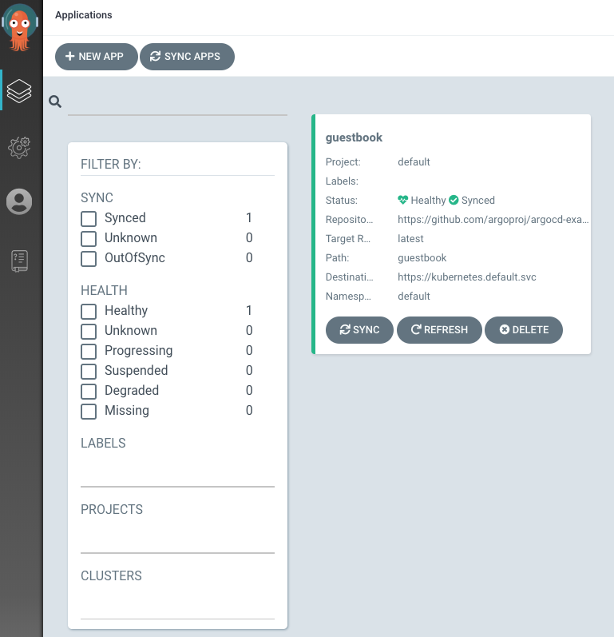

Durante el proceso de adopción de Kubernetes en una empresa, uno de los
últimos desafíos que se presenta es implementar el Continuous Deployment
(CD) de manera fácil y sencilla. Dentro de los términos de dockerfile,
con "helm" vas moldeando tu desarrollo de la forma en la que se adapta a
tus necesidades, pero ciertamente es un tanto engorroso y sobre todo si
tienes diversos entornos fisicos y quieres hacerlo de una forma
"similar" a como la tenemos como por ejempolo con WebApps. ¿Cómo lo
podemos hacer con AKS? ¿Tenemos una serie de ficheros helm para cada uno
de los entornos, reinventamos la rueda y nos hacemos algo custom para
nosotros? ArgoCD es la solución que buscábamos para facilitar la
implementación de CD en nuestros entornos Kubernetes.

Antes de definir ArgoCD, es importante mencionar que se basa en GitOps,
una filosofía similar a DevOps, que utiliza los repositorios de Git como
única fuente de verdad para gestionar la infraestructura como código.
Ofrece:

-   Un flujo de trabajo estándarizado para el desarrollo de las
    aplicaciones.

-   Mayor seguirad para definir los requisitos de las aplicaciones por
    anticipado.

-   Confiabilidad mejorada con un sistema de supervisión y control de
    versiones a traves de Git.

-   Uniformidad en todos los clústers, las nubes y los entornos locales.

Argo CD es una herramienta declarativa de entrega continua GitOps para
Kubernetes. Las definiciones, configuraciones y entornos de las
aplicaciones deben ser declarativos y controlados por versiones. El
despliegue y la gestión del ciclo de vida de las aplicaciones deben ser
automatizados, auditables y fáciles de entender y Argo CD viene a
solucionar esta problema que nos encontramos con los Helm cuando los
abordamos de forma manual.

**Principales caracterisitcias de ArgoCD**

-   Gestión de la configuración de la infraestructura y la
    administración de actualizaciones de las aplicaciones, entre otros.

-   Puede sincronizar de manera automática el estado de la aplicación
    con su versión más reciente de la configuración declarativa.

-   Incluye la posibilidad de implementar las aplicaciones de forma
    manual o automatizada en el interior de un clúster de la plataforma
    de Kubernetes.

-   Permite la visualización de los errores o inconsistencias de
    implementación, así como la identificación y resolución de las
    modificaciones a nivel de ajuste y configuración.

-   Ofrece aplicación automática de las modificaciones del estado
    deseado en el interior del repositorio de Git al entorno de destino,
    lo que garantiza que las diferentes aplicaciones puedan mantenerse
    sincronizadas.

-   Ofrece compatibilidad con webhooks para activaciones en plataformas
    como BitBucket, GitHub y GitLab.

-   Posee una interfaz de Línea de Comandos, conocida como CLI, así como
    su Interfaz de Usuario Web

**Conceptos básicos de ArgoCD**

Antes de empezar a ver como funciona Argo definamos cueles son los
conceptos que tiene Argo y como se llama, este punto nos valdrá para
posteriormente entender su correcto funcionamiento.

-   **Application =>** El grupo de recurso de Kubernetes que estarán
    definidos en un manifiesto.

-   **Application Source =>** Feature de la aplicación, la herramienta
    o repositorio de donde se origina la configuración.

-   **Target State =>** El estado de la aplicación, respresentado por
    unos ficheros git en el repositorio.

-   **Live State =>** Estado en tiempo real de la aplicación, que pods
    estan desplegados.

-   **Sync Status =>** Estado de la sincronización. Esta desplegado el
    mismo código en el cluster que en el eque tenemos en nuestro
    repositorio de Git.

-   **Sync Operation =>** El estado en el que esta la opearción de
    sincroniazación.

-   **Refresh =>** Es el tiempo en el que se compara el ultimo código
    de Git con el estado de Live.

-   **Health =>** La salud de la aplicación, si esta funcionando
    correctamente o no.

Definiendo un poco, en Argo se tiene que hacer un mapeo de que se llama
nuestra Applicación con que recursos de Kubernetes son lo que tiene que
tener y en base a eso tambien se verifica que este funcionando como se
espera. En la creación de estos recursos, se hace una primera validación
de que sintaxicamente este funcionando y si hay algo que no cuadra ya
nos lo indica y podemos visualizar los errores, algo bastante diferente
a cuando tenemos que depurar el helm y encontrar donde esta nuestro
error.

Argo tiene tres posibilidades una API, un Cli y una UI donde poder hacer
las operciones relativas a nuestra Aplicación, podemos decir que se
puede hacer lo "mismo" en ambas plataformas, aunque una vez entrais en
detalle el Cli te da unas opciones que en la UI no las puedes
solucionar. Bueno tras esta introducción vamos un poco a verlo en
detalle.

**Como funciona ArgoCD**

Para que os hagais una idea de como funciona ArgoCD echar un vistazo a
la arquitectura del mismo:




La arquitectura de ArgoCD se compone de tres componentes principales:

-   **API Server:** Servicio gRPC/REST que expone la API consumida por
    WebUI, CLI y sistemas CI/CD.

-   **Repository Server:** Servicio que mantiene una caché local del
    repositorio Git, responsable de generar y devolver los manifiestos
    de Kubernetes.

-   **Application Controller:** Controlador que supervisa las
    aplicaciones en ejecución, comparando el estado actual con el
    deseado y tomando medidas correctivas cuando es necesario.

**Por donde empezar**

Antes de empezar a poner Argo en un entrono productivo, es importante
que nos los instalemos en un entorno dummy para entender los conceptos y
posteriormente ver como lo queremos utilizar. El uso de Argo va
vinculado a como se organizan los equipos de desarrollos, el como se
quiere hacer uso. Argo puede ir en el mismo cluster donde tienes tu
desarrollo pero no es lo aconsejable para entornos con una gran
volumetria, hay varias opciopnes multicluster. También es importante que
el equipo se sienta familiarizado con la cultura GitOps y como funciona
eso, a nosotros desarrolladores que venimos del mundo .NET estamos muy
acostumbrados a las pipelines de AzureDevOps/GitHub y este es un
concepto totalmente distinto. Al final cuando nosotros realizamos un
despliegue de una aplicación que es lo que se modifica: la imagen del
contenedor que se esta montando y elementos de infraestructura. Por lo
tanto al final es algo tan sencillo como modificar unos valores, el
concepto de "despliegue" al uso esta mas vinculado a todo los conceptos
que tenemos dentro de Kubernetes que de un despliegue en WebAPP.

**Puesta en marcha del entorno ArgoCD**

Al igual que cualquier despliegue dentro del cluster, con los siguientes
comando instalariamos Argo en nuestro Cluster.

```
kubectl create namespace argocd

kubectl apply -n argocd -f
https://raw.githubusercontent.com/argoproj/argo-cd/stable/manifests/install.yaml
```

Una vez lo tenemos instalado ArgoCD el siguiente paso es instalar el Cli
para poder realizar las operaciones con Argo desde una linea de comando
o bien mediente la interfaz. Para instalarlo se puede descargando el cli
desde el repositorio para un entorno windows
https://github.com/argoproj/argo-cd/releases/tag/v2.12.1 o si utilizar
un Mac se puede instalar mediante el siguiente comando:

```
brew install argocd
```

Una vez instalado el Cli, la API Server de Argo CD no está expuesto con
una IP externa. Para acceder a la API, lo podemos hacer desde bien de
dos formas:

Service Type Load Balancer = Cambiamos el tipo de servicio del servidor
de ArgoCD a LoadBalancer con el siguiente comando:

```
kubectl patch svc argocd-server -n argocd -p '{"spec": {"type": "LoadBalancer"}}'
```

Port Forwarding => Sino la queremos exponer la API siempre podemos
hacer un mapping del puerto interno con el externo y de esta forma
acceder desde el ordenador local.

```
kubectl port-forward svc/argocd-server -n argocd 8080:443
```

Una vez ya la tenemos la API que se puede consultar el siguiente paso es
hacer un login, para ello hay un pasword inicial que se almacena en un
secreto llamado argocd-initial-admin-secret almacenado en plano en el
propio clúster. También lo podemos hacer mediante un comando del propio
argocd.

```
argocd admin initial-password -n argocd
```

Obviamente este secreto debe ser borrado una vez se cambia, y
posteriormente se puede regenerar y volver a solicitar bajo demanda.

Una vez ya tenemos la contraseña con los siguientes comandos haremos un
login y procederemos a cambiar la contraseña.

```
argocd login <ARGOCD_SERVER>

argocd account update-password
```

En caso de que el cluster donde vayamos a desplegar las soluciones no
sea el mismo donde esta Argo tendremos que enrollar el Cluster con Argo,
para que tenga permisos para poder hacer las operaciones con Kubernetes.
Para findes de demostración no hace falta hacer este paso y lo
obviaremos pero en caso de entornos productivos se recomienda tenerlos
separados.

Ya para finalizar lo ultimo que nos queda es crear la aplicación, se
puede crear de dos forma bien via CLI bien por la propia UI.

**Creación Apps Via Cli**

El propio proyecto de Argo trae una serie de ejemplos con la finalidad
de la demostración de como funciona
https://github.com/argoproj/argocd-example-apps Para crear una
aplicación de argo podemos hacerlo con el siguiente comando:

```
argocd app create guestbook 
 --repo https://github.com/argoproj/argocd-example-apps.git 
 --path guestbook 
 --dest-server https://kubernetes.default.svc 
 --dest-namespace default
```

**Creación Apps via UI**

Abre un navegador a la interfaz de usuario externa del CD Argo e inicia
sesión visitando la IP/nombre de host en un navegador. Utiliza las
credenciales obtenidas anteriormente.

Después de loguearse, pulsaremos sobre el botón de New App:




Dale a tu aplicación el nombre que decidas, utiliza el proyecto por
defecto y deja la política de sincronización como Manual:




A continuación tienes que indicar cual es el repositorio de Git donde
esta nuestra aplicación, en esta ocasión usaremos el repositorio
ofrecido por ArgoCD.




Una vez tenemos el repositorio GIT nos faltará indicar el Cluster donde
se va a desplegar y el namespace donde se va a desplegar.




Ya por último paso queda el aspecto de sincronizar el código que hay en
el repositorio con el contenido en el cluster. Esto se puede hacer
obviamente desde la interfaz como desde el CLI. Desde la linea de
comando o UI la primera vez que lo consultemos el estado incial sera
OutOfSync dado que aun no se ha desplegado y los recursos de Kubernetes
aún no se han creado.

Para ver el estado con el siguiente línea:

```
$ argocd app get guestbook

Name: guestbook

Server: https://kubernetes.default.svc

Namespace: default

URL: https://10.97.164.88/applications/guestbook

Repo: https://github.com/argoproj/argocd-example-apps.git

Target:

Path: guestbook

Sync Policy: <none>

Sync Status: OutOfSync from (1ff8a67)

Health Status: Missing

GROUP KIND NAMESPACE NAME STATUS HEALTH

apps Deployment default guestbook-ui OutOfSync Missing

Service default guestbook-ui OutOfSync Missing
```

Y una vez consultado el estado en el que esta la APP si ejecutamos el
siguiente comando se ejecutará la creación de los recursos en el
cluster.

```
argocd app sync guestbook
```

Para hacerlo mediante la interfaz es dándole desde el botón de Sync:




**Conclusión**

ArgoCD es una herramienta fácil de usar que simplifica
significativamente el proceso de despliegue. Sin embargo, su adopción
requiere que los equipos de desarrollo se familiaricen previamente con
su funcionamiento. En primer lugar, hay que saber cuál es la
distribución y organización de las aplicaciones que se van a desplegar,
el cómo se quiere hacer y establecer cuál es el proceso que se quiere
realizar, todo dependerá de las necesidades de los productos y de los
equipos. ArgoCD da un amplio abanico de posibilidades, pero los equipos
tienen que cambiar el chip de lo realizado anteriormente. Si estás en el
proceso de adopción de Kubernetes en tu compañía y estas buscando una
solución para facilitar los despliegues de una forma sencilla, échale un
vistazo en profundidad a ArgoCD y verás como mejoran mucho los
despliegues.

ArgoCD, también tiene otros productos/extensiones como Argo Rollouts
para mejorar el Continuos Integrations y como de esta forma hacer tener
un proceso de calidad incluyendo las pruebas, o técnicas como Cannary o
Blue/Green.

**Adrián Diaz Cervera** <br />
Technical Lead at SCRM Lidl Hub International <br />
.NET MVP <br />
http://theavenger.dev <br />
@AdrianDiaz81 <br />


import LayoutNumber from '../../../components/layout-article'
export default LayoutNumber