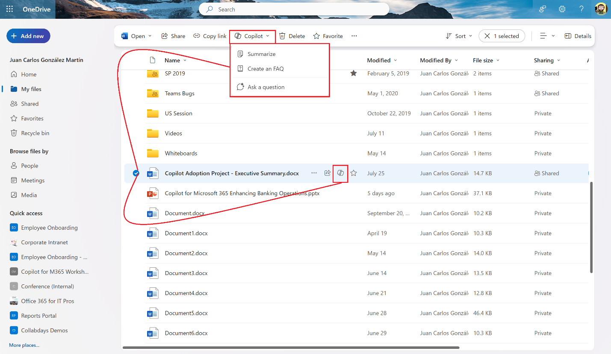
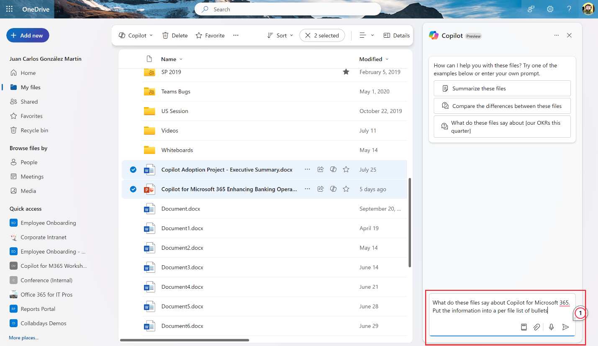
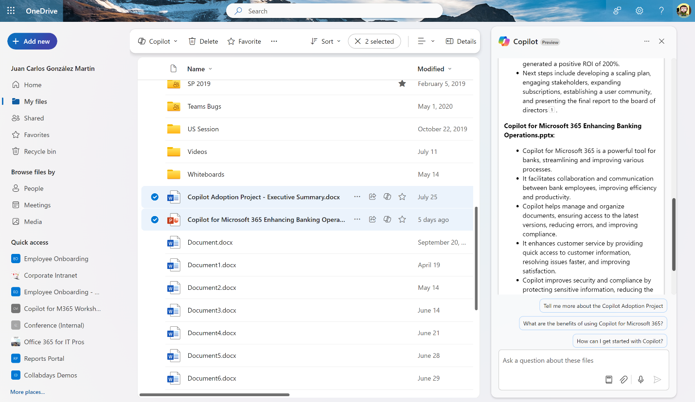
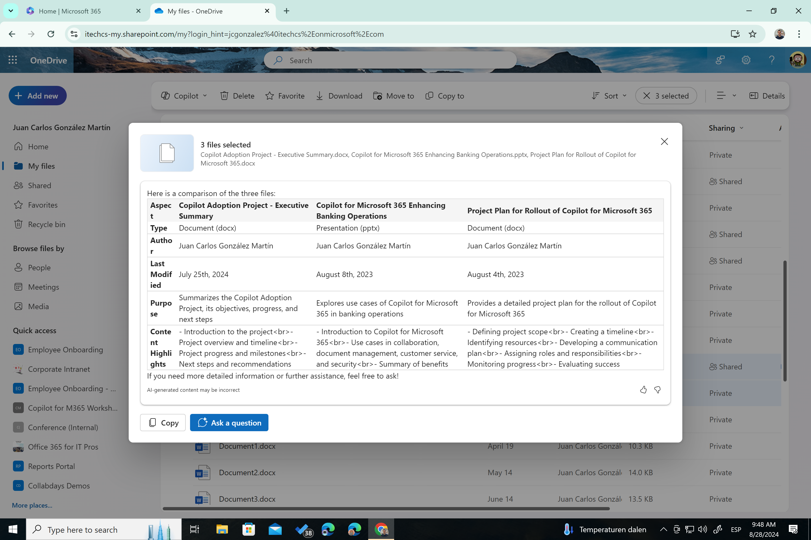
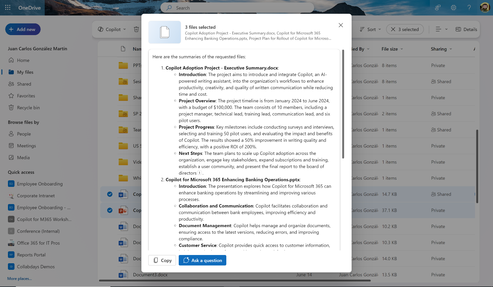
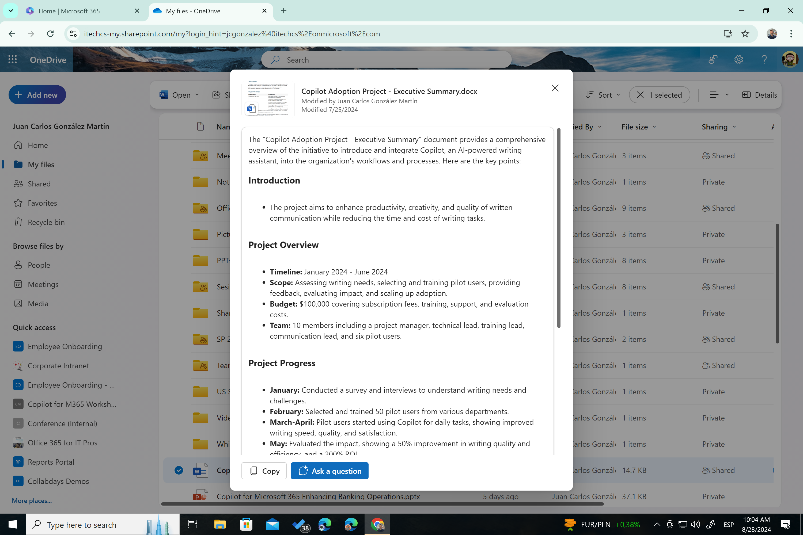
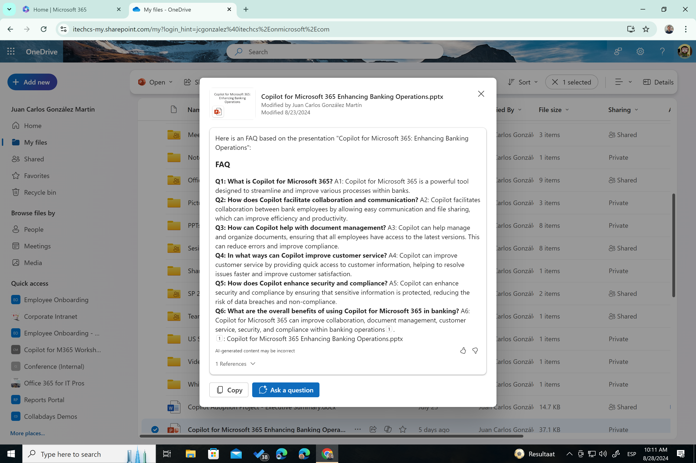

En la era de los Copilots, desde hace unas semanas ya tenemos disponible
un nuevo sabor dentro del ecosistema de Copilot para Microsoft 365:
Copilot para OneDrive for Business. Este nuevo sabor se enfoca, entre
otros casos de uso, a que podamos sacar partido a nuestros archivos y
los archivos que nos comparten a la vez que ganamos en eficiencia y
productividad. En este artículo veremos los escenarios y casos de uso de
Copilot para OneDrive for Business.

**Como funciona Copilot para OneDrive for Business**

Copilot para OneDrive for Business está disponible desde la App de
OneDrive (incluyendo el acceso a esta desde la App de Microsoft 365,
desde Outlook o desde teams) en el momento en que:

-   Pasamos el ratón por un archivo que gestionamos a través de OneDrive
    for Business ya sea propio o que se nos ha compartido.

-   Seleccionamos uno o varios archivos en la App de OneDrive for
    Business. En este caso además Copilot nos ofrecerá distintas
    posibilidades:

    -   Resumir el archivo o archivos seleccionados.

    -   Generar una FAQ a partir del seleccionado.

    -   Realizar una pregunta sobre el archivo o archivos seleccionados

    -   Comparar los archivos seleccionados.

A la hora de trabajar con Copilot para OneDrive for Business hay que
tener en cuenta varias consideraciones:

-   No soporta cualquier tipo de archivo sino que solo soporta los
    siguientes formatos: Word, Excel, PowerPoint y PDF.

-   Cuando se seleccionan varios archivos para interactuar con Copilot
    para Microsoft 365, se pueden seleccionar hasta 5 archivos como
    máximo.

**Escenarios y Casos de Uso de Copilot para OneDrive for Business**

Los escenarios y casos de uso iniciales (y principales) de OneDrive for
Business están muy bien documentados por Microsoft en sus [páginas de
soporte](https://support.microsoft.com/en-us/topic/7fc81e10-e0cf-4da8-af2e-9876a2770e5d):

-   Extraer información de varios archivos en OneDrive sin necesidad de
    abrirlos.

-   Comparar varios archivos almacenados en OneDrive.

-   Resumir un archivo o varios archivos de forma rápida.

-   Generar FAQs u otras información de interés a partir del archivo o
    archivos seleccionados en OneDrive.

A continuación, vamos a revisar cada uno de estos casos de uso.

**Extraer información de un archivo o varios archivos**

En este escenario podemos [pedirle a Copilot para OneDrive que nos
proporcione información sobre el archivo o archivos
seleccionados](https://support.microsoft.com/en-us/topic/ask-about-a-topic-without-opening-your-files-8ea1bb0d-5ae7-4f81-8cb8-cd755862834b)
(un máximo de 5) en base a un Prompt y sin necesidad de abrirlos. En el
ejemplo le estoy preguntando que se dice en los archivos seleccionados
sobre Copilot para Microsoft 365 y le pido que me los ponga como una
lista de temas:

El resultado de nuestra pregunta lo obtendremos en el panel lateral de
Copilot:

**Comparar archivos con Copilot para OneDrive**

Caso de uso muy útil porque habilita que [podamos comparar archivos
similares (por ejemplo versiones diferentes de un mismo documento) o
diferentes de cara a entender no solo su contenido, sino sus
diferencias](https://support.microsoft.com/en-us/office/compare-files-with-copilot-in-onedrive-46dace59-76c3-44ff-a116-a7aee5fe1f3c).
Para hacer uso de la funcionalidad de comparar archivos con Copilot para
OneDrive, seleccionamos los archivos a comparar (un máximo de 5) y
simplemente hacemos uso de la funcionalidad de comparar. El resultado
que obtendremos es que Copilot nos muestra en una ventana emergente la
comparación que ha realizado:

**Resumir archivos con Copilot para OneDrive for Business**

De forma similar a la funcionalidad de comparar, podemos [resumir
archivos con Copilot para OneDrive for Business seleccionado estos (un
máximo de
5)](https://support.microsoft.com/en-us/office/compare-files-with-copilot-in-onedrive-46dace59-76c3-44ff-a116-a7aee5fe1f3c)
y haciendo uso de la funcionalidad de resumir:

De forma similar, el resultado de resumir un documento es como sigue:

**Generar FAQs a partir de un documento con Copilot para OneDrive**

El último caso de uso es el relativo a como a partir de un documento
seleccionado podemos generar rápidamente una serie de FAQs. De nuevo es
una utilidad simplemente brutal y este es el resultado:

**Conclusiones**

Copilot para OneDrive es el último sabor incorporado a la familia de
Copilots dentro de Copilot para Microsoft 365. Los escenarios y casos de
uso que habilitan giran en torno a trabajar de forma eficiente con
archivos almacenados o compartidos en cuanto a generar resúmenes de
archivos, comparar archivos, extraer información o bien generar FAQs.

**Juan Carlos González**  
Microsoft 365 & Microsoft Teams MVP \|SME & Delivery Manager  
@jcgm1978 | https://www.linkedin.com/in/juagon/  

import LayoutNumber from '../../../components/layout-article'
export default LayoutNumber