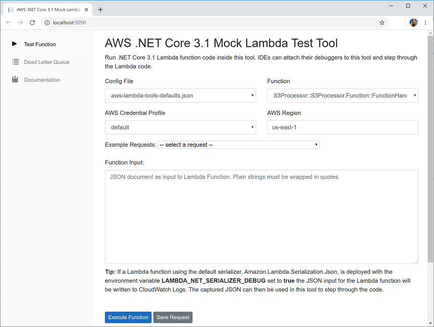

Llevo un tiempo viendo desarrollarse las **Azure Functions**,
desarrollando algunas para entornos productivos y haciendo pruebas de
algunas de sus capacidades. Ahora, me ha surgido pasarme al desarrollo
de las Lambdas y me he percatado de algunas cosas que me gustaría
compartir. Es posible que cometa el mismo error una y otra vez y es
referirme a ellas con cualquiera de estos dos nombres. Personalmente,
cuando hablamos del concepto o el servicio, yo prefiero llamarlas
"Functions", por mi tradición en Azure y porque Google Cloud también usa
ese nombre (2vs1).

**El mismo concepto**

Estas soluciones *serverless* vienen a cumplir con el mismo concepto y
en esencia, deberían de usarse para lo mismo, pero no siempre es así.
Como toda solución *serverless* nos abstraemos del hardware que hay por
detrás, debemos de tener en cuenta la memoria RAM que consumirán, pero
no sabemos sobre que máquina, sistema operativo o versión de este se
ejecutan, incluso podría ir cambiando en el tiempo (aunque sinceramente,
no lo creo).

Todos se basan en un disparador (trigger) que comienza la Function, un
proceso y una respuesta. Tan sencillo como eso y tan sencilla debería de
ser tu Function, luego entenderás por qué digo esto. Los *triggers*
pueden ser de mil orígenes y servicios. Y hago esa diferenciación porque
nos podemos encontrar *triggers* más genéricos, como una llamada HTTP,
agnóstica al origen de datos (podría ser un servicio en otro cloud,
on-premise o tu rasbperry) y otros más propietarios, como el *trigger*
que tenemos para Blob Storage en Azure y el de S3 en AWS, aunque en este
caso, el servicio de origen de nuevo cumple la misma función.

**Capacidades extra o no...**

En mi experiencia me he encontrado que Azure permite una cosita que
llama las "Durable Functions", esta capacidad permite extender una
limitación que tienen este tipo de servicios y es que las AWS Lambdas
sólo se pueden ejecutar por 15 minutos y las Functions pueden llegar a
ser "ilimitadas" y no tengo nada claro que esto sea una buena opción. Es
verdad que esta capacidad te permite romper las limitaciones iniciales
del servicio, pero creo que debería de ser usado con cuidado y que es
una advertencia de que estás necesitando otra cosa, por lo que qué AWS
no lo ofrezca, no me llega a parecer tan malo, porque tiende a
corromperse. Llegamos a tener ese software que merece una
refactorización, quizás pasar a un contenedor (más ligero, con menor
vendor-locking...) pero como funciona, no lo tocamos y lo posponemos y
posponemos. No te creas que la otra opción te hubiera vendido y haría
que tu aplicación no funcione. Seguro que si hablas con soporte de AWS
puedan extender ese tiempo, pero ya te pondrán alguna condición o
recomendación. Además, las Durable tenían algo que suele dar dolor de
cabeza, sobre todo cuando no cuentas con ello que son las re ejecuciones
(por llamarlo de alguna forma) y es que recupera el estado entre las
"activities" que tiene, pero el código externo a ellas lo ejecuta de
nuevo y pueden cambiar los valores, hay que tener cuidado con ellos, más
de un dolor de cabeza he visto. ([Más
info](https://www.compartimoss.com/revistas/numero-48/azure-functions-best-practices/))

En el caso de que desarrolles con C# (AWS Lambda soporta los mismos
lenguajes que Functions, pero además Go y Ruby) creo sin duda que Azure
Functions es mucho más cómodo y tiene más soporte del lenguaje, creo que
está mejor planteado y usar cosas como Inyección de dependencias (DI) es
más sencillo y *testeable*. En el caso de AWS me ha resultado complejo,
pero... igual que con lo anterior, no creo que debamos usar/necesitar
las librerías de DI o reflexión. Podemos hacer una function sencilla,
con principios SOLID y si tienes ya varios servicios que gestionar,
quizás necesitas otro servicio.

Si, en este caso no es necesario que hagas una gestión de las llamadas
HTTP como harías en tu programa con un servicio, con Factory y demás,
porque por cada *trigger* se iniciará una Functions y morirá al
terminar, por eso no creo que necesitemos gestionar singletons, todo,
por construcción y definición es scope ([Más
info](https://stackoverflow.com/questions/38138100/addtransient-addscoped-and-addsingleton-services-differences)).

Test en local

Esto es algo que me ha sorprendido y gustado de las AWS Lambdas y es que
cuentan con unas herramientas de desarrollo (al menos para .net, no he
bicheado más lenguajes) que cuando las estás ejecutando en local,
arrancan una interfaz web que te permite pegar la llamada que vas a
hacer, ver la traza de respuesta y algunas cositas más. La estética es
un poco amateur, parece realmente algo externo a AWS aunque no lo es.
Pero creo que, especialmente para perfiles junior, hace las pruebas más
cercanas que depender totalmente de la terminal.

**En conclusión**

No te voy a decir que una u otra es mejor o cual debes usar. Creo que
ambas cumplen su cometido y realmente vas a usar unas u otras por una
estrategia o negociación a más alto nivel en tu empresa. Lo importante
es que las usemos bien. ¿Tienes una pequeña funcionalidad que se vaya a
ejecutar muy pocas veces o estás probándola? Functions está bien. ¿Esa
funcionalidad dura ya sus 10 minutillos o terminas con una instancia
arrancada todo el día? Yo iría mirando Container Apps o Elastic
Container.

Y no montes una pirámide dentro de una Function, son 2 llamadas, quizás
aquí podemos romper esa "regla" de no tener funciones de más de 10
líneas o de abstraer en una clase "Service" que realmente tendrá un
método con una llamada Http. Déjalo en un método.

Y, sobre todo. Dame tu opinión sobre este artículo o tu experiencia en
cualquiera de mis redes sociales o email.

**Diego Zapico**  
Azure AI MVP

import LayoutNumber from '../../../components/layout-article'
export default LayoutNumber