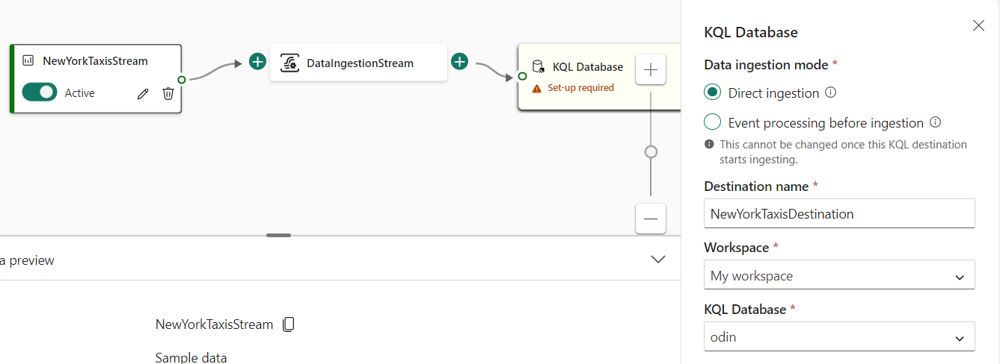
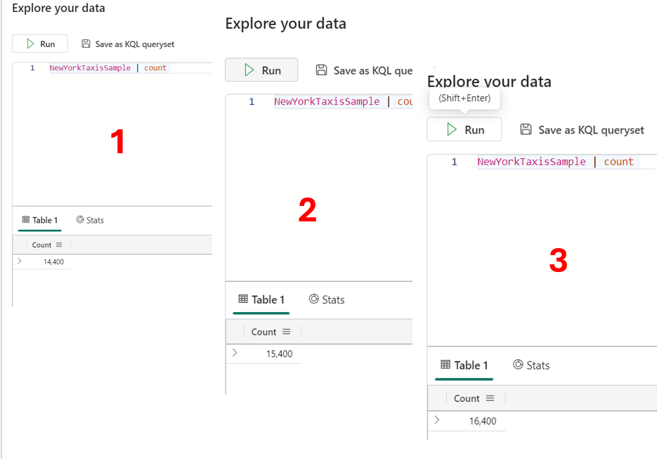
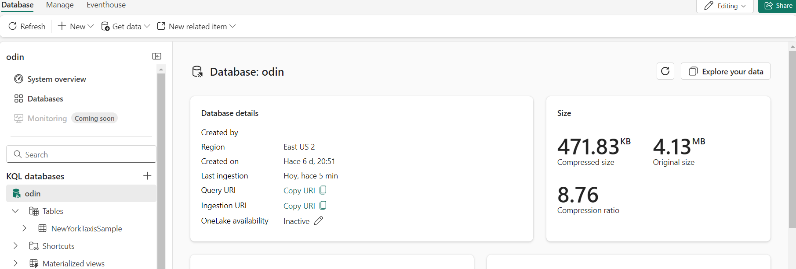

En un mundo donde la información en tiempo real es clave para la toma de
decisiones, Microsoft Fabric se posiciona como una solución integral que
lleva la analítica a un nuevo nivel. Hoy, exploraremos uno de sus
componentes más innovadores: el Eventhouse, una herramienta que promete
transformar cómo las organizaciones manejan y analizan datos en tiempo
real.

En este artículo, nos centraremos en el mundo del Real-Time Analytics,
un componente clave para las organizaciones que desean tomar decisiones
informadas y ágiles.

Azure es conocido por su vasto catálogo de productos y servicios. Sin
embargo, en el ámbito de los datos, ha habido una herramienta que ha
pasado relativamente desapercibida en la comunidad, ya que no ha
recibido tanta atención mediática como otros productos. Estamos hablando
de Azure Data Explorer.

Tal vez algunos de ustedes no estén familiarizados con esta herramienta,
ya que Azure Data Explorer ha estado conviviendo con Azure Synapse, que
también incluye capacidades de análisis en tiempo real. Esto ha llevado
a que Azure Data Explorer se convirtiera en el \"underdog\" en el ámbito
del análisis de datos. Azure Synapse ha capturado gran parte de la
atención debido a su marketing más agresivo y su enfoque más amplio en
las capacidades analíticas, lo cual ha contribuido a que muchos no
conozcan las increíbles funcionalidades que ofrece Azure Data Explorer.

**¿Qué es Azure Data Explorer?**

Azure Data Explorer es un servicio de análisis de datos de Azure
diseñado para almacenar y consultar volúmenes masivos de datos con una
eficiencia impresionante. Utiliza el Kusto Query Language (KQL), creado
específicamente para escenarios de análisis en tiempo real, donde la
velocidad y la precisión son cruciales.

**¿Qué es un Eventhouse y qué tiene que ver con Azure Data Explorer?**

Ahora que ya hemos cubierto los antecedentes de Azure Data Explorer, es
momento de abordar el tema principal: ¿Qué es un Eventhouse? ¿Cómo se
relaciona con Azure Data Explorer? Y, por cierto, ¿es en un Eventhouse
donde se montan las fiestas?

Bueno, el Eventhouse es un concepto nuevo introducido por Microsoft
Fabric. Aunque el nombre puede parecer poco serio, los Eventhouses son
en realidad el caballo de Troya de Azure Data Explorer. Según la
documentación de Microsoft, los Eventhouses ofrecen una solución robusta
para manejar y analizar grandes volúmenes de datos, especialmente en
escenarios que requieren análisis y exploración en tiempo real.

**¿Qué hace especial a un Eventhouse?**

Los Eventhouses están diseñados para gestionar flujos de datos en tiempo
real de manera eficiente, permitiendo a las organizaciones ingresar,
procesar y analizar datos casi instantáneamente. Estas características
los hacen particularmente valiosos en situaciones donde obtener
información rápida y precisa es esencial. Aquí están algunas de sus
principales características:

1.  **Infraestructura escalable:** Esto garantiza un rendimiento óptimo
    y un uso eficiente de los recursos.

2.  **Datos estructurados, semiestructurados y no estructurados:**
    Puedes obtener datos de múltiples fuentes y canales (como
    Eventstream, SDKs, Kafka, Logstash, flujos de datos, y más) en
    diversos formatos.

3.  **Espacio de trabajo de bases de datos:** Un Eventhouse actúa como
    un espacio de trabajo compartido para bases de datos, permitiendo la
    gestión simultánea de varias bases de datos.

4.  **Adaptado a eventos en tiempo real:** Los Eventhouses están
    diseñados para manejar eventos basados en el tiempo y datos en
    streaming, soportando diversos formatos y fuentes de datos.

5.  **Consumo mínimo:** Están diseñados para optimizar costos
    permitiendo la suspensión del servicio cuando no está en uso.

6.  **Monitoreo y gestión unificados:** Ofrecen un control centralizado
    a nivel global y por cada base de datos individual, simplificando la
    gestión y asegurando que las operaciones sean eficientes.

**La llegada de Azure Data Explorer a Fabric**

¿Todo esto te suena familiar? Un Eventhouse funciona igual que un
clúster de Azure Data Explorer. Los datos se almacenan dentro de una o
varias bases de datos KQL, que son gestionadas en conjunto dentro de un
Eventhouse. Ahora que entendemos qué es un Eventhouse y cómo se integra
con Azure Data Explorer, ¡es hora de poner manos a la obra! Vamos a
aprender cómo montar tu propio Eventhouse en Microsoft Fabric.

**Paso 1: Crear un Eventhouse**

Crear un Eventhouse es un proceso simple que puedes realizar
directamente desde el portal de Microsoft Fabric. Para comenzar, pulsa
sobre la opción de Real-Time Intelligence dentro del portal:

Dentro de tu espacio de trabajo, selecciona la opción para añadir un
Eventhouse. El sistema te pedirá que le pongas un nombre a esta nueva
entidad que se convertirá en el centro de tus operaciones de eventos en
tiempo real.

**Paso 2: Configurar tu Eventhouse**

Una vez que hayas creado tu Eventhouse, se abrirá automáticamente la
página de detalles de la base de datos predeterminada asociada con él.
Esta base de datos es el corazón de tu Eventhouse, donde se almacenarán
y gestionarán todas tus databases.

Si deseas ver todas las bases de datos dentro de tu Eventhouse o crear
otras adicionales, simplemente haz clic en el elemento de menú
\"Eventhouse\". Este puede estar ubicado en la barra de navegación o
dentro de la página de detalles de la base de datos que ya has abierto.

**Paso 3: Añadir datos a tu Eventhouse**

Ahora que has creado tu Eventhouse, es hora de llenarlo de datos. Una
base de datos sin datos es como una casa vacía; no tiene mucho sentido.
Vamos a agregar algunos datos en tiempo real para que tu KQL Database
cobre vida y realmente demuestre su poder en el procesamiento de eventos
en tiempo real.

Para empezar, vamos a crear un nuevo EventStream. La función de
EventStream en Microsoft Fabric te permite capturar, transformar y
enrutar eventos en tiempo real hacia varios destinos desde un único
punto:

**Paso 4: Configurar EventStream y conectar la KQL**

Al crear un EventStream, se abrirá el EventStream Visual Editor, una
herramienta que sigue la filosofía de drag & drop que caracteriza a
Microsoft Fabric. Este editor es intuitivo y fácil de usar. Para añadir
datos, simplemente haz clic en \"New Source\" para ver las opciones de
origen disponibles.

Para este tutorial, utilizaremos el Sample Data, que funciona de manera
similar a un origen real como un EventHub. Microsoft enviará datos de
muestra continuamente, lo cual es perfecto para simular un caso de uso
real sin necesidad de una fuente de datos en producción.

El siguiente paso es conectar la base de datos KQL que hemos creado en
nuestro Eventhouse con los datos que estamos recibiendo en tiempo real.
Para esto, seleccionamos la opción de 'Direct Ingestion'. Al hacerlo,
optamos por omitir el procesamiento de eventos individuales antes de la
ingesta, lo que significa que los eventos se enviarán directamente a su
destino sin transformación, enriquecimiento, filtrado, etc.

Dentro del cuadro de configuración, selecciona la opción para crear una
nueva tabla y nómbrala.

Una vez que hayas completado este paso, se mostrará un ejemplo de los
datos que recibirás. Una de las ventajas de usar SampleData es que los
eventos comienzan a llegar inmediatamente, lo que te permite visualizar
el esquema de tu futura tabla de manera instantánea.

**Paso 5: Explorando los Datos en Tiempo Real**

Después de finalizar la configuración de la tabla, aparecerá un resumen
con diferentes opciones. En este caso, seleccionamos la opción de
Explore para comenzar a visualizar los datos en tiempo real.

Se nos desplegará una ventana donde podremos ejecutar varias consultas
de tipo COUNT con unos segundos de diferencia entre cada una, verás cómo
los datos llegan de manera continua desde tu EventStream hacia la tabla.

Además, si cambias a la ventana de tu EventStream, podrás observar
gráficas que muestran cómo los datos se reciben a lo largo del tiempo,
proporcionándote una visión clara del flujo de eventos.

**Conclusión: Verificando el Estado del Eventhouse**

Finalmente, puedes navegar de nuevo a tu Eventhouse y revisar las
estadísticas generales. Ahora, verás que tu Eventhouse ha cobrado vida,
con datos fluyendo y procesándose en tiempo real.

Con el Eventhouse de Microsoft Fabric, las organizaciones pueden
transformar cómo manejan y analizan datos en tiempo real, obteniendo
insights cruciales de manera más rápida y eficiente. Al dominar estas
herramientas, estarás mejor preparado para enfrentar los desafíos de la
analítica moderna y tomar decisiones más informadas.

**Javier Iniesta**  
Data & AI Architect

import LayoutNumber from '../../../components/layout-article'
export default LayoutNumber