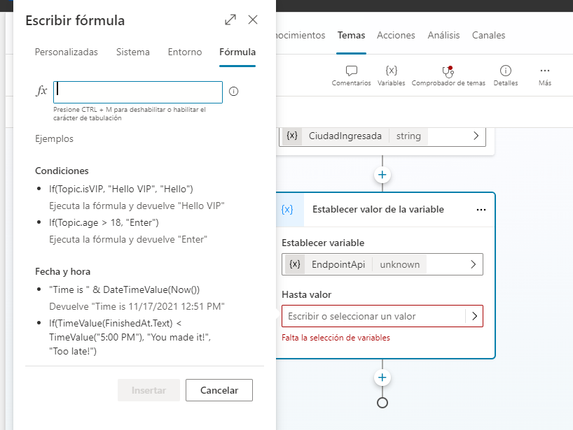

Hoy por hoy las tarjetas adaptables son una buena solución para
utilizarlas como medio para visualizar, de forma clara, información
resumida, notificaciones, información sobre el clima, recordatorios,
etc. Por eso, te cuento aquí lo que necesitamos para utilizarlas en
Copilot Studio en conjunción con APIs externas.

**Requerimientos iniciales**

Los requerimientos de partida son los siguientes:

-   Una licencia de Copilot Studio. Importante destacar que se puede
    utilizar de manera gratuita durante un mes:
    https://copilotstudio.microsoft.com/.

-   Una licencia de una API externa, en este caso a modo de ejemplo,
    vamos a utilizar una API gratuita de clima: [Weather API -
    OpenWeatherMap](https://openweathermap.org/api) (Una vez
    registrados, obtendrán el APiKey).

-   La tarjeta adaptable a visualizar en el Copilot. Recomiendo utilizar
    el diseñador provisto por Microsoft: https://adaptivecards.io/ .
    En este caso, utilizaremos el ejemplo de clima de las tarjetas
    adaptables.


**¿Cómo arrancamos?**

Completados todos los requerimientos iniciales, nos dirigimos a Copilot
Studio y pulsamos "Crear" y posteriormente "Nuevo copiloto".


Ingresamos Nombre, Descripción y seleccionamos el idioma, al finalizar
pulsamos "Crear". Una vez finalizado el proceso de creación, nos
dirigimos hacia su parte superior a la opción de temas.

¿Qué son los temas?

Los temas son los componentes básicos de un copiloto. Los temas pueden
verse como las competencias del copiloto: definen cómo se desarrolla un
diálogo de conversación. Los temas son rutas de conversación discretas
que, cuando se usan juntas, permiten a los usuarios tener una
conversación que se siente natural y fluye apropiadamente.

https://learn.microsoft.com/es-es/microsoft-copilot-studio/guidance/topics-overview

**Imagen 3.- Acceso a los temas de Copilot Studio.**

Allí, vamos a poder observar los temas que vienen de forma
predeterminada (Nota: Recomiendo investigar cada uno en particular, ya
que son parte fundamental del motor de nuestro Bot), pulsamos en "+
Agregar un tema" y luego "Desde cero".


En este ejemplo, vamos a llamar a nuestro tema "Clima".


Una vez allí, comenzamos a agregar frases desencadenadoras.

¿Qué son las frases?

Cuando una o más de las frases desencadenadoras coinciden con el mensaje
entrante de un usuario.

https://learn.microsoft.com/es-es/microsoft-copilot-studio/authoring-triggers

**Imagen 6.- Frases desencadenadoras.**

Para ello pulsamos en Editar, agregando frases como: Va a llover?, Hace
calor?, me decís el clima. Te recomiendo variar la forma de redacción de
las frases.


De esta manera, cuando el usuario escriba alguna de esas frases o parte
de ellas, el reconocimiento de lenguaje natural de nuestro copiloto nos
dirige de forma automática a dicho tema. Realizado lo anterior, el
siguiente paso, será preguntarle la ciudad al usuario, para ello
pulsamos en el "+" y elegimos la opción "Formular una pregunta ".

En "identificar" se puede elegir obtener la respuesta completa del
usuario (como en este ejemplo) o extraer parte de la respuesta de
usuario en la entidad Ciudad.


En el presente ejemplo, la API se encuentra parametrizada para Argentina
únicamente, pero vale recordar que se puede configurar para cualquier
país del mundo. Una vez ingresada la respuesta del usuario, almacenemos
el valor en una variable la cual de forma predeterminada toma el nombre
de "Var1", haciendo clic en ella, se la puede renombrar según se desee,
en este caso le asignamos "CiudadIngresada" y cambiamos la propiedad
"Identificar" a "Respuesta completa del usuario".

El siguiente paso será preparar la url de la API, para lo cual
utilizamos una nueva variable , por lo tanto, nuevamente pulsamos en el
"+" y seleccionamos " Administración de variables "=> "Establecer valor
de la variable" y creamos una nueva variable llamada "EndpointApi" ,
seleccionamos el desplegable que se encuentra en "Hasta valor" y nos
dirigimos a "Formula"(esta nos permite agregar fórmulas a nuestro
valores de variables) , una vez allí, utilizamos la función de
concatenar y escribimos lo siguiente:

```
Concatenate("https://api.openweathermap.org/data/2.5/weather?q=",Topic.CiudadIngresada,",AR&appid="APIkey otorgado"&units=metric&lang=es")
```

Topic nos va a permitir acceder a nuestras variables disponibles, la
cual concatenamos a la url mediante la función Concatenate.




Ahora, agregamos la llamada http de la API, nuevamente pulsamos en "+" y
nos dirigimos a "Avanzados" => "Enviar solicitud http".


En el parámetro URL ingresamos nuestra variable generada en el paso
anterior, seleccionamos el Método de tipo GET, tipo de respuesta
seleccionamos "A partir de datos de ejemplo" , para obtener estos datos
de ejemplos, realizamos una llamada desde Postman a nuestra API,
copiamos la salida de la misma y la ingresamos en lo mencionado
anteriormente.


La salida de la API la asignamos en una nueva variable llamada
"JsonResultadoEndPoint". Lo próximo que debemos hacer es mostrar el
valor en nuestra tarjeta adaptable, para ello, copiamos la parte del
Body del Json de la misma desde el diseñador de tarjetas y lo pegamos en
nuestro Copilot en la acción "Enviar mensaje" una vez agregado este
vamos a pulsar donde dice "+ Agregar" y seleccionamos "tarjeta
adaptable".


Posteriormente pulsamos en el elipsis superior derecho, seleccionamos
"propiedades", agregamos el JSON ( Editamos el mismo según nuestras
preferencias), pulsamos "Editar JSON", para cambiar a "Formula" y poder
asignarle nuestras variables resultantes de la llamada a la API.


Como último paso, probamos nuestro Bot , ingresando una de las frases
desencadenadoras.


Espero que te sirva!

**Juan Emilio Martínez** <br />
Ing. en Sistemas de Información, SharePoint Lead en Nación Servicios S.A  <br />
juane.martinez@hotmail.com  <br />
https://www.linkedin.com/in/juan-emilio-mart%C3%ADnez-3b76824b/ <br />


import LayoutNumber from '../../../components/layout-article'
export default LayoutNumber
