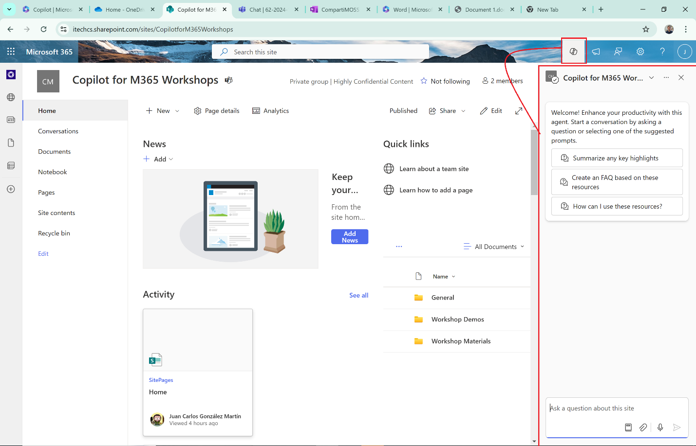
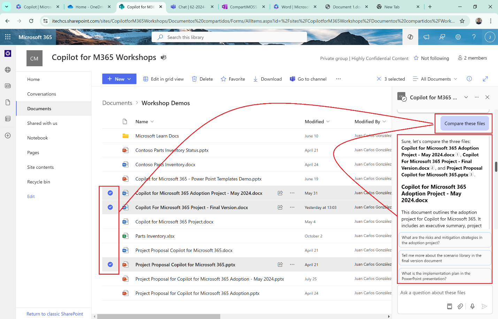
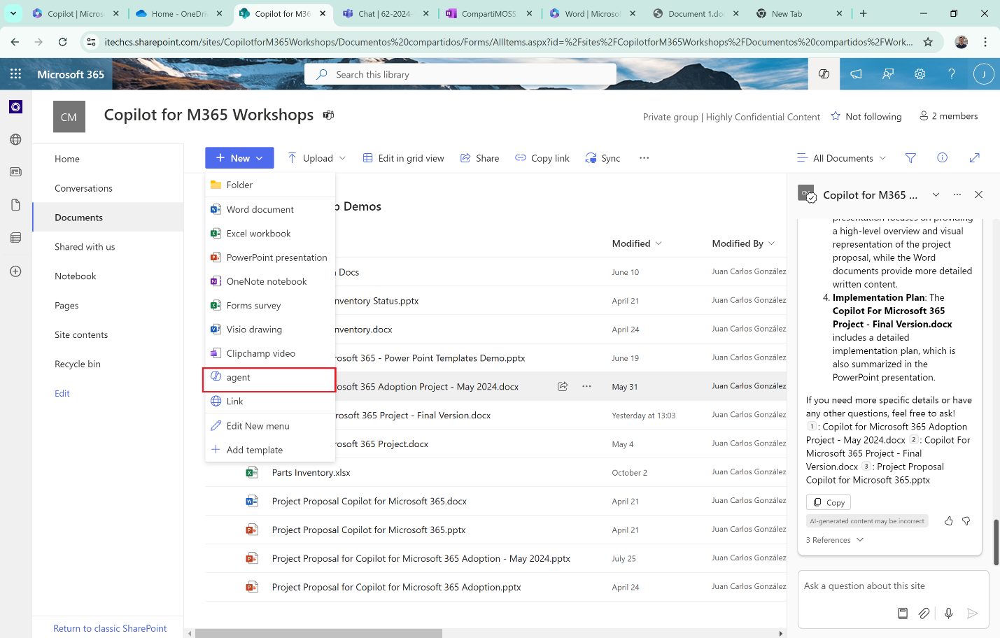
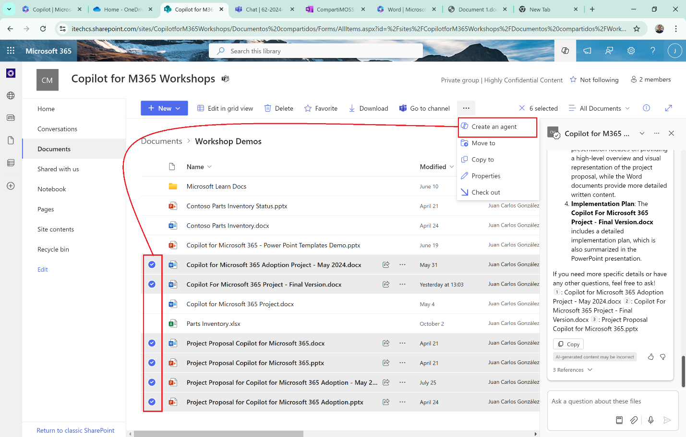
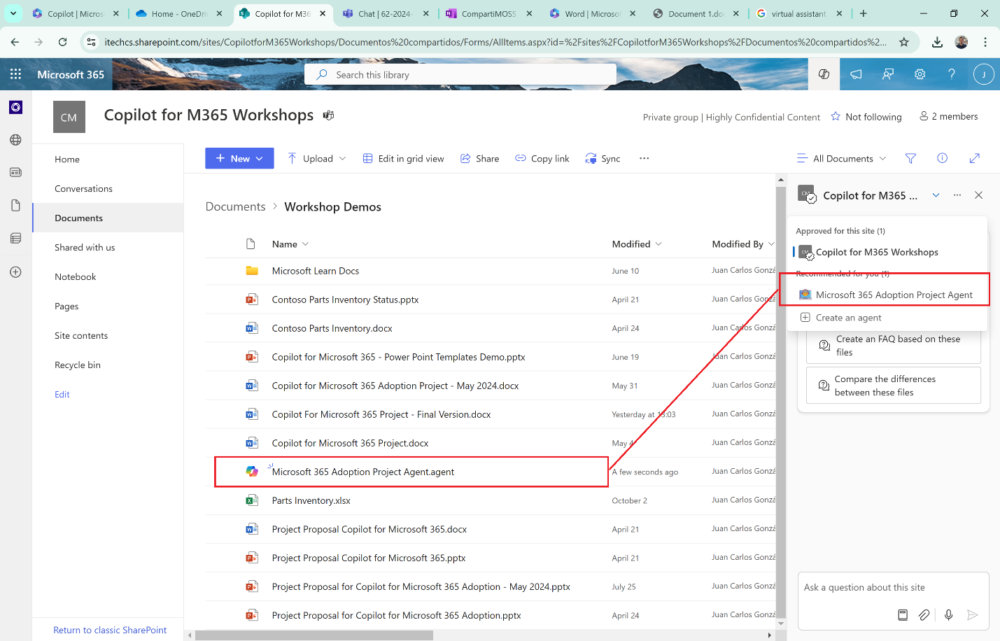
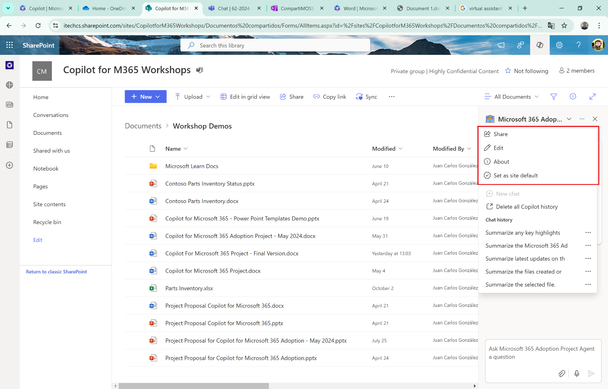

Una de las novedades de la Wave 2 de Microsoft 365 Copilot es la llegada
de los [Agentes de Copilot para Sitios de
SharePoint](https://techcommunity.microsoft.com/blog/microsoft365copilotblog/microsoft-365-copilot-wave-2-ai-innovations-in-sharepoint-and-onedrive/4245159).
Se trata de Agentes especializados en el contenido de Sitios de
SharePoint y como tal su ámbito de actuación es el relativo a responder
a cuestiones relativas a dicho contenido. En este artículo daremos un
vistazo a los Agentes de Copilot para Sitios de SharePoint.

**Agente de Copilot por defecto en Sitios de SharePoint**

Por defecto, si un usuario dispone de una licencia de Microsoft 365
Copilot tendrá también a su disposición un Agente de Copilot
pre-construido en cada Sitio de SharePoint al que tiene acceso. Este
Agente está preparado para responder ante cuestiones relativas a
contenido almacenado en SharePoint.

Por ejemplo, a este Agente por defecto le podemos preguntar sobre las
últimas novedades en el Sitio, que nos genere un documento de FAQs a
partir de documentos específicos, etc. Si le preguntamos sobre las
últimas novedades del Sitio y los cambios más relevantes en información
almacenada veremos una respuesta en la que por cada documento del sitio
nos indica cuando fue actualizado por última vez y un resumen del mismo:

Si accedemos a una de las Bibliotecas de Documentos del Sitio y
seleccionamos uno o varios archivos, podemos solicitarle al Agente que
nos resuma dichos archivos, que nos los compare, etc. En definitiva,
proporciona una funcionalidad similar a la que vimos en Copilot para
OneDrive en el número previo de la revista:
https://www.compartimoss.com/revistas/numero-61/copilot-para-onedrive-for-business/

**Creando un nuevo Agente de Copilot en Sitios de SharePoint**

Además del Agente de Copilot por defecto, podemos crear nuevos Agentes
desde la opción "New" de la página principal del Sitio, desde el menú de
acciones de una Biblioteca de Documentos, seleccionando uno o varios
documentos y la opción de Copilot o bien desde el Agente de Copilot
creado por defecto.

En mi caso voy a crear el Agente a partir de una serie de documentos
seleccionados:

Como veis, tras seleccionar los documentos en la biblioteca se habilita
la opción "Create an agent". Al hacer clic en la misma, se abre una
ventana en la que:

-   Se visualizan los documentos sobre los que va a responder el Agente.

-   Podemos optar por abrir el agente o bien editarlo.

En el caso en el que optemos por editar el Agente podremos hacer lo
siguiente:

-   Cambiar configuraciones relativas al Nombre, Imagen y Descripción.

-   Modificar los orígenes de información que "alimentan" el agente
    añadiendo o eliminado archivos para este caso concreto, cambiando el
    ámbito del Agente para que abarque el Sitio completo o incluso
    añadiendo Sitios adicionales:

-   Realizar cambios en el comportamiento del Agente en cuanto a los
    prompts de inicio. Se puede modificar el texto de estos, pero no es
    posible añadir nuevos Prompts:

Una vez hayamos finalizado las configuraciones del Agente, podemos
probar el mismo usando los Prompts de inicio o bien prompts específicos
que tengamos en mente.

Si estamos satisfechos con el resultado, podemos guardar el Agente de
manera que estará listo para su uso. Fijaros como también podemos
realizar personalizaciones avanzadas con el botón "Add advanced
communication in Copilot Studio" que nos lleva a poder personalizar el
Agente en Copilot Studio. El efecto de guardar los cambios hace dos
cosas:

-   Se genera en la biblioteca un archivo ".agent" que representa el
    Agente.

-   Se añade al Agente en el listado de Agentes disponibles en el Sitio.

Si hacemos click en archivo ".agent", se muestra el Agente en el visor
de archivos de Microsoft 365 y podemos interactuar con el realizando
preguntas sobre los contenidos que configuramos:

Lo interesante de que el Agente creado sea tratado de manera inicial
como un archivo es que lo podemos compartir vía e-mail, en Teams, etc.
Aunque claro, para usar el Agente se necesita una licencia de Microsoft
365 Copilot.

Finalmente, para todo Agente que creemos podemos:

-   Promocionarlo a Agente aprobado en el Sitio de forma que desaparece
    el archivo mencionado y está disponible como Agente verificado
    (Misma experiencia que el Agente por defecto).

-   Convertirlo en el Agente por defecto.

-   Editarlo para añadir nuevas personalizaciones.

**Conclusiones**

Los Agentes de Copilot forman parte de la Wave 2 de Microsoft 365
Copilot y permiten crear Agentes especializados que respondan en torno a
información almacenada en un Sitio de SharePoint. Podemos crear Agentes
que cubran un Sitio entero o bien documentos específicos. Finalmente,
para personalizaciones avanzadas de un Agente podemos recurrir a Copilot
Studio.

**Juan Carlos González**  
Microsoft 365 & Microsoft Teams MVP | Microsoft 365 SME & Delivery Manager  
@jcgm1978 | https://www.linkedin.com/in/juagon/ 

import LayoutNumber from '../../../components/layout-article'
export default LayoutNumber