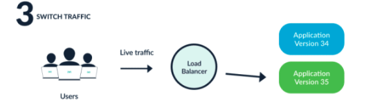
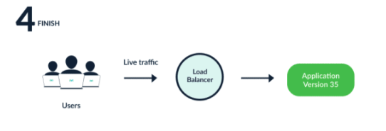
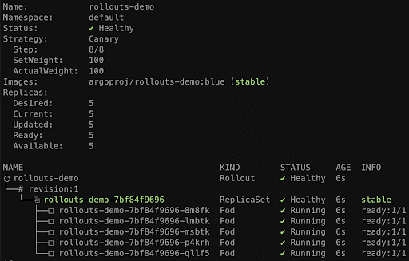
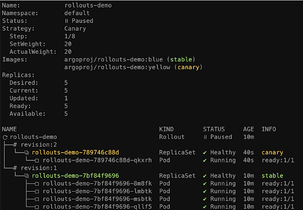
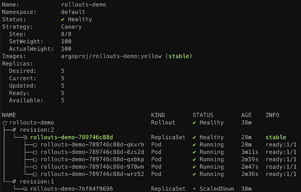

En el número anterior, hablamos de cómo Argo CD/CI puede simplificar
considerablemente el proceso de despliegue en Kubernetes. Ahora es
momento de dar un paso más y abordar el siguiente nivel: asegurar la
calidad de las nuevas versiones desplegadas. La calidad en el desarrollo
de un producto es fundamental. No se trata solo de evitar errores en
producción, sino también de minimizar el impacto en los clientes durante
los despliegues, garantizar rollbacks sencillos en caso de fallos, y
planificar estrategias de despliegue eficaces. Aquí es donde entra Argo
Rollouts, una herramienta diseñada para optimizar tus procesos de
despliegue.

**¿Qué es Argo Rollouts?**

Argo Rollouts es un controlador de Kubernetes que introduce capacidades
avanzadas de despliegue mediante CRDs (Custom Resource Definitions).
Estas incluyen estrategias como blue-green, canary, experimentación y
entrega progresiva. Además, Argo Rollouts se integra opcionalmente con
controladores de ingreso y service meshes para gestionar el tráfico de
forma gradual durante las actualizaciones. También permite consultar
métricas externas de diversos proveedores para verificar indicadores
clave de rendimiento (KPIs) y tomar decisiones automáticas sobre
promociones o rollbacks durante una actualización.

**¿Por que Argo Rollouts?**

Aunque Kubernetes ya ofrece estrategias de actualización progresiva,
estas tienen limitaciones significativas:

-   Escaso control sobre la velocidad de despliegue.

-   Imposibilidad de gestionar el flujo de tráfico hacia la nueva
    versión.

-   Las sondas de disponibilidad no evalúan condiciones avanzadas, como
    pruebas de estrés.

-   Incapacidad para consultar métricas externas y detener
    actualizaciones automáticamente en caso de fallos.

Estas restricciones hacen que, en aplicaciones con grandes volúmenes de
usuarios, las actualizaciones sean arriesgadas. Argo Rollouts aborda
estos desafíos proporcionando control granular y capacidades avanzadas
para minimizar riesgos.

**Cuales son sus principales caracteristicas**

Las características principales son las siguientes:

-   Estrategia de update blue-green.

-   Estragia de update Canary.

-   Desplazamiento de trafico administrado y detallado.

-   Ascensos y retrocesos automatizados.

-   Automatización manual.

-   Consultas métricas personalizaciones .

-   Intregración con controladores de entradas como Nginx.

-   Integración con Service Mesh: Istio, Linkerd.

-   Integración con proveedores de métricas: Prometheus, Wvefront, ...

**Como funciona Argo Rollouts**

El controlador Argo Rollouts opera como una extensión del objeto
Kubernetes Deployment, gestionando ReplicaSets para crear, escalar y
eliminar pods. A través del campo spec.strategy, permite definir
estrategias avanzadas para introducir nuevos ReplicaSets y validarlos
antes de considerarlos estables.


Para ver cómo funciona el controlador Argo Rollouts, veamos cómo ejecuta
un despliegue blue-green :

1.  Se crean un ReplicaSet antiguo y otro nuevo uno al lado del otro.

> 

2.  El antiguo ReplicaSet recibe todo el tráfico

> 

3.  Los desarrolladores pueden probar el nuevo ReplicaSet hasta que
    determinen que es seguro desplegarlo.



4.  Una vez que el controlador ha desplegado la nueva versión,
    transfiere el tráfico del antiguo ReplicaSet y reduce la versión
    antigua.



**Manos a la obra**

**Instalando Argo Rollouts con Helm**

Argo Rollouts puede instalarse a través del Helm creado por la
comunidad, que lo podemos encontrar en la siguiente url
https://github.com/argoproj/argo-helm/tree/main/charts/argo-rollouts.
Para instalarlo tan solo hay que ejecutar estos dos comandos.

helm repo add argo https://argoproj.github.io/argo-helm

helm install my-release argo/argo-rollouts

**1 Crear el Rollout**

Una vez instalado vamos a ver un ejemplo de como crear un Deployment de
tipo Canary. El primer paso es crear un objeto Rollout que especifique
su estrategia de despliegue. Por ejemplo, la siguiente estrategia
especifica un despliegue Canary.

```yaml
spec:
replicas: 5
strategy:
canary:
steps:
- setWeight: 20
- pause: {}
- setWeight: 40
- pause: {duration: 10}
- setWeight: 60
- pause: {duration: 10}
- setWeight: 80
- pause: {duration: 10}
```

Este código inicialmente despliega una nueva versión al 20% de los pods,
luego espera por una acción manual - esta es la pausa: {}. Después de
que un operador apruebe el despliegue, se entrega automáticamente al
40%, luego al 60%, luego al 80% y finalmente al 100% de los pods, con
intervalos de 10 minutos.

Hay que tener en cuenta de que la primera vez que desplgamos el Canary,
inmediatamente escalará al 100% ya que rpeviamente no habia ningun
Rollout previamente. Para ver el estado del Rollout podemos ejecutar el
siguiente comando

```
kubectl argo rollouts get rollout rollouts-demo --watch
```



2 .- Actualizar el Rollout

Cada vez que actualice el archico spec.tempalte de los pods en su
Rollout se desplegará una nueva versión, con el comportamiento de
despliegue que especificamos en el paso 1. Para actualizar el rollout
puede ser con un comando similar al siguiente:

```
kubectl argo rollouts set image rollouts-demo rollouts-demo=argoproj/rollouts-demo:yellow
```

Recordemos que la estrategia de despliegue especificaba que la nueva
versión debía desplegarse sólo en el 20% del tráfico y, a continuación,
hacer una pausa y esperar la aprobación del operador. Para comprobar que
esto ha ocurrido realmente, ejecute de nuevo el comando get rollout de
nuevo:



**3.- Promociona el Rollout**

Nuestra configuración indicaba que tras escalar el canario al 20%, el
Rollout debía detenerse indefinidamente y esperar a un operador. Utilice
este comando para promover el Rollout, lo que significa que la nueva
versión se ve bien y queremos continuar el despliegue:

kubectl argo rollouts promote rollouts-demo

Ahora el Rollout ejecuta los pasos restantes -dirige el trafico al
canary al 40%, esperar 10 minutos, incrmenta el trafico al 60%, etc.-
hasta dirigir todo el trafico al canary. Ejecute get rollout durante
este proceso si desea ver el Rollout en acción. Después de 40 minutos,
ejecútalo una última vez para ver el resultado final:



**Conclusión**

Argo Rollouts amplía las capacidades del objeto de Kubernetes
Deployment, permitiendo a los equipos implementar fácilmente estrategias
avanzadas de Continuos Deployment. En este articulo solo hemos visto una
de las pequeñas funcionalidades de las que se tiene, cada
producto/desarrollo tiene unas particularidades diferentes y pueden
implicar una estratégica diferente con la que queremos abordar. Pensar
los diferentes tipos de aplicaciones que podemos tener, no es lo mismo
desplegar una API, un Frontal Web o bien Procesos en Background. Debido
a esas diferencias se han de adaptar como configuramos nuestros
Rollouts. También y no menos importante es tener claro cuál es nuestro
plan de Calidad de nuestro producto, junto con claro cuál es la suite de
test que queremos ejecutar para llevar nuestro desarrollo a producción.
Argo Rollout es solamente una herramienta y lo importante es que
tengamos claro cuál es nuestro plan y tener las herramientas que nos
facilitan llegar a ese objetivo. cuales se ha de adaptar


**Adrián Diaz Cervera** <br />
Technical Lead at SCRM Lidl Hub International <br />
.NET MVP <br />
http://theavenger.dev <br />
@AdrianDiaz81 <br />

import LayoutNumber from '../../../components/layout-article'
export default LayoutNumber