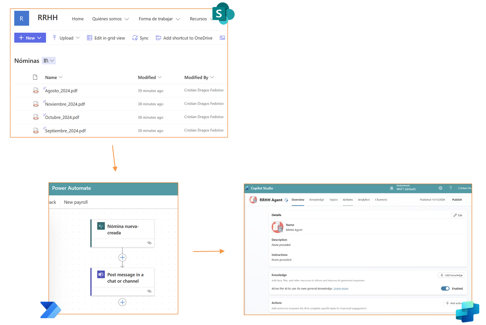
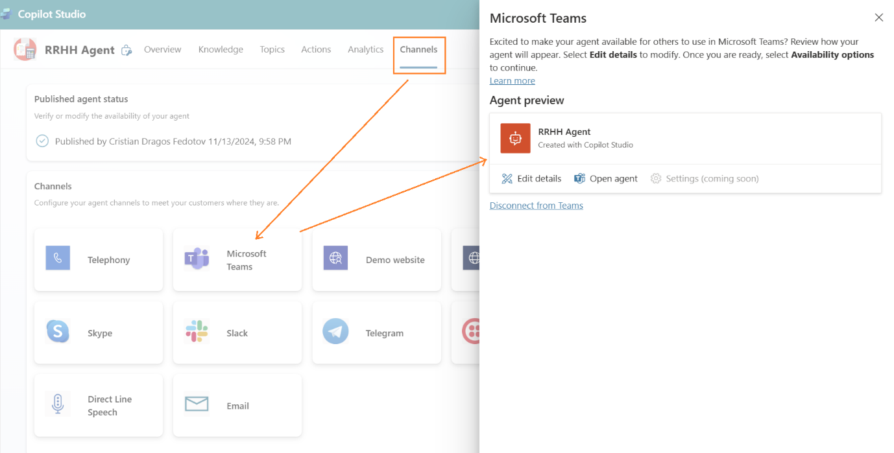
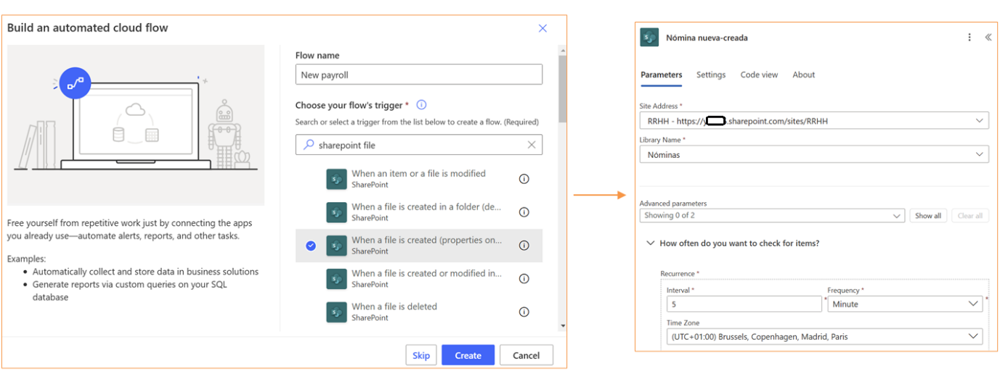
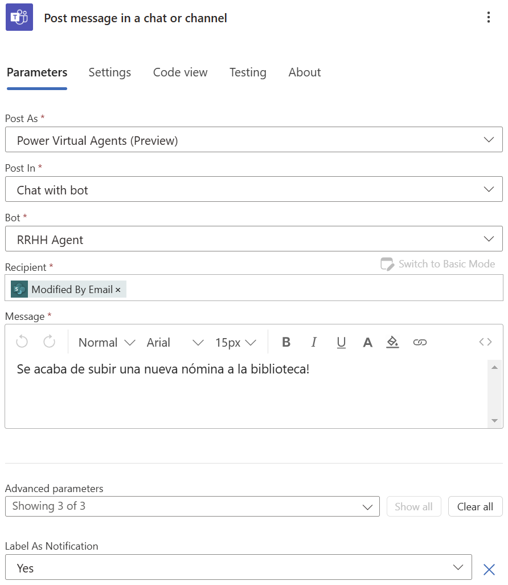

Una vez más, te traigo una buena manera de aprovechar las capacidades de
automatización y mensajería proactiva a través de Copilot Studio y Power
Automate. En este artículo, vamos a integrar un agente en Copilot Studio
con los mensajes proactivos enviados desde Power Automate, y cómo
configurarlo para responder a cambios en elementos de una lista de
SharePoint.

**¿Cómo empezamos?**

Por una parte, necesitamos un agente de Copilot Studio creado, y
publicado a través del canal de comunicación de Microsoft Teams.

Segundo, necesitamos un sitio de SharePoint Online, en mi caso, este
sitio contiene una biblioteca de documentos en la que mes a mes se
subirán ficheros .pdf (nominas). Cada vez que se añada una nueva nomina,
queremos avisar al usuario de este hecho a través de un agente de
Copilot Studio con un mensaje proactivo.

Y por último, necesitamos un flujo de Power Automate que será el que se
encargue de desencadenar el envío de mensajes proactivos a diferentes
usuarios, cada vez que se añada un documento nuevo en la biblioteca de
SharePoint.

**Creación del agente en Copilot Studio **

En Copilot Studio, seleccionamos "Nuevo Agente" y proporcionamos la
información básica, como el nombre del agente y una breve descripción de
su propósito. Este agente será responsable de enviar los mensajes de
cambios en la lista de SharePoint a los usuarios correspondientes. 
Dentro de los detalles del agente ya creado, vamos a encontrar la
pestaña "Canales" donde podremos publicar el agente en diferentes
canales. En mi caso voy a seleccionar MS Teams.

Una vez configurado el canal de comunicación en Teams, publicamos el
agente con el botón de "Publicar" presente en la barra superior de la
pantalla de configuración en Copilot Studio.

**¿Cómo configuramos el flujo de Power Automate?**

Dentro de Power Automate necesitamos crear un nuevo flujo automatizado
con un desencadenador basado en acciones de SharePoint, en mi caso,
cuando un nuevo fichero se crea o edita dentro de una biblioteca
(llamada "Nóminas" dentro del sitio de SharePoint de RRHH).

Posteriormente añadimos la lógica necesaria dentro del flujo para
extraer datos necesarios, así como el usuario al que tenemos que enviar
el mensaje proactivo o cualquier lógica de negocio intermedia que se
necesite antes del envío final del mensaje.

Como paso final dentro del flujo debemos añadir una nueva acción basada
en MS Teams, llamada '**'Enviar un mensaje de Teams**'' donde será
necesario configurar el agente a través del cual queremos enviar el
mensaje.

Tenemos diferentes opciones de envío en MS Teams, mensajes en chats
individuales o en un canal al igual que podemos enviar Adaptive Cards
con formato más atractivo y dinámico, incluso podemos enviar una
Adaptive Card a un usuario y esperar por su respuesta.

Por simplificar la prueba estoy recogiendo un campo de SharePoint que
almacena el nombre del usuario al que se le debe enviar este mensaje
proactivo. De la misma manera podríamos enviar este mismo mensaje a
varios usuarios a la vez. Podemos también marcar este mensaje proactivo
como una notificación más en la campanita de MS Teams, a través de la
configuración disponible en el paso anterior descrito.

**Consideraciones**

Se debe preinstalar el agente a todos los usuarios que van a recibir
estos mensajes proactivos ya que el canal de comunicación en MS Teams
con el usuario debe estar abierto antes de enviar los mensajes.

Todos los mensajes proactivos enviados a través de Power Automate están
directamente relacionados con los límites de la herramienta y throttling
de MS Teams por lo tanto debemos usarlo controlando previamente en estos
aspectos.

**¿Estás pensando ya en posibles casos de uso?**

**Cristian Dragos Fedotov**  
Microsoft 365 Solutions Architect  
cristianfedotov@gmail.com  
https://www.linkedin.com/in/cristianfedotov/  

import LayoutNumber from '../../../components/layout-article'
export default LayoutNumber