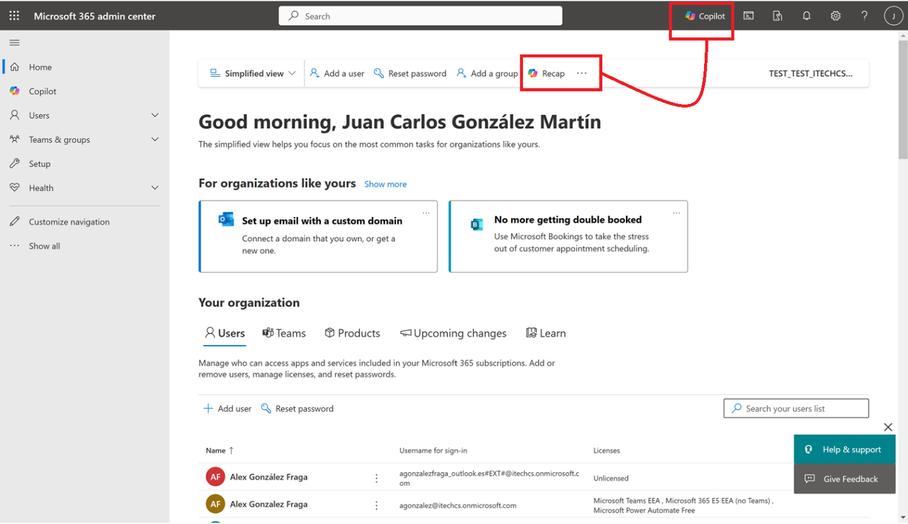
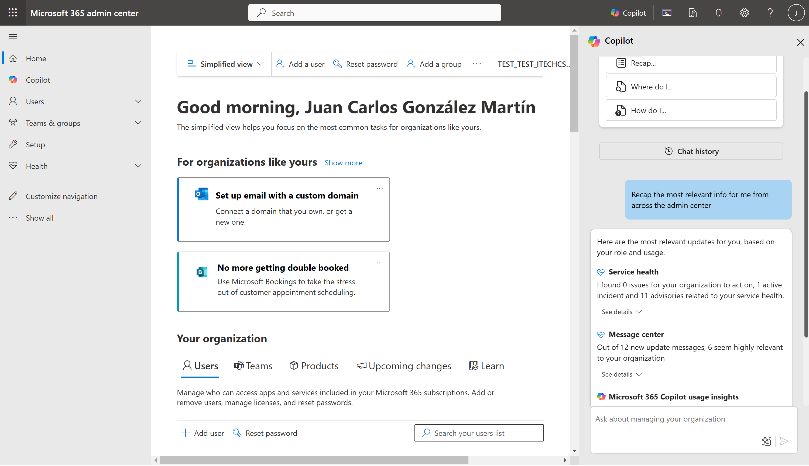
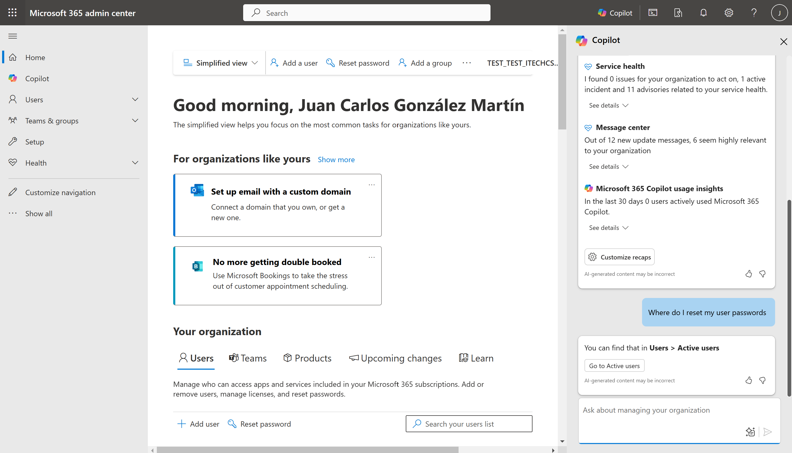
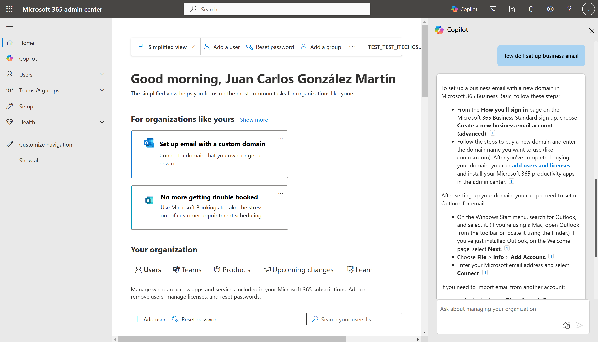
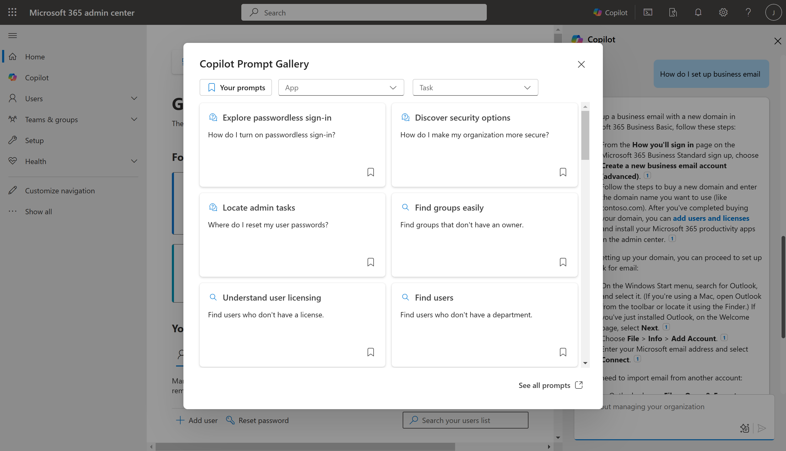
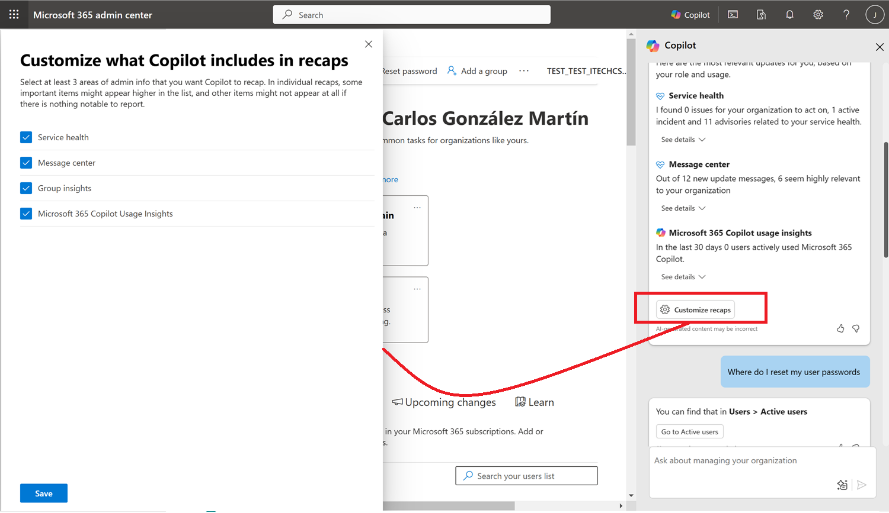

Como parte de la evolución continua de escenarios y casos de uso para
Copilot, se incorpora el de herramienta de apoyo a la administración de
Microsoft 365 y también de sus servicios core (SharePoint Online,
Microsoft Teams inicialmente y veremos que otros workloads se
incorporan). En este articulo revisaremos la experiencia de uso de
Copilot para administrar Microsoft 365 a la espera de que podamos hacer
lo mismo en SharePoint Online, Microsoft Teams y otros servicios.

**Accediendo a Copilot para administrar Microsoft 365**

El acceso a Copilot para administrar Microsoft 365 lo podemos realizar
desde dos ubicaciones en la página de Administración de Microsoft 365:

-   Desde la opción "rápida" de Recap que como su nombre indica nos
    permite solicitarle un Recap rápido de lo que nos podemos estar
    perdiendo como Administradores de la plataforma en cuanto a mensajes
    del centro de mensajes, incidentes en el tenant o insights sobre el
    uso de Microsoft 365 Copilot en la organización.

-   Desde la opción "Copilot" que nos abre el panel de Copilot para que
    empecemos a interactuar con nuestro ayúdate de soporte para
    administrar Microsoft 365.

Cualquiera de las dos opciones nos abre Copilot para administrar
Microsoft 365 listo para ayudarnos. Por ejemplo, con la opción Recap
este es el resultado:

**Casos de Uso de Copilot para administrar Microsoft 365**

Una vez que hemos visto como acceder a Copilot para administrar
Microsoft 365: ¿Qué escenarios y casos de uso nos habilita como nuestro
"mejor" ayudante para administsrar la plataforma? La respuesta la
podemos deducir a partir de los prompts de inicio que nos proporciona
Copilot:

-   El primer caso de uso es el que ya hemos visto: Obtener un Recap de
    lo que nos hayamos perdido desde la última vez en el tenant en
    cuanto a mensajes del centro de mensajes, incidentes en el tenant o
    insights sobre el uso de Microsoft 365 Copilot en la organización.
    Este caso de uso nos ahorra claramente tiempo de ir por cada una de
    las opciones correspondientes en el centro de administración a
    revisar las últimas informaciones. Copilot nos hace un resumen y
    podemos decidir si necesitamos más detalle y por lo tanto acceder al
    Centro de Mensajes, el Panel de Salud o los Informes d eUso de
    Microsoft 365 Copilot.

-   El segundo caso de uso es el relativo a "Where do I...", es decir,
    preguntarle a Copilot donde tengo que ir para realizar cierta
    opción. Por ejemplo, si le indicamos la consulta de ejemplo de donde
    tengo que ir para resetear la contraseña de los usuarios del tenant
    veremos como Copilot nos indica la ruta de acceso y además nos
    proporciona un botón de acceso rápido que nos lleva en este caso a
    la lista de usuarios activos para proceder a realizar los reseteos
    de contraseña necesarios.

-   El tercer caso de uso es el de "How do I...", es decir, le
    preguntamos a Copilot como podemos realizar una configuración
    concreta a nivel de configuración y administración para que nos
    detalle todos los pasos a realizar. Si cogemos el prompt de ejemplo
    de como configurar un e-mail de negocio, veremos como Copilot nos
    detalla todos los pasos a seguir para poder realizar dicha acción.

Aparte de estos três casos de uso base: ¿Qué más podemos hacer con
Copilot para administrar Microsoft 365? La respuesta como siempre la
tenemos en los Prompts asicionales de la Copilot Prompt Gallery. Como
véis, tenemos varios ejemplos más que interesantes que nos muestran el
gran valor del que será nuestro ayudante favorito para administrar
Microsoft 365.

**Prerrequisitos y opciones de configuración de Copilot para Microsoft 365**

Para finalizar, aunque quizás debería haber comentado esta cuestión al
principio: ¿Qué necesitamos para poder usar Copilot para administrar
Microsoft 365? La respuesta es muy sencilla: con tener una licencia en
el tenant de Microsoft 365 Copilot, los administradores de la plataforma
verán las opciones de Recap y Copilot para poder administrar la
plataforma.

Y para finalizar este articulo: ¿Qué opciones de configuración tenemos
en Copilot para administrar Microsoft 365? La respuesta es que no muchas
por el momento y estas se limitan a que podamos indicar en el caso del
Recap que elementos queremos que se incluyan en la respuesta de Copilot.
Podremos elegir entre:

-   Estado de salud de los servicios del tenant.
-   Mensajes del Centro de Mensajes.
-   Insights de Grupos de Microsoft 365.
-   Insights de uso de Microsoft 365 Copilot.

**Conclusiones**

Copilot para administrar Microsoft 365 es el mejor ayudante para nuestra
tarea de administrar la plataforma y estar al día de cambios, incidentes
o del estado de adopción de Microsoft 365 Copilot. Copilot además nos
ayuda a determinar rápidamente donde tenemos que ir para ejecutar una
cierta acción o los pasos detallados para realizar configuraciones en el
tenant.

Para usar Copilot para administrar Microsoft 365 solo necesitamos tener
al menos una licencia de Microsoft 365 Copilot y los administradores
podrán hacer uso de este nuevo ayudante.

**Juan Carlos Gonzalez**  
Microsoft 365 & Microsoft Teams MVP  
@jcgm1978 | https://www.linkedin.com/in/juagon/

import LayoutNumber from '../../../components/layout-article'
export default LayoutNumber
