Cuando los *makers* comienzan a construir un copiloto, deben pensar en
diferentes elementos como la recopilación de requisitos, el desarrollo
de acciones o la estrategia de fallo en las conversaciones (*fallback*).
Si necesitas conocer los conceptos básicos de la creación de bots, te
recomendamos encarecidamente que leas el **Manual de Creación de Bots de
PVA**[^1] (menciona *Power Virtual Agents*, pero los conceptos siguen
siendo válidos en Copilot Studio) y la **Guía de implementación de
Copilot Studio**[^2] de Microsoft.

El desarrollo de acciones es un elemento importante dentro de una
conversación, ya que es donde el copiloto puede realizar acciones en
nombre del agente o usuario. En el diseñador de temas, puedes
agregar **acciones** que podrían ser cualquiera de las siguientes:

-   **Acción de conector**: Usa acciones basadas en conectores
    existentes, como MSN Weather o Excel.

-   **Acción de conector personalizado**: Usa acciones basadas en
    conectores personalizados.

-   **Flujo en la nube de Power Automate**: Llama a un flujo en la nube
    de Power Automate existente.

-   **AI Builder prompts**: Usa AI Builder para crear un *prompt* y
    usarlo en tu acción (por ejemplo, clasificar texto o detectar
    análisis de sentimientos).

-   **Bot Framework skill**: Reutiliza otros bots usando skills.

Si queremos restringir quién puede usar nuestro copiloto, debemos
habilitar la autenticación de usuario (usando diferentes proveedores
compatibles). Por supuesto, cuando se habilita la autenticación, sabemos
quién es el usuario que ha iniciado la sesión e interactúa con el
copiloto, pero hasta hace poco, las credenciales utilizadas para llamar
a esas acciones eran las del autor del copiloto, y no las del usuario.
Por lo tanto, estábamos muy limitados desde una perspectiva de seguridad
y no era posible restringir el uso de algunas acciones a un subconjunto
de usuarios.

Ahora es posible configurar la autenticación de usuario final para
acciones, y te mostraremos cómo hacerlo usando el conector personalizado
*Kimi Quotes* dentro de un copiloto personalizado.

**El conector personalizado Kimi Quotes**

Para fines de ejemplo, vamos a usar la **API de KimiQuotes**[^3], que
devuelve citas de radio de equipo y entrevistas del piloto finlandés de
F1 **Kimi Räikkönen**. Nuestro conector personalizado usará la
autenticación de Entra ID, por lo que solo usuarios específicos estarán
autorizados para usar el conector.

Primero, necesitamos crear un Registro de Aplicación en Azure y seguir
los pasos mencionados en este **artículo**[^4]. Después de eso, podemos
crear un conector personalizado desde cero en el portal de Power
Automate o Power Apps, donde necesitamos definir el ícono, la
descripción, el host (*kimiquotes.pages.dev*) y luego configurar la
sección de seguridad de la siguiente manera:

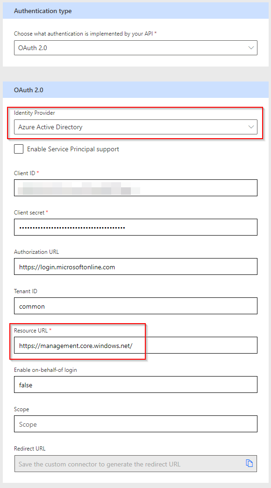

Los valores de ID de cliente y secreto de cliente se pueden encontrar en
el registro de la aplicación en Azure. A continuación, podemos agregar
diferentes acciones al conector, como la que obtiene una cita aleatoria:

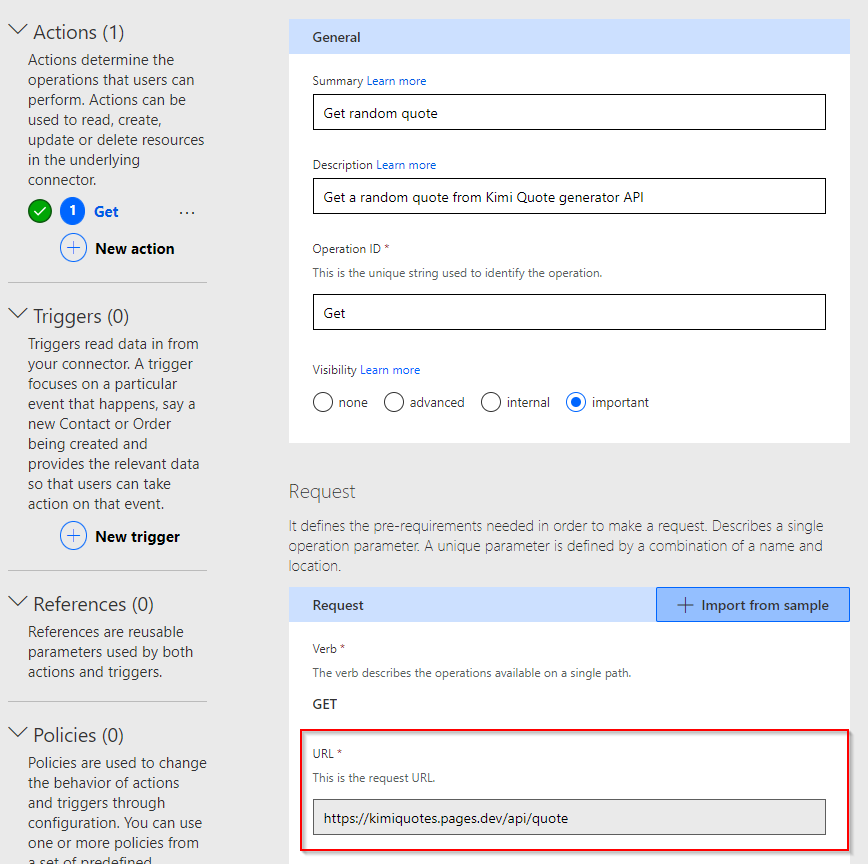

Todavía necesitamos un par de pasos para tener nuestro conector
personalizado listo:

1.  En las propiedades de la aplicación ***Enterprise Application***,
    necesitamos configurar la propiedad **Asignación
    Requerida** en **sí** y definir **qué usuarios pueden usar la
    aplicación**[^5] (en nuestro caso, Ferran y Lisa):

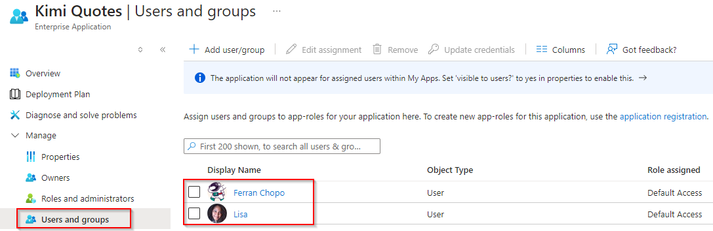

2.  En la sección **Seguridad** del conector personalizado, el
    campo **URL de redirección** debe tener un valor (se asigna después
    de guardar los cambios por primera vez) y necesitamos agregarlo en
    la configuración de **Autenticación** del registro de la aplicación.

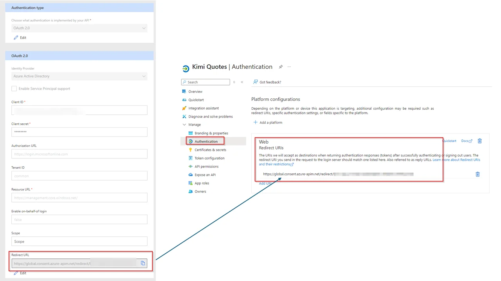

Finalmente, podemos comprobar que el conector personalizado funciona:

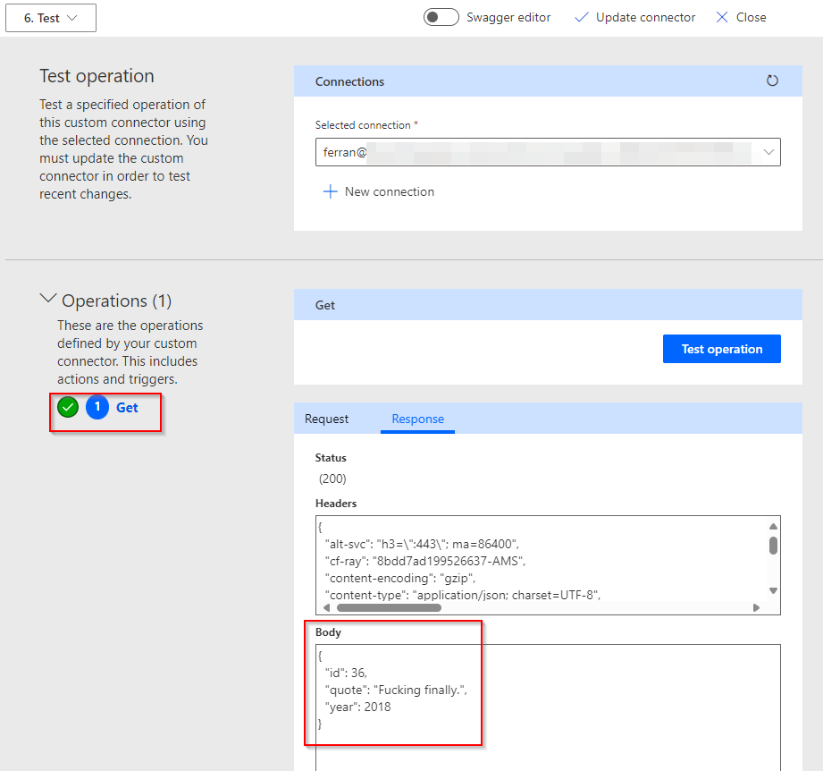

Ahora nuestro conector personalizado está listo y lo usaremos en Copilot Studio.

**Crear una acción usando la autenticación de usuario final**

Para mantenerlo simple, vamos a usar el tema del sistema **Inicio de
Conversación** (*ConversationStart*) para llamar a la acción de obtener
una cita de Kimi:

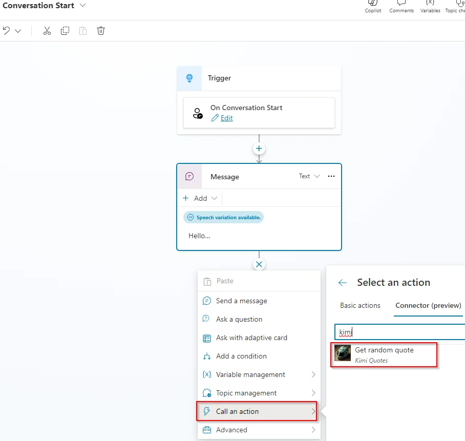

Tan pronto como seleccionamos la acción, necesitamos crear una conexión
para usar el conector, pero debemos tener en cuenta el mensaje que
también se muestra en la pantalla: ***Los usuarios con acceso de edición
a este copiloto pueden reutilizar tu conexión en otros temas de este
copiloto. Puedes configurar el acceso al copiloto en la configuración de
Seguridad más tarde***. Esto significa que, si compartes el copiloto con
cualquier otro *maker* para editarlo, él o ella podrán **usar tu
conexión**[^6] en otros temas del mismo copiloto.

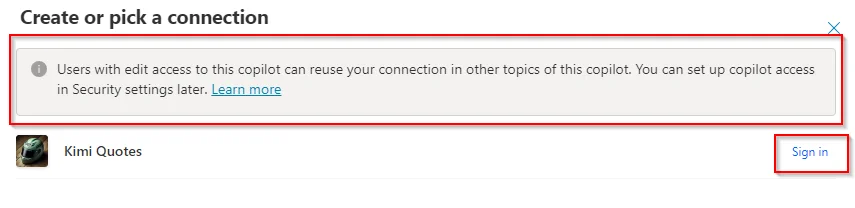

Inicié sesión usando mis propias credenciales (Ferran) y luego actualicé el tema para mostrar la cita:

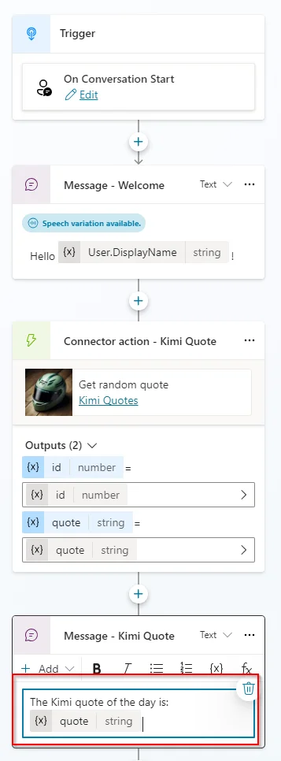

Si observamos detenidamente las propiedades de la acción del conector,
podemos ver que, **por defecto, está usando las credenciales del usuario
que ha iniciado sesión actualmente**.

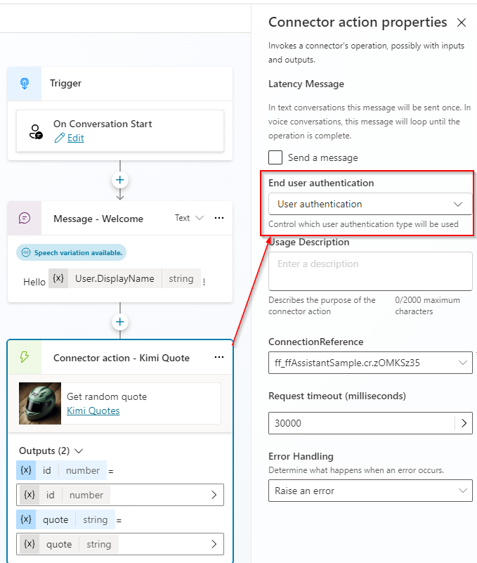

Por lo tanto, **si el usuario que usa el copiloto no tiene permisos para
usar el conector Kimi Quote, se generará un error**. ¡Vamos a
comprobarlo! Usando mis credenciales (Ferran), puedo usar el copiloto y
cuando comienza la conversación, se muestra el siguiente mensaje:

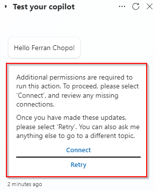

Necesitamos crear o elegir una conexión para usar la acción. Cuando
hacemos clic en el botón **Conectar**, se abre una nueva ventana del
navegador, solicitando al usuario que cree o elija una conexión:

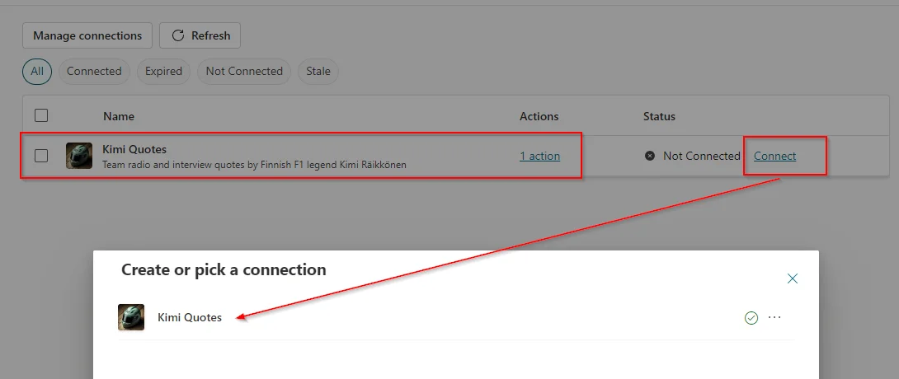

Una vez que la conexión está creada y la acción está **conectada**,
podemos volver a la conversación del copiloto y hacer clic en el
botón **Reintentar** para obtener la cita.

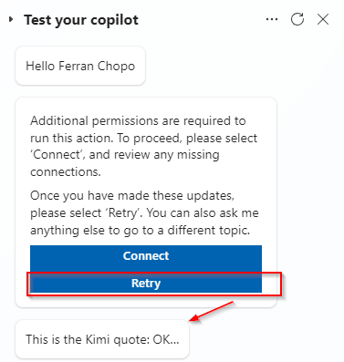

¿Qué pasa si iniciamos sesión con otro usuario, como Sara, que no tiene
acceso al conector personalizado? Recuerda, el conector solo permite
conexiones de Ferran y Lisa. Una imagen vale más que mil palabras:

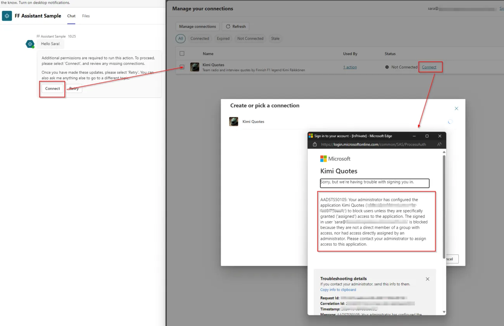

Cuando Sara intenta crear una conexión, aparece una nueva ventana
mostrando un mensaje que indica que no tiene permisos para hacerlo.
Básicamente significa que no puede usar la acción de Kimi Quote. Tendría
la misma experiencia si, por ejemplo, intenta crear un flujo en la nube
en Power Automate usando ese conector:

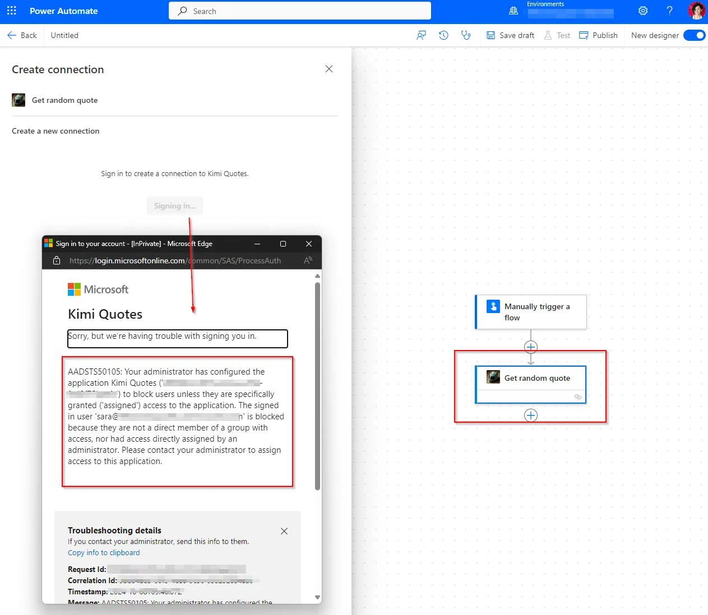

Por otro lado, si queremos que todos los usuarios puedan usar la acción,
podríamos cambiar la configuración de autenticación de usuario final de
la acción a **autenticación del autor del copiloto**. En este ejemplo,
el autor es un usuario llamado Ferran, que tiene permisos para usar el
conector personalizado Kimi Quotes.

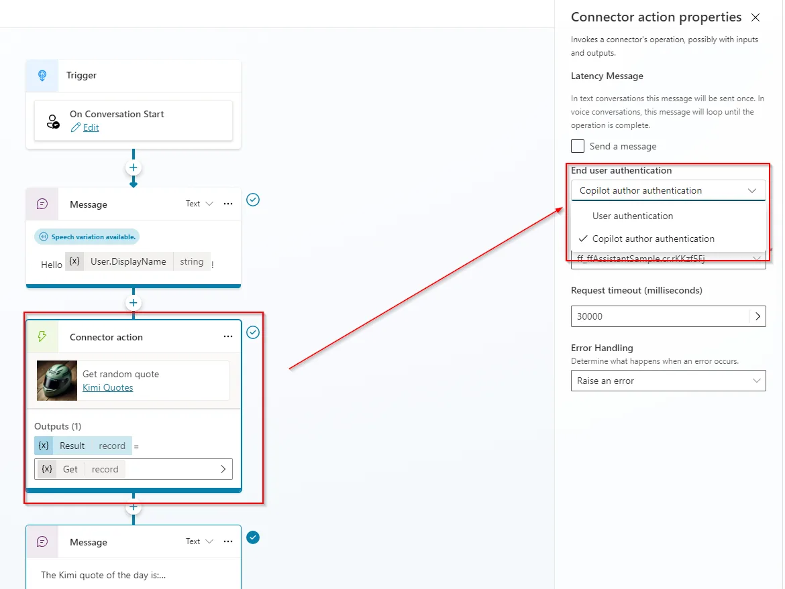

**Recordatorio rápido** (y muy importante): Como estamos usando un
conector personalizado, recuerda **compartirlo**[^7] con todos los
usuarios del copiloto, sin importar si tienen permisos o no (puedes
configurarlos en los usuarios y grupos de la **Aplicación
Empresarial**). No lo hicimos y tuvimos algunos problemas hasta que nos
dimos cuenta de eso.

## Conclusiones

La implementación de acciones de autenticación de usuario final en
Copilot Studio introduce una capa robusta de seguridad que mejora
significativamente la funcionalidad y confiabilidad general de los
copilotos. Al garantizar que solo los usuarios autenticados puedan
acceder e interactuar con algunas acciones específicas, esta función
permite a los *makers* crear copilotos más seguros. Sin embargo, para
implementar estas características de manera efectiva, es crucial estar
al tanto de las diferentes configuraciones sobre conectores, copilotos y
sistemas de terceros (si es el caso).

En cualquier caso, recomendaríamos diseñar temas (*topics*) de manera
que los usuarios no autorizados no necesiten leer esos mensajes de
error, ya que agregaría confusión en el uso del agente.

**Ferran Chopo**  
M365 & Power Platform SME  

[^1]: [https://github.com/microsoft/CopilotStudioSamples/blob/master/Playbook/PVA
    Bot Building
    Handbook.pdf](https://github.com/microsoft/CopilotStudioSamples/blob/master/Playbook/PVA%20Bot%20Building%20Handbook.pdf)
[^2]: https://aka.ms/CopilotStudioImplementationGuide
[^3]: https://kimiquotes.pages.dev/
[^4]: https://learn.microsoft.com/es-es/connectors/custom-connectors/azure-active-directory-authentication
[^5]: https://learn.microsoft.com/es-es/entra/identity/enterprise-apps/assign-user-or-group-access-portal
[^6]: https://learn.microsoft.com/es-es/microsoft-copilot-studio/advanced-connectors#use-connectors-with-copilot-authors-credentials
[^7]: https://learn.microsoft.com/es-es/connectors/custom-connectors/share

import LayoutNumber from '../../../components/layout-article'
export default LayoutNumber
