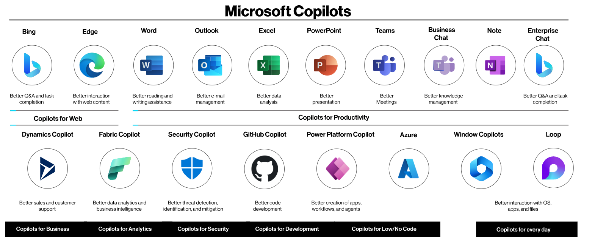
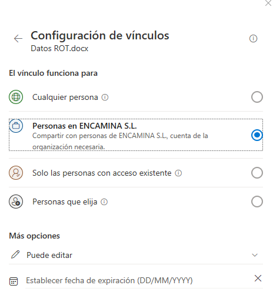
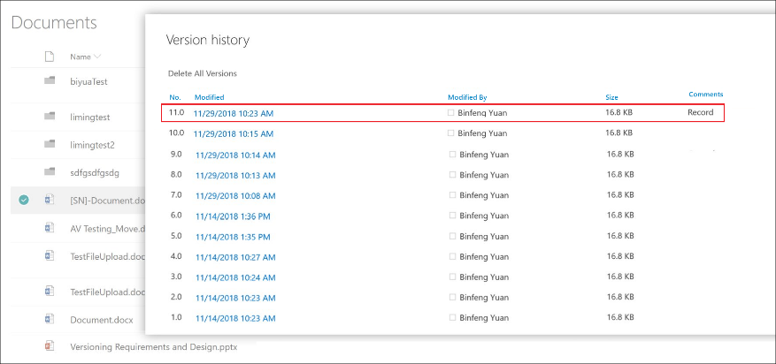
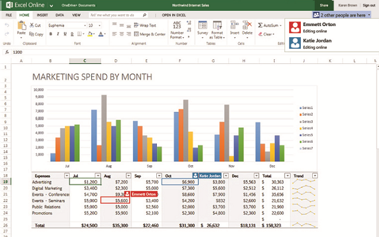

ROT es el acrónimo de Redundante, Obsoleto y Triviales. Por lo tanto,
podemos definir los datos ROT como aquellos que, por su naturaleza, no
aportan valor a la compañía o al usuario.

## Datos Redundantes

Son aquellos que están duplicados o repetidos innecesariamente en
distintos lugares. Por ejemplo, incluyen múltiples copias del mismo
documento o correos electrónicos repetidos.

## Datos Obsoletos

Estos datos han perdido su relevancia o utilidad debido al paso del
tiempo o cambios en las circunstancias. Por ejemplo, documentos de
proyectos antiguos que ya han concluido o versiones previas de archivos
que han sido actualizados.

## Datos Triviales

Son datos que no tienen valor significativo para las operaciones
actuales o futuras. Esto puede incluir correos electrónicos personales,
anotaciones temporales o archivos de entretenimiento no relacionados con
el trabajo.

# Historia y Evolución de los Datos ROT

Cuando la mayoría de las empresas trabajaban on-Premises, el manejo de
datos no era una prioridad para muchas de ellas. La información se
almacenaba en unidades de red, y localmente en los equipos de los
usuarios, Los únicos criterios eran el de orden y clasificación manual.
La acumulación de datos redundantes, obsoletos y triviales (ROT) no
representaba un problema significativo. Sin embargo, con el avance de la
tecnología y la adopción masiva de sistemas digitales, la cantidad de
información generada y almacenada creció exponencialmente.

Derivado de ese escenario, existe (aún hoy) la costumbre generalizada de
guardarlo todo, incluso sabiendo de antemano que el documento guardado
no lo va a usar pasado un tiempo, y poniendo como principal criterio el
"por si acaso"

Algunos escenarios para explicar esto mejor sería:

-   No borrar un correo, aunque el contenido tenga una vigencia temporal
    y ya está "caducado". P.E un correo notificando una suspensión de un
    servicio por mantenimiento, o un correo de un proveedor con una
    oferta temporal.

-   Guardar toda la historia de un documento haciendo versiones, incluso
    haciendo referencia en el nombre. P.E InformeV1, V2, Informe_Final.
    Etc etc

-   Guardar archivos creados periódicamente como archivos separados.
    Cuando pueden ser generados en uno solo. P.E una tabla extraída
    periódicamente de un ERP, y guardar esos datos en archivos
    distintos, en vez de en columnas de un mismo archivo.

## El Auge de la Digitalización y el modern Workplace

A medida que las compañías fueron incorporándose a servicios en la nube
y adoptando su forma de trabajo a Modern Workplace fueron (sin darse
cuenta) elevando la criticidad de tener una correcta higiene documental.
Eso unido a la capacidad de almacenar grandes volúmenes de información,
lejos de "solucionar" esa cuestión, la incrementó.

En la mayoría de los casos el error estaba oculto, el usuario seguía
sesgando la información ROT por que esa clasificación la hacía
manualmente y no era "mucho problema" que en esa ubicación hubiese otros
archivos redundantes, obsoletos o triviales.

En el buzón de correo ocurría exactamente el mismo caso, buzones que de
pronto cambiaban de 1 ó 2Gb a 100Gb, correos que no se eliminaban ni se
etiquetaban para su eliminación pasado cierto tiempo. El usuario usaba
la "misma técnica" de guardado, una estructura de carpeta, y ordenar
según ese único criterio.

La tendencia de los usuarios a guardar información innecesaria está
influenciada por varios factores culturales. El temor a perder datos
valiosos, la falta de tiempo para organizar adecuadamente la información
y la percepción errónea de que más datos equivalen a más conocimiento
son algunos de los motivos por los cuales se acumulan datos ROT. Es
vital cambiar esta perspectiva y adoptar prácticas de gestión de
información que prioricen la calidad sobre la cantidad.

Raramente el equipo de TI regulaba el acceso ni siquiera detectaba que
sin una estrategia de limpieza y organización la acumulación de datos
redundantes, obsoletos y triviales va en aumento.

Este fenómeno no solo afecta la eficiencia operativa sino también la
seguridad y el cumplimiento normativo, pero era manejado con solvencia
por los usuarios. Cambiar la cultura no es fácil

## La Relevancia de Microsoft Copilot

Con la introducción de herramientas avanzadas como Microsoft Copilot, la
necesidad de gestionar adecuadamente los datos ROT ha cobrado una nueva
importancia. Microsoft Copilot, la solución de IA integrada en Microsoft
365, está diseñada para optimizar la productividad y eficiencia de los
usuarios. Accede y analiza grandes volúmenes de datos para proporcionar
recomendaciones inteligentes. Sin embargo, su efectividad puede verse
limitada si los datos que analiza están llenos de información
redundante, obsoleta o trivial.

Comencemos por analizar a que accede Microsoft Copilot:

-   Todos los repositorios de SharePoint a los que el usuario pueda
    acceder
-   A OneDrive para la Empresa
-   Archivos de OneDrive de otros usuarios, compartidos explícitamente con el usuario
-   Tu propio Microsoft 365
-   Conversaciones, canales, chats de equipo y de grupos de chats
-   Calendario, reuniones y contactos del usuario
-   Información sobre las personas, artículos, y reuniones
-   Estructura de la organización
-   Datos de terceros introducidos en Microsoft 365 para los que tiene
    permisos de acceso.
-   Cualquier plugin que tenga configurado

El acceso a la información se produce incluso sin que el usuario sea
consciente de que los tenía.

Anteriormente en este mismo artículo hablábamos del sesgo del usuario al
buscar la documentación. El usuario podía tener acceso a una carpeta,
pero si no era consciente de ello nunca accedería. Ahora y con Microsoft
Copilot esa carpeta va a formar parte del banco de datos de Microsoft
Copilot usará para devolver respuestas.

Otro elemento importante (unido al anterior) es la gestión de permisos y
si el usuario accede solo a la documentación necesaria para elaborar su
trabajo. Normalmente las estructuras de permisos se van degradando con
el tiempo y debido a eso, no es difícil encontrar repositorios a los que
acceden usuarios que no estaba planificado.

Por este motivo los datos ROT toman una especial importancia. Una
higiene documental mejora los resultados de ejecuciones de Prompts a
través de Microsoft Copilot.

Hay múltiples casos en los que esos resultados se pueden ver afectados,
veamos algunos casos habituales:

-   **Dos archivos con el mismo nombre + V1, V2 etc**: Estos archivos
    suelen ser evoluciones de un trabajo por parte del usuario, eso
    significa que va a contener contenido distinto, y es posible que
    incluso contradictorio. (dato Redundante)

-   **Archivos ubicados sin orden**: Imaginemos un archivo relacionado
    con el departamento de TI, guardado en una carpeta de Marketing
    (Dato Trivial)

-   **Archivos obsoletos junto a archivo actualizado**: Imaginemos que
    el Dto. Legal almacena leyes relacionadas con su área de negocio.
    Con el paso del tiempo esa ley se actualiza, y en vez de retirar la
    ley antigua, la mantiene y guarda la nueva en la misma ubicación.
    (dato obsoleto y/o Redundante)

-   **Correos de promociones o alertas**: Estos correos suelen ser
    temporales o muy repetitivos, si se almacenan correo con promociones
    puntuales y no se eliminan al acabar el periodo de validez, se
    convierte en Obsoleto. (dato Obsoleto)

-   **Correos de Menciones en Teams o alertas de otras aplicaciones:**
    Estos correos se acumulan en el buzón haciendo que el volumen de
    información se incremente. (dato Obsoleto, Trivial y Redundante)

# Consejos para Reducir los Datos ROT

Aquí algunos consejos prácticos a nivel global adecuados para reducir
los datos ROT:

-   **Realizar Auditorías de Información**: Establecer revisiones
    periódicas de los datos almacenados para identificar y eliminar
    información redundante, obsoleta y trivial.

-   **Implementar Políticas de Retención:** Crear y aplicar políticas
    claras sobre cuánto tiempo se deben almacenar ciertos tipos de datos
    y cuándo deben ser eliminados.

-   **Utilizar Herramientas de Gestión:** Aprovechar herramientas de
    software que ayudan a identificar y limpiar datos ROT
    automáticamente.

-   **Fomentar la Cultura de Calidad de Datos:** Capacitar a los
    usuarios sobre la importancia de mantener datos relevantes y útiles,
    promoviendo prácticas de almacenamiento responsable.

-   **Sharepoint Restrictión Search**: Una vez tenemos licencias de
    Microsoft Copilot, podemos disfrutar de esta característica de
    Sharepoint Premium. Permite a los administradores definir que sitios
    de sharepoint son visibles, o no, para Microsoft Copilot.

Especialmente importante es la información, gestión, y concienciación
del usuario en estos aspectos. No se trata de dar una formación al
usuario únicamente, y la imposición de un nuevo procedimiento suele ser
contraproducente. Se trata de un cambio cultural en la compañía. Ese
cambio cultural hay que planificarlo, establecer una estrategia, atacar
las resistencias, En definitiva, Hablamos de adopción y gestión del
Cambio.

Algunas acciones puntuales que pueden ayudar a que el usuario tenga más
fácil.

-   **DLP Manuales:** Crear políticas de DLP manuales para que los
    usuarios puedan programar el borrado del archivo o correo. De esta
    forma el usuario puede poner una etiqueta de borrado de un objeto a
    una fecha futura, 1 mes, 3 meses, 1 año, etc.

-   **Etiquetado o metadatos en Sharepoint:** Igualmente el etiquetado
    en Sharepoint puede reducir el ROT, creando etiquetas que reflejen
    de una forma u otra el ciclo de vida de un archivo. Un ejemplo
    básico puede ser poner etiquetas de cuando finaliza el ciclo de
    vida.

-   **Compartir en vez de crear versiones de archivos:** El alojamiento
    en Sharepoint y OneDrive habilita tres funciones que permite a los
    usuarios mantener una sola copia de archivos, por lo que no es
    necesario versionar.

    -   **Compartir:** Normalmente los archivos "versionados" vienen
        dados por que los usuarios empiezan a trabajar en un archivo, y
        cada actualización es adjuntada a un correo electrónico y
        enviado a todos los integrantes. Cuando compartimos todas las
        personas implicadas acceden al mismo archivo, por lo tanto, la
        información es única.

-   **Historial de versiones:** Esta herramienta permite tener puntos de
    control de los cambios del archivo, siendo muy fácil volver a un
    punto atrás en caso de acciones no deseadas dentro del contenido.

-   **Coautoria:** Permiten que varios usuarios trabajen a la vez en un
    archivo y que en tiempo real cada usuario vea los cambios realizados
    por otro.

En conclusión, la gestión adecuada de los datos ROT es esencial para
mejorar la eficiencia operativa y aprovechar al máximo herramientas
avanzadas como Microsoft Copilot. Adoptar prácticas de almacenamiento
responsable y mantener una base de datos limpia permitirá que las
organizaciones se beneficien plenamente de la inteligencia artificial y
la automatización.

**José Manuel Castillo García**  
Modern Workplace Team Lead en ENCAMINA

import LayoutNumber from '../../../components/layout-article'
export default LayoutNumber
