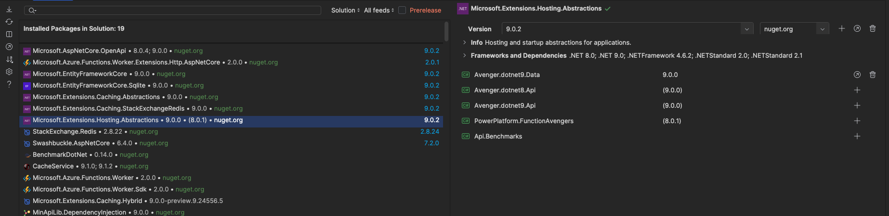

Uno de los problemas más frecuentes en nuestros desarrollos es la
alineación de las dependencias de librerías, ya sean de terceros o
propias. Es habitual encontrarnos con una misma solución en la que
diferentes proyectos utilizan versiones distintas de una misma librería,
lo que puede generar incompatibilidades y errores inesperados.

En este artículo, exploraremos cómo mantener alineadas todas las
versiones de nuestras dependencias para evitar estos problemas. Además,
como extra, veremos cómo actualizar nuestras dependencias a sus
versiones más recientes, evitando así que nuestro desarrollo quede
anclado en módulos obsoletos y con numerosos cambios disruptivos.

**Que opciones tenemos disponibles**

En nuestro IDE, siempre tenemos disponible la opción de administrar los
paquetes de NuGet a nivel de proyecto. Esto nos permite actualizar
manualmente las dependencias para igualar sus versiones. Además, en
Visual Studio existe un apartado que indica si hay versiones
discrepantes, facilitando su alineación de forma sencilla.



Sin embargo, ¿cuál es el problema de este enfoque? La principal
desventaja es que depende completamente de una gestión manual. Este
desequilibrio suele ocurrir de forma natural: cuando añadimos una nueva
dependencia a un proyecto, es posible que no verifiquemos si ya se está
utilizando en otra parte de la solución. Como resultado, podríamos
instalar automáticamente la última versión disponible, generando
inconsistencias entre proyectos.

**¿Cómo lo podemos solucionar?**

**U**na Lo primero que podemos empezar a utilizar en haciendo uso de un
fichero Build.Props. ¿Qué és? El archivo Directory.Build.props es un
archivo de configuración utilizado en proyectos .NET para establecer
propiedades compartidas y configuraciones que afectan a todos los
proyectos dentro de un directorio específico y sus subdirectorios. Es
una forma de centralizar y simplificar la configuración en un entorno de
solución que puede contener varios proyectos.

¿Cómo funciona?

Ubicación: Este archivo se coloca en un directorio de la solución o en
cualquier carpeta superior dentro de un proyecto o subproyecto. Cuando
se encuentra en un directorio, sus configuraciones se aplican a todos
los proyectos que están dentro de esa carpeta o en sus subdirectorios.

El archivo se utiliza principalmente para definir propiedades comunes
como versiones de paquetes, configuraciones de compilación, rutas de
salida, etc., de manera que no sea necesario repetirlas en cada archivo
de proyecto individual.

Este archivo es un archivo XML, similar al archivo .csproj. Dentro de él
se pueden definir PropertyGroup y ItemGroup que establecen propiedades y
elementos para todos los proyectos que hagan referencia a este archivo.
Algo similar a este ejemplo

```
<Project>
<PropertyGroup>
<!-- Propiedad común para todos los proyectos -->
<Configuration>Release</Configuration>
<Platform>x64</Platform>
<TargetFramework>net9.0</TargetFramework>
<Version>1.0.0</Version>
</PropertyGroup>
<ItemGroup>

<!-- Definir paquetes NuGet comunes -->
<PackageReference Include="Newtonsoft.Json" Version="13.0.1" />
</ItemGroup>
</Project>
``` 

**PropertyGroup:** Define las propiedades comunes. Las propiedades
dentro de este bloque se aplican a todos los proyectos en los que el
archivo Directory.Build.props esté presente.

Configuration, Platform, TargetFramework, etc., son propiedades que
controlan aspectos de la compilación y la configuración del proyecto.

**ItemGroup:** Define grupos de elementos, como las referencias a
paquetes NuGet, que se aplicarán igualmente a todos los proyectos dentro
del directorio.

Como funciona Si un proyecto tiene su propio archivo .csproj, las
configuraciones en Directory.Build.props se combinan con las
configuraciones del archivo .csproj del proyecto. Las propiedades
definidas en el archivo Directory.Build.props pueden ser sobrescritas
por el archivo de configuración del proyecto si es necesario. Los
archivos Directory.Build.props pueden ser ubicados en cualquier
directorio. Si se coloca un archivo en el directorio raíz de la
solución, se aplicará a todos los proyectos dentro de esa solución. El
saber donde ubicarlo y el tener controlado cómo funciona internamente es
algo que ocasiona muchos problemas dentro de los equipos.

Si bien Directory.Build.props es una herramienta poderosa para gestionar
configuraciones en proyectos grandes y complejos, su uso adecuado
requiere organización y claridad en la estructura de los archivos y las
propiedades que se definen. A medida que la solución crece y se hace más
compleja, los problemas mencionados pueden volverse más pronunciados,
por lo que es esencial gestionar y documentar las configuraciones de
manera efectiva

**¿Como lo podemos solucionar?** Directory.Packages.props ☺

El archivo Directory.Packages.props en C# es otro archivo de
configuración que se utiliza en proyectos .NET para gestionar las
versiones de los paquetes NuGet de manera centralizada. A diferencia de
Directory.Build.props, que se enfoca en propiedades y configuraciones
generales de los proyectos, Directory.Packages.props se centra
específicamente en las dependencias de paquetes NuGet que utilizan los
proyectos dentro de una solución.

Este archivo se utiliza principalmente para especificar las versiones de
los paquetes NuGet de manera global, lo que permite garantizar que todos
los proyectos de la solución usen las mismas versiones de las
dependencias, evitando problemas de inconsistencias en las versiones.

**¿Cómo funciona?**

**Ubicación:** Al igual que Directory.Build.props, el archivo
Directory.Packages.props se coloca generalmente en un directorio común
de la solución (por ejemplo, el directorio raíz) para que afecte a todos
los proyectos dentro de ese directorio y sus subdirectorios.

**Propósito:** Su principal función es especificar las versiones de los
paquetes NuGet que deben utilizar los proyectos dentro de la solución,
para evitar que diferentes proyectos tengan versiones inconsistentes de
los mismos paquetes.

Formato: Es un archivo XML similar a Directory.Build.props. En este
archivo, se definen las versiones de los paquetes NuGet de manera
centralizada dentro de un ItemGroup.

```
<Project>
<ItemGroup>

<!-- Definir versiones de paquetes NuGet comunes -->
<PackageVersion Include="Newtonsoft.Json" Version="13.0.1" />
<PackageVersion Include="Serilog" Version="2.10.0" />

</ItemGroup>
</Project>
```

**ItemGroup:** Contiene los elementos de los paquetes NuGet que
serán utilizados de forma centralizada.

**PackageVersion:** Cada entrada define el nombre de un paquete
NuGet y su versión. El atributo Include especifica el nombre del
paquete, y el atributo Version define la versión específica que deben
usar todos los proyectos dentro de la solución.

Cuales son sus principales caracteristicas:

**Centralización de versiones:** En lugar de especificar la versión de
un paquete NuGet en cada archivo .csproj individual de los proyectos,
las versiones se definen una sola vez en Directory.Packages.props. Esto
asegura que todos los proyectos usen la misma versión, evitando
problemas de "versiones incompatibles" entre los proyectos.

**Simplificación de dependencias:** Si se tiene una solución con muchos
proyectos que dependen de los mismos paquetes NuGet, mantener las
versiones sincronizadas manualmente puede ser tedioso.
Directory.Packages.props simplifica esta tarea, ya que puedes modificar
la versión de un paquete en un solo archivo y todos los proyectos que
hagan referencia a ese archivo se actualizan automáticamente.

**Soporte para versiones de paquetes comunes:** Además de versiones
específicas de paquetes, este archivo puede incluir referencias a
versiones específicas para frameworks, o incluso otras configuraciones
relacionadas con las dependencias de los proyectos.

**Herencia en subdirectorios:** Al igual que Directory.Build.props, si
se coloca Directory.Packages.props en un directorio, sus configuraciones
se aplicarán a todos los proyectos dentro de ese directorio y sus
subdirectorios.

El principal inconveniente de este enfoque es que, al principio, resulta
bastante tedioso copiar todas las dependencias dentro de este archivo, y
además es fácil olvidar añadir nuevas dependencias cuando se empiezan a
utilizar. En este sentido, los acuerdos dentro del equipo son
fundamentales, ya que, si no se gestiona adecuadamente, se puede generar
un caos con diferentes formas de manejar las dependencias, lo que podría
derivar en inconsistencias y complicaciones al desarrollar el proyecto

**Siguiente pasos**

Uno de los problemas que tienen los proyectos es que se quedan
desfasados de versiones, bien durante su propio desarrollo o bien porque
el proyecto ya no se modifica mucho debido a que no se requieren nuevas
funcionalidades hasta que se vuelven a requerir y entonces tienes un
proyecto legacy y en el que muchas veces requieren un refactor integral
del proyecto.

Ahora bien como podemos mantener este proyecto en la última, seguramente
que el lector que usa GitHub en algun momento le han llegado que tiene
algunas dependencias con problemas bien porque se han notificado un
fallo de seguridad y requiere de una acción correctora por nuestra
parte, bien porque se han deprecado y nos llega un correo electronico.
Pues existen herramientas muy similares que nos avisan de si nuestras
dependencias tienen nuevas versiones o no, e includo nos hacen la PR con
esa modificación. Esta herramienta es Open Source y se llama Renovate
Bot Es una herramienta OpenSource https://github.com/renovatebot/renovate que no solo es valido para las
dependencias de .NET, sino para dependencias de Infraestructura como
código, librerias de frontend, etc...

**Cómo funciona Renovate Bot**

Explora sus repositorios para encontrar archivos de paquetes y sus
dependencias

Comprueba si existen versiones más recientes

Genera Pull Requests para las actualizaciones disponibles

Los Pull Requests parchean directamente los archivos del paquete, e
incluyen registros de cambios para las nuevas versiones (si están
disponibles).

Por defecto:

Recibirá Pull Requests separadas para cada dependencia

Las actualizaciones importantes se mantienen separadas de las que no lo
son.

Este tool se puede utilizar en GitHub, GitLab, BitBucklet, Azure DevOps
o AWS CodeComit.

**Como instalarlo en Azure DevOp**

Primero, crea un Token de Acceso Personal (PAT) para la cuenta del bot.
Haz que Renovate use tu PAT de las siguientes maneras:

1.  Configura tu PAT como un token en tu archivo config.js.
2.  Configura tu PAT como una variable de entorno RENOVATE_TOKEN.
3.  Establece tu PAT cuando ejecutes Renovate en la CLI con --token=.

Los permisos de tu PAT deben ser, como mínimo:

  -----------------------------------------------------------------------
  **Alcance**     **Permiso**   **Descripción**
  --------------- ------------- -----------------------------------------
  Código          Lectura y     Requerido
                  escritura     

  Elementos de    Lectura y     Solo necesario para vincularlo con un
  trabajo         escritura     elemento de trabajo.
  -----------------------------------------------------------------------

Recuerda configurar platform=azure en algún lugar de tu archivo de
configuración de Renovate.

Ejecutando Renovate en Azure Pipelines
Configuración de una nueva pipeline
Crea una nueva pipeline en Azure DevOps y selecciona tu fuente: Azure
DevOps crear nueva pipeline.

Luego selecciona tu repositorio.

Dentro de "Configura tu pipeline" selecciona: Plantilla de pipeline
inicial de Azure DevOps.

Reemplaza todo el contenido en la pipeline inicial con:

```
schedules:

- cron: '0 3 * * *'

displayName: 'Todos los días a las 3am (UTC)'

branches:

include: [main]

always: true

trigger: none

pool:

vmImage: ubuntu-latest

steps:

- task: npmAuthenticate@0

inputs:

workingFile: .npmrc

- bash: |

git config --global user.email 'bot@renovateapp.com'

git config --global user.name 'Renovate Bot'

npx --userconfig .npmrc renovate

env:

RENOVATE_PLATFORM: azure

RENOVATE_ENDPOINT: $(System.CollectionUri)

RENOVATE_TOKEN: $(System.AccessToken)
```

Crea un archivo .npmrc
Crea un archivo .npmrc en tu repositorio:

```
registry=https://pkgs.dev.azure.com/YOUR-ORG/_packaging/YOUR-FEED/npm/registry/

always-auth=true
```

Para la clave del registro, reemplaza YOUR-ORG con tu organización de
Azure DevOps y YOUR-FEED con tu feed de Azure Artifacts.

Crea un archivo config.js
Crea un archivo config.js en tu repositorio:

```
module.exports = {

hostRules: [

{

hostType: 'npm',

matchHost: 'pkgs.dev.azure.com',

username: 'apikey',

password: process.env.RENOVATE_TOKEN,

},

],

repositories: ['YOUR-PROJECT/YOUR-REPO'],

};
```

Para la clave de repositories, reemplaza YOUR-PROJECT/YOUR-REPO con tu
proyecto y repositorio de Azure DevOps.

Usuarios de Yarn

Para realizar una instalación exitosa de yarn, necesitas que la URL del
registro coincida completamente. Usa la opción matchHost para
especificar la ruta completa del registro.

```
module.exports = {

platform: 'azure',

hostRules: [

{

matchHost:

'https://myorg.pkgs.visualstudio.com/_packaging/myorg/npm/registry/',

token: process.env.RENOVATE_TOKEN,

hostType: 'npm',

},

{

matchHost: 'github.com',

token: process.env.GITHUB_COM_TOKEN,

},

],

repositories: ['YOUR-PROJECT/YOUR-REPO'],

};
```

Pon esto en el archivo .npmrc de tu repositorio:

```
registry=https://myorg.pkgs.visualstudio.com/_packaging/myorg/npm/registry/

always-auth=true
```

Agregar archivo renovate.json
Adicionalmente, puedes crear un archivo renovate.json (que contiene la
configuración de Renovate) en la raíz del repositorio que deseas
actualizar. Lee más sobre las opciones de configuración de Renovate.

Usar una sola pipeline para actualizar múltiples repositorios
Si deseas usar una sola pipeline de Renovate para actualizar múltiples
repositorios, debes realizar los siguientes pasos:

1.  Agrega los nombres de los repositorios a config.js.
2.  Asegúrate de que el usuario "Project Collection Build Service
    (YOUR-PROJECT)" tenga los siguientes permisos en los repositorios:
    -   Contribuir
    -   Contribuir a pull requests
    -   Crear ramas
    -   Leer

3.  El usuario debe tener el siguiente permiso a nivel de proyecto:
    -   Ver la información a nivel de proyecto.

Vinculación de un elemento de trabajo a los Pull Requests
Si deseas que Renovate vincule automáticamente un elemento de trabajo
existente a los Pull Requests, puedes establecer la configuración
azureWorkItemId. Asegúrate de que el usuario tenga los siguientes
permisos en la ruta del área del elemento de trabajo:

-   Editar elementos de trabajo en este nodo
-   Ver elementos de trabajo en este nodo

Si el usuario no tiene estos permisos, Renovate aún creará un PR, pero
no tendrá un enlace al elemento de trabajo.

Agregar etiquetas a los Pull Requests
Se pueden agregar etiquetas a los Pull Requests usando las
configuraciones labels o addLabels. Si la etiqueta no existe en el
proyecto DevOps, se creará automáticamente durante la creación del Pull
Request, siempre que el usuario tenga los permisos a nivel de proyecto:

-   Crear definición de etiqueta.

De lo contrario, cuando una etiqueta no existe y el usuario no tiene
permiso para crearla, Renovate mostrará un error durante la creación del
Pull Request.

¡Aviso importante! La primera vez que instales Renovate es normal que
durante los primeros días veas muchas Pull Requests abiertas, lo que
puede generar algo de confusión y una carga adicional de trabajo. Sin
embargo, piensa que todo lo que está detectando el bot debería estar ya
actualizado. Una vez que tengas el bot al día, solo recibirás
notificaciones cuando haya nuevas versiones, lo cual ya depende de las
librerías que tengas.

Lo bueno de usar las soluciones que se han propuesto anteriormente es
que modifica este archivo, lo cual tiene una ventaja doble, ya que
optimiza la gestión de dependencias y automatiza el proceso de
actualización.

**Conclusión**

En este artículo se aborda uno de los problemas más comunes en el
desarrollo de software: la gestión de las dependencias y su alineación
entre diferentes proyectos. Las versiones inconsistentes de las
librerías pueden causar incompatibilidades y errores imprevistos. Para
resolver este problema, se exploran diferentes soluciones como la
gestión de dependencias mediante archivos de configuración como
Directory.Build.props y Directory.Packages.props en proyectos .NET, que
permiten centralizar y gestionar de manera más eficiente las versiones
de los paquetes NuGet. Esto reduce la posibilidad de inconsistencias
entre los proyectos y facilita la actualización de versiones.

Además, se destaca la utilidad de herramientas como Renovate Bot, un
sistema automatizado de gestión de dependencias que notifica y actualiza
las versiones de las librerías, haciendo el proceso más eficiente y
menos propenso a errores. Renovate Bot no solo es útil para proyectos
.NET, sino también para otros tipos de dependencias, como
infraestructuras como código o librerías de frontend. Con la integración
de Renovate en plataformas como Azure DevOps, GitHub y otros, se
simplifica enormemente la actualización de las dependencias, permitiendo
que los desarrolladores mantengan sus proyectos al día sin tener que
realizar cada actualización manualmente.

En conclusión, para gestionar correctamente las dependencias y
mantenerlas actualizadas de manera eficiente, se deben usar herramientas
y configuraciones adecuadas como Directory.Build.props,
Directory.Packages.props, y Renovate Bot. Estos enfoques no solo evitan
problemas de versiones incompatibles, sino que también automatizan el
proceso, ahorrando tiempo y reduciendo errores.

**Adrián Diaz Cervera** <br />
Technical Lead at SCRM Lidl Hub International <br />
.NET MVP <br />
http://theavenger.dev <br />
@AdrianDiaz81 <br />


import LayoutNumber from '../../../components/layout-article'
export default LayoutNumber