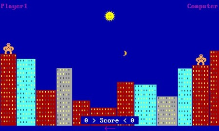

Soy Mar Pedroche, valenciana de nacimiento, pero con sangre manchega.
Actualmente, trabajo como **Tech Lead en Axazure**, liderando un
equipazo que tiene la paciencia de aguantar todas mis locuras.

En 2022 fui reconocida como **MVP en Business Applications**, y hoy en
día sigo en esa línea, destacando en las categorías de **Power Automate
y Power Apps**.

Aunque no lo digo muy alto (no vaya a ser que me reclamen de vuelta en
Modern Work...), también gestiono en la parte de IT una empresa familiar
donde administro y optimizo **la suite de Microsoft 365**: desde la
centralita en Teams y las Power Apps hasta la compra y configuración de
equipos para nuevas incorporaciones. Y sí...también he pasado y crimpado
cable para la nueva oficina.

Todo esto lo compagino con mi pasión por compartir conocimiento en la
comunidad técnica. He desarrollado varias herramientas para
**XrmToolBox**, escrito artículos, colaboro en el programa **Power Up de
Microsoft**, participo como **speaker** y organizo eventos como el
**Bizz Summit**.

Ahora, mi foco está en hacer que **PowerUser365** gane visibilidad y en
animar a más gente a participar en el blog.

**¿Por qué y cómo empezaste en el mundo de la tecnología?**
Cuando tenía 4 años, mi hermano mayor tuvo su primer ordenador. En
cuanto descubrí que se podía jugar con él, me puse manos a la obra para
aprender a lanzar juegos en **MS-DOS**, como este:

Eso derivó, inevitablemente, en **Monkey Island**. Crecí con ese juego,
recuerdo perfectamente cómo había que meter varios disquetes para
instalarlo, que no tenía audio y tenías que leer los subtítulos. Duelos
de espadas con insultos absurdos, el Grog, un mono de 3 cabezas y un
Stan que no paraba de hablar moviendo los brazos.

Mi pasión por los ordenadores nació de los videojuegos. Quería más
potencia para jugar, así que, con 12 años, terminé **montando mi propio
PC por piezas**. Una placa por aquí, la torre de este, la gráfica del
otro, etc.

Sin embargo, no estudié informática, decidí estudiar **Ingeniería
Agronómica especializada en industria alimentaria** (aunque me pasé más
tiempo en la sala de 'los cables' de informática jugando que en mi
propia escuela). Siempre me habían gustado muchas cosas, se me daban
bien las ciencias y, en aquel entonces, la informática no era algo que
se viera en los colegios demasiado, al menos en el mío.

Pero cuando llegué al mundo laboral, **descubrí la informática aplicada
a la gestión empresarial**, y ahí decidí cambiar de rumbo. Aunque ya
hacía algunas cosas en la empresa, mi objetivo era claro: **quería ser
consultora de tecnología**.

Me lancé a aprender por mi cuenta, recopilando contenido de aquí y de
allá, sobre todo generado por **MVPs con los que ahora comparto
espacio**. Finalmente, una empresa me dio la oportunidad de demostrar lo
que sabía y, varios años después, aquí estoy.

Sé lo que significa que te den una oportunidad cuando no tienes un
título que lo respalde. Por eso, **apuesto por perfiles como el mío** y
apoyo iniciativas como el programa **Power Up de Microsoft**. Y, por
ahora, todos los 'reconvertidos' que conozco, como yo nos llamo, han
resultado ser grandes profesionales.

**¿Cuáles son tus principales actividades tecnológicas hoy en día?**

Me considero un auténtico *entrenador*: mi labor es dirigir al equipo
para lograr el éxito en cada proyecto en el que nos involucramos. Como
buena jugadora, disfruto ganando, así que asumo el rol necesario para
que brillemos juntos. Aunque mi papel más habitual es el de responsable
técnico de la solución o arquitecto, no tengo problema en asumir otros
roles si eso nos acerca a nuestros objetivos. En algunos proyectos,
incluso he ejercido como *Project Manager* o me he puesto a desarrollar
como cualquier otro miembro del equipo.

Más allá de los proyectos, me motiva ver crecer a mi equipo. Me gusta
retarlos para que avancen en sus carreras y guiarlos en el camino de la
tecnología, especialmente en el ámbito de Dynamics 365 CRM y Power
Platform. Además, fomento el aprendizaje continuo y el intercambio de
conocimiento para que todos podamos evolucionar juntos.

Curiosamente, hace unos años ni siquiera me planteaba liderar un equipo.
Siempre pensé que gestionar personas sería complicado y que el rol de
*Team Leader* no me aportaría gran cosa. Pero la realidad ha sido muy
distinta: he aprendido muchísimo en áreas en las que aún tengo camino
por recorrer. Lo mejor de todo es que cada persona de mi equipo tiene
algo valioso que enseñarme, y por eso valoro enormemente el *feedback*
constante.

Soy una apasionada de los retos y siempre busco nuevos estímulos. Me
encanta llevar las soluciones al límite. Soy de las optimistas que
siempre piensa: *"Seguro que se puede hacer"*, y no paro hasta dar con
la solución. Si no, que se lo digan a mis amigos *Custom Connectors*, a
los que ya les he metido directivas, código, trazas, nuevos parámetros
de conexión... Vamos, que, si queréis hacer algo realmente *raro o casi
imposible*, ya sabéis a quién contactar.

Y si hablamos de mi faceta organizadora de eventos, podéis llamarme
*Señor Lobo* y contarme cuál es el problema. Lo cierto es que se me da
bien encontrar recursos y soluciones rápidas.

**¿Cuáles son tus principales actividades NO tecnológicas hoy en día?
¿Cuáles son tus hobbies?**

Últimamente, me estoy enfocando en el autocuidado: haciendo deporte,
comiendo sano y, por supuesto, disfrutando de una buena comida con
amigos. Soy una auténtica turista de restaurantes, me encanta descubrir
y probar sitios nuevos.

Por otro lado, los videojuegos siguen siendo una parte importante de mi
tiempo libre. Últimamente, he retomado *League of Legends* en mi rol de
*Support o troll*, y, por supuesto, también le dedico horas al
*Fortnite*. Tengo la suerte de compartir este hobby con familia y
amigos, lo que hace las partidas aún más divertidas.

Otra de mis grandes pasiones son los animales. De hecho, si hubiese un
diploma universitario de *Animal Lover*, lo tendría con honores. Soy la
orgullosa madre de tres *gatones* bien grandes:

-   **Maya**, la mayor y uno de mis grandes amores, siempre esperando a
    que termine de trabajar para compartir un rato conmigo en el sofá.

-   **Loki**, el más trasto y simpático de todos. Si algo se rompe en
    casa, hay un 100% de probabilidades de que haya sido él.

-   **Frey**, el más vago, peludito y cariñoso. Es tan esponjoso que
    pasar por la peluquería es casi una misión en sí misma.

Además, me apasionan las *escape rooms*. He terminado encerrada en
jaulas, esposada, con grilletes... pero con un alto porcentaje de éxito.
Me encantan las que incluyen mecanismos, porque se me da bien descubrir
cómo funcionan y qué necesito para resolverlos. Por eso mismo, también
disfruto los juegos de *caja secreta*, donde el desafío es descifrar los
acertijos para abrirlas.

**¿Cuál es tu visión de futuro en la tecnología en los próximos años?**

Estamos viviendo una nueva revolución: la era de la inteligencia
artificial. Esta tecnología cambiará por completo nuestro paradigma de
trabajo, donde pasaremos de interactuar con aplicaciones y pantallas a
comunicarnos con nuevos elementos o agentes inteligentes.

Desde el punto de vista del desarrollo, herramientas como GitHub Copilot
ya están marcando la diferencia. Personalmente, lo utilizo con
frecuencia y me parece increíble lo mucho que acelera y optimiza el
código. Creo que todo desarrollador debería incorporarlo a su flujo de
trabajo. Eso sí, es como aprender cálculo: primero hay que entender los
fundamentos antes de usar la calculadora. Con la IA ocurre lo mismo; es
fundamental tener una base sólida para utilizarla con criterio.

La manera en la que aprendemos también está evolucionando. Recuerdo a un
compañero que solía decir: *"Nosotros no somos desarrolladores, somos
googleadores"*, haciendo referencia a nuestra habilidad para buscar
información en Internet. Ahora, este concepto se transforma en
*"prompteadores"*: la clave será saber cómo formular las peticiones a
la IA para obtener respuestas útiles y precisas.

Y aquí entra en juego otro factor clave: la calidad de la información y
los datos. La IA solo puede alimentarse de la información a la que tiene
acceso. Si esos datos son erróneos o incompletos, las respuestas que
genere difícilmente serán satisfactorias. Por eso, si queremos que
realmente funcione bien, debemos asegurarnos de que la información que
le proporcionamos sea precisa y de calidad.

Por otro lado, la seguridad de la información y las famosas *DLPs* (Data
Loss Prevention) adquieren una importancia aún mayor. Muchas empresas
carecen de políticas de seguridad adecuadas, y aunque algunos usuarios
tienen más acceso del que deberían, hasta ahora esto no era un problema
porque no sabían cómo aprovecharlo. Pero con la IA, esa barrera
desaparece. Ahora, cualquiera podrá acceder a información sensible
simplemente formulando las preguntas adecuadas. Por eso, reforzar las
políticas de seguridad de los datos es más crítico que nunca.

import LayoutNumber from '../../../components/layout-article'
export default LayoutNumber