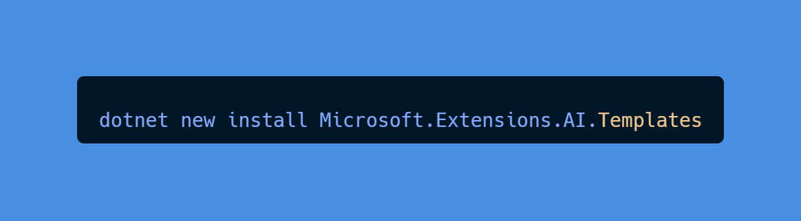
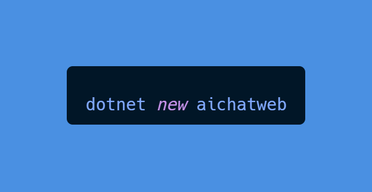
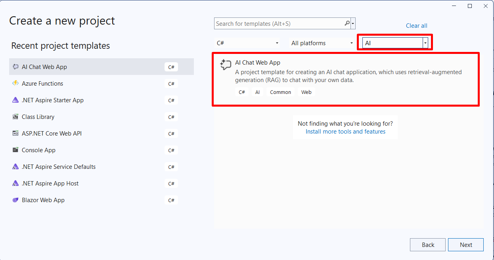
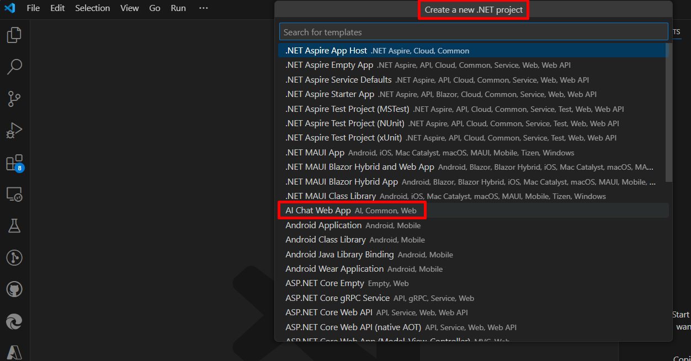
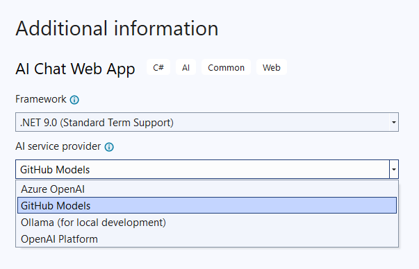
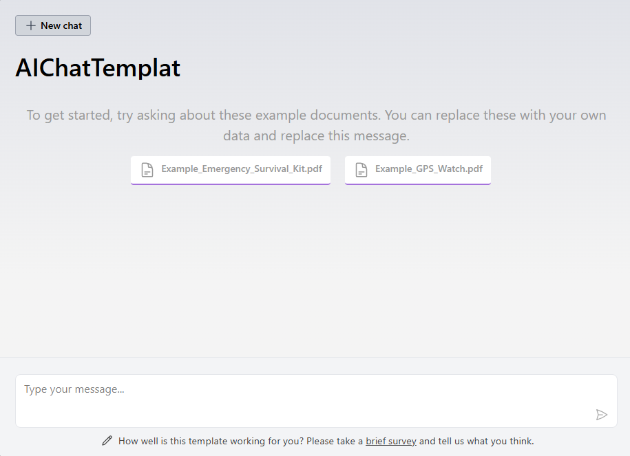
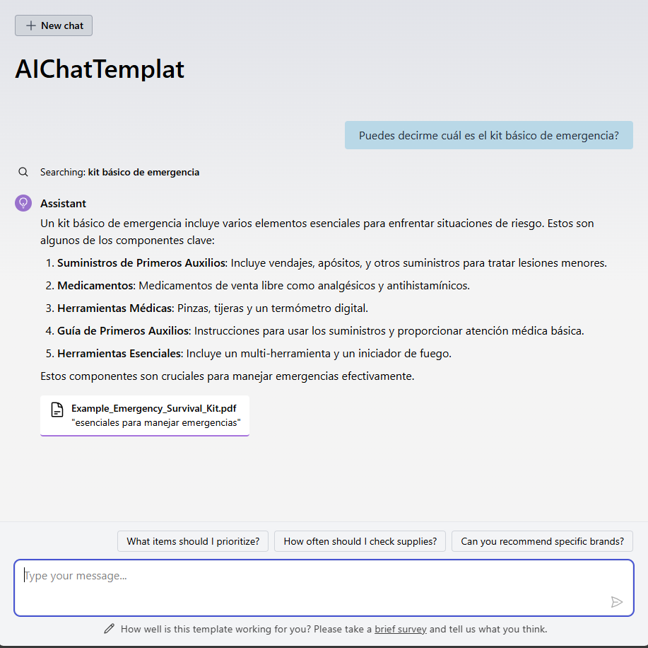
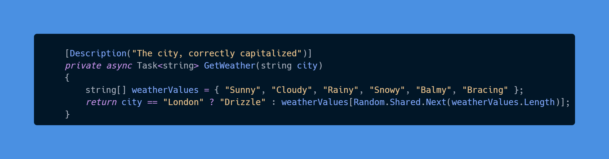
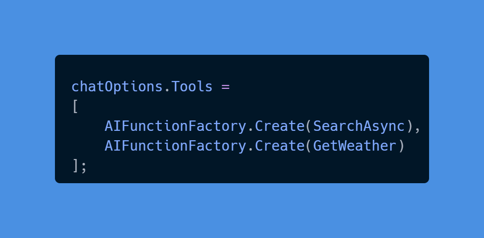
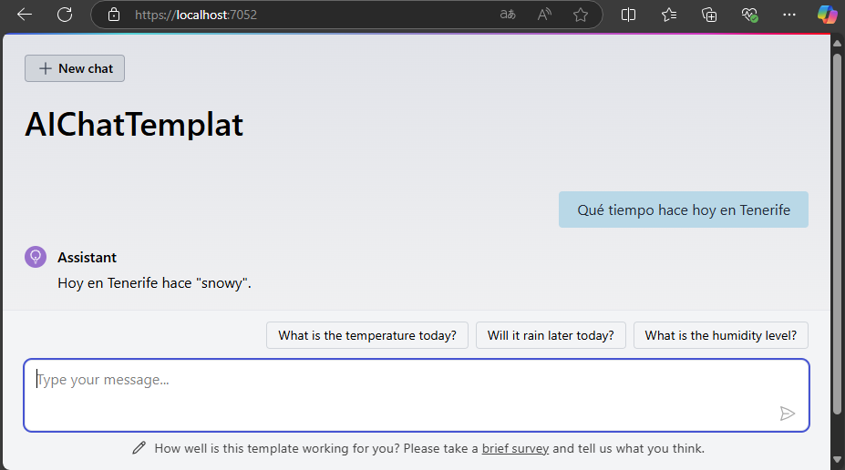

Hoy quiero compartir con ustedes algo súper emocionante que encontré:
¡el nuevo template de AI Chat Web App para .NET! 🎉 Esta plantilla está
en preview y es perfecto para aquellos que quieren empezar con el
desarrollo de AI pero no saben por dónde comenzar. Vamos a ver cómo
ponerlo en marcha, los beneficios de usar el **Semantic Kernel**, y
algunas impresiones propias sobre esta herramienta.

## Características principales de la plantilla

Antes de entrar en los detalles de la instalación y configuración,
echemos un vistazo a algunas de las características más destacadas de
esta plantilla:

-   **Integración con modelos AI:** La plantilla permite la integración
    con varios proveedores de modelos AI, facilitando la experimentación
    con diferentes tecnologías.

-   **Almacén de vectores:** Incluye soporte para un almacén de vectores
    local, ideal para pruebas y desarrollo inicial.

-   **Ingestión de datos:** Viene con código de muestra para la
    ingestión de datos desde archivos PDF, lo que permite personalizar
    fácilmente el chatbot con tus propios datos.

-   **Extensibilidad:** Es muy fácil extender el comportamiento del
    chatbot añadiendo nuevas funciones en C#.

-   **Interfaz web:** Proporciona una interfaz web lista para usar, lo
    que acelera el desarrollo y despliegue de aplicaciones de chat AI.

## ¿Qué es el patrón RAG y cómo interviene Semantic Kernel?

El **patrón RAG (Retrieval Augmented Generation)** es una técnica
utilizada en aplicaciones de chat AI para mejorar la calidad de las
respuestas generadas. Básicamente, combina la generación de texto con la
recuperación de información relevante. Esto significa que el chatbot no
solo genera respuestas basadas en un modelo AI, sino que también busca
información en una base de datos para proporcionar respuestas más
precisas y contextuales.

**Semantic Kernel** juega un papel crucial en este proceso. Aunque no
está incluido directamente en la plantilla, su uso puede mejorar
significativamente la capacidad de tu aplicación para entender y
procesar lenguaje natural. Aquí algunos beneficios del Semantic Kernel:

-   **Mejor comprensión del contexto:** Permite a tu aplicación entender
    mejor el contexto de las conversaciones, lo que resulta en
    respuestas más precisas y relevantes.

-   **Flexibilidad:** Puedes integrar fácilmente el Semantic Kernel con
    otros servicios y herramientas, lo que te da más control sobre cómo
    se manejan los datos y las respuestas.

-   **Escalabilidad:** Ideal para aplicaciones que necesitan manejar
    grandes volúmenes de datos y usuarios, asegurando que la performance
    se mantenga óptima.

## Paso a paso para Instalar y usar la plantilla

Vamos a ver cómo instalar la plantilla y empezar a trabajar con ella
desde la línea de comandos, Visual Studio y Visual Studio Code.

### Instalación desde la Línea de Comandos

Primero, necesitamos instalar la plantilla. Abre tu terminal y ejecuta
el siguiente comando:

Una vez instalado, puedes crear un nuevo proyecto con la plantilla usando el siguiente comando:

### Uso desde Visual Studio

Si prefieres usar Visual Studio, sigue estos pasos:

1.  Abre Visual Studio.

2.  Ve a **File > New > Project...**

3.  Busca "AI Chat Web App" en la barra de búsqueda.

4.  Selecciona la plantilla y sigue las instrucciones para crear el
    proyecto.

**Uso desde Visual Studio Code**

Para usar la plantilla en Visual Studio Code, primero instala la
extensión **C# Dev Kit**. Luego, sigue estos pasos:

1.  Abre Visual Studio Code.

2.  Usa el comando **.NET: New Project...**

3.  Busca "AI Chat Web App" en la barra de búsqueda.

4.  Selecciona la plantilla y sigue las instrucciones para crear el
    proyecto.

**Configuración Inicial**

Después de crear el proyecto, abre Visual Studio y selecciona el
template desde el menú **File > New Project...**. Aquí puedes elegir tu
proveedor de modelo AI y el almacén de vectores. Por defecto, se usa
GitHub Models con un almacén de vectores local, lo cual es genial para
empezar sin complicaciones.

Si optamos por crearlo desde VS Code no he encontrado la opción para
seleccionar qué proveedor usar, supongo que vendrá en próximas
actualizaciones de la plantilla.

## Integración de Datos

La plantilla incluye dos archivos PDF de muestra y código para la
ingestión de datos. Para chatear con tus propios datos, sigue estos
pasos:

1.  Detén la ejecución del proyecto si está corriendo.

2.  Elimina los archivos PDF de muestra de la carpeta /wwwroot/Data.

3.  Añade tus propios archivos PDF a la carpeta /wwwroot/Data.

4.  Ejecuta la aplicación nuevamente.

El código de ingestión de datos se encargará de procesar tus archivos y
actualizar el almacén de vectores.

No obstante, si queremos probar un poco cómo funciona, podemos
preguntarle directamente sobre el contenido de estos ficheros y
comprobar cómo, en unos instantes, es capaz de respondernos con la
información, siempre que la encuentre.

## Extender el comportamiento del Chatbot

Una de las mejores partes de esta plantilla es lo fácil que es extender
el comportamiento del chatbot. Puedes darle acceso a cualquier función
de C# para que realice tareas adicionales. Por ejemplo, para obtener
datos del clima, puedes definir una función en *Pages/Chat/Chat.razor*:

Luego, actualiza *chatOptions.Tools* del evento *OnInitialized* para
incluir tu método:

El ejemplo da un resultado "random" sobre el tiempo pero, podríamos
conectarlo a AccuWeather por ejemplo y tener un ejemplo real.

## Conclusiones

La plantilla de AI Chat Web App para .NET es una versión preliminar en
la que se sigue trabajando en cosas importantes como añadir soporte para
.NET Aspire y mejorar la integración con Semantic Kernel. Sin embargo,
es un buen punto de partida, con una arquitectura básica, para poder
explorar lo que nos ofrece la IA. Con estos pasos, tendrás tu AI Chat
Web App funcionando en poco tiempo. No olvides explorar más sobre
Semantic Kernel y cómo puede beneficiar tu proyecto. ¡Feliz
codificación! 🚀

**Santiago Porras Rodriguez**  
Squad Lead en ENCAMINA

import LayoutNumber from '../../../components/layout-article'
export default LayoutNumber
